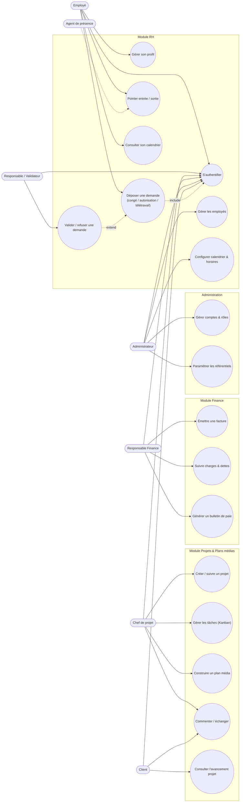
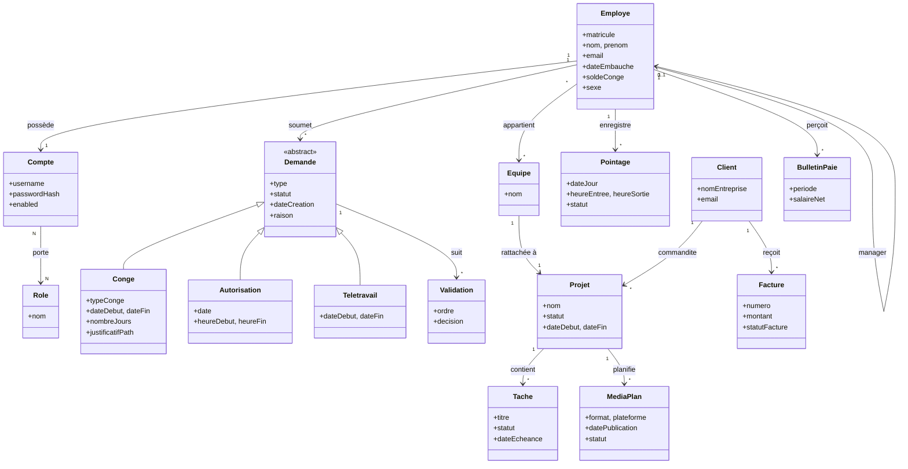
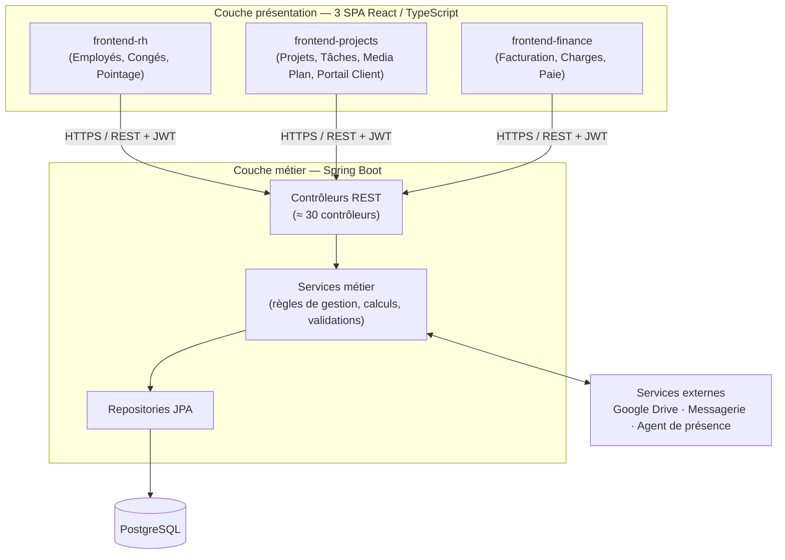
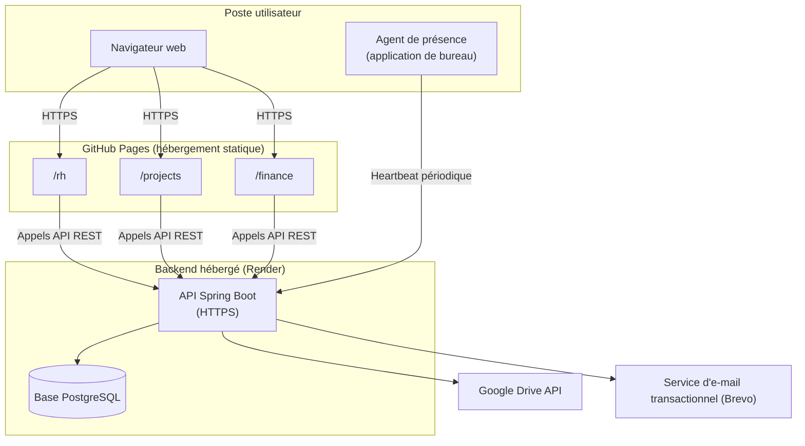

# Chapitre II : Analyse et spécification des besoins

## II.1 Introduction

Le chapitre précédent nous a permis de situer le cadre général du projet : l'organisme d'accueil, la problématique rencontrée et les grandes lignes de la solution envisagée. À présent, il s'agit de descendre d'un niveau et de poser, noir sur blanc, ce que le futur système doit réellement faire et pour qui.

Cette étape est décisive. Se lancer dans le développement sans avoir clarifié le périmètre fonctionnel expose à deux risques classiques : construire des fonctionnalités inutiles, ou pire, découvrir en cours de route qu'un besoin essentiel a été oublié. Nous avons donc pris le temps, avant d'écrire la moindre ligne de code, d'identifier les utilisateurs du système, de recenser leurs attentes et de les traduire en exigences exploitables.

Ce chapitre suit une progression logique. Nous commençons par modéliser le contexte du projet à travers l'identification des acteurs et la spécification des besoins fonctionnels et non fonctionnels. Nous formalisons ensuite ces besoins au moyen d'un diagramme de cas d'utilisation général, puis nous posons les bases de la conception avec un diagramme de classes d'analyse et une description de l'architecture globale de la plateforme, tant logique que physique. Nous détaillons par la suite la méthode de pilotage adoptée — la méthode agile SCRUM — avec son backlog et sa planification en sprints. Nous terminons en présentant l'environnement matériel et logiciel qui a servi de socle à ce travail.

## II.2 Modélisation du contexte

Avant de parler de fonctionnalités, il faut d'abord répondre à une question simple : qui va utiliser cette plateforme, et pourquoi ? Antigone n'est pas une petite structure figée sur un seul métier — c'est une agence créative qui gère en parallèle des ressources humaines, des projets clients, des plans médias et une comptabilité. Le système devait donc être pensé comme un espace de travail partagé entre plusieurs profils aux besoins très différents, plutôt que comme une simple application de gestion de congés.

### II.2.1 Identification des acteurs

Un acteur, au sens UML, représente un rôle joué par une entité externe — humaine ou non — qui interagit avec le système pour en tirer un bénéfice concret. Nous avons distingué les acteurs principaux, qui initient des actions et attendent un résultat, des acteurs secondaires, qui soutiennent le système sans le piloter directement.

**Acteurs principaux (humains)**

| Acteur | Rôle dans le système |
|---|---|
| **Administrateur** | Détient l'ensemble des permissions. Configure les référentiels, gère les comptes et les rôles, supervise les quatre modules (RH, Projets, Finance, Portail client) et arbitre en dernier recours. |
| **Employé** | Utilisateur du quotidien. Consulte son profil, dépose ses demandes (congé, autorisation, télétravail, documents administratifs), pointe ses horaires, consulte son calendrier personnel et suit ses tâches. |
| **Responsable hiérarchique / Validateur** | Un employé investi d'un rôle de validation. Intervient dans le circuit d'approbation des demandes de son équipe, à un ou plusieurs niveaux selon le paramétrage. |
| **Chef de projet** | Pilote un ou plusieurs projets : crée les équipes, répartit les tâches, planifie les plans médias, échange avec le client via les commentaires et suit l'avancement. |
| **Responsable Finance / Comptable** | Accède au module financier : facturation, suivi des charges et des dettes, paie, déclarations CNSS et barème IRPP. Ce périmètre est protégé par une permission dédiée, distincte des droits RH. |
| **Client** | Acteur externe à l'entreprise. Se connecte via un accès dédié pour suivre l'avancement de ses projets, consulter ses plans médias et récupérer ses livrables déposés sur un espace Drive partagé. |

**Acteurs secondaires (systèmes ou services externes)**

| Acteur | Rôle dans le système |
|---|---|
| **Agent de présence (application de bureau)** | Petit programme installé sur le poste de l'employé qui envoie des signaux de présence (heartbeat) au serveur, utilisés pour recouper automatiquement les pointages. |
| **Service de messagerie (Brevo)** | Achemine les e-mails transactionnels : réinitialisation de mot de passe, notifications importantes. |
| **Google Drive** | Stocke et restitue les fichiers liés aux projets et aux clients (livrables, justificatifs, dossiers partagés). |
| **Assistant conversationnel (Chatbot)** | Composant interne qui répond aux questions courantes des utilisateurs (solde de congé, statut d'une demande, etc.) à partir du contexte de l'utilisateur connecté. |

Cette diversité d'acteurs — six profils humains et quatre briques logicielles externes — explique pourquoi nous avons opté, comme nous le détaillerons plus loin, pour une architecture éclatée en plusieurs interfaces plutôt qu'une application monolithique unique.

### II.2.2 Spécification des besoins

Une fois les acteurs posés, nous avons formulé les besoins auxquels le système doit répondre. Nous les avons classés en deux familles, comme le veut l'usage : les besoins fonctionnels, qui décrivent *ce que* le système doit faire, et les besoins non fonctionnels, qui décrivent *comment* il doit le faire.

#### a) Besoins fonctionnels

Nous les avons regroupés par module, ce qui reflète assez fidèlement la manière dont la plateforme est elle-même découpée. Pour chaque fonctionnalité, nous précisons l'acteur — ou les acteurs — qui la déclenche, afin de garder le lien direct avec l'identification faite au point II.2.1.

**Module Authentification & Administration**

| Fonctionnalité | Acteur(s) concerné(s) |
|---|---|
| S'authentifier de façon sécurisée (jeton JWT) | Tous les utilisateurs internes (Employé, Responsable hiérarchique, Chef de projet, Responsable Finance, Administrateur) |
| Changer son mot de passe à la première connexion | Tous les utilisateurs internes |
| Gérer les comptes utilisateurs (création, activation/désactivation, réinitialisation) | Administrateur |
| Définir des rôles avec des permissions granulaires (RBAC) | Administrateur |

**Module Ressources Humaines**

| Fonctionnalité | Acteur(s) concerné(s) |
|---|---|
| Gérer le cycle de vie d'une fiche employé (création, modification, hiérarchie manager/subordonné) | Administrateur |
| Consulter le solde de congé calculé automatiquement selon l'ancienneté | Employé |
| Déposer une demande de congé (12 types), avec calcul intelligent des jours et upload de justificatif | Employé |
| Déposer une demande d'autorisation de sortie ou de télétravail | Employé |
| Valider ou refuser une demande dans le circuit multi-niveaux | Responsable hiérarchique / Validateur |
| Pointer les heures d'entrée et de sortie | Employé |
| Recouper automatiquement le pointage déclaré | Agent de présence |
| Configurer le calendrier d'entreprise (jours fériés, jours spéciaux) | Administrateur |
| Configurer les horaires de travail (standards, été, télétravail imposé) | Administrateur |
| Recevoir une notification à chaque décision prise sur une demande | Employé |

**Module Projets & Plans médias**

| Fonctionnalité | Acteur(s) concerné(s) |
|---|---|
| Créer et suivre un projet (statuts planifié / en cours / clôturé / annulé) | Chef de projet |
| Constituer et gérer une équipe dédiée à un projet | Chef de projet |
| Répartir et suivre les tâches sur un tableau Kanban | Chef de projet |
| Faire avancer ses tâches assignées | Employé |
| Construire un plan média (contenus, formats, plateformes, dates de publication) | Chef de projet |
| Échanger sur un plan média via le fil de commentaires | Chef de projet, Client |
| Planifier des réunions de projet | Chef de projet |
| Suivre les compétences mobilisées par équipe | Chef de projet |
| Générer un rapport d'inactivité ou d'avancement de projet | Chef de projet, Administrateur |

**Portail Client**

| Fonctionnalité | Acteur(s) concerné(s) |
|---|---|
| Se connecter via un accès dédié, distinct des comptes internes | Client |
| Consulter l'avancement de ses projets | Client |
| Consulter ses plans médias | Client |
| Accéder à son espace Google Drive dédié pour récupérer ses livrables | Client |

**Module Finance**

| Fonctionnalité | Acteur(s) concerné(s) |
|---|---|
| Émettre une facture à partir du catalogue de services | Responsable Finance |
| Suivre le statut de paiement d'une facture et relancer si besoin | Responsable Finance |
| Suivre les charges fixes et variables de l'entreprise | Responsable Finance |
| Suivre les dettes et leurs échéanciers de paiement | Responsable Finance |
| Générer les bulletins de paie (barème IRPP, cotisations CNSS, acomptes) | Responsable Finance |
| Consulter le tableau de bord financier (chiffre d'affaires, charges, trésorerie) | Responsable Finance, Administrateur |

**Transverse**

| Fonctionnalité | Acteur(s) concerné(s) |
|---|---|
| Paramétrer les référentiels du système (départements, postes, catégories financières, formats et plateformes de plan média…) | Administrateur |
| Consulter un tableau de bord adapté à son rôle | Tous les utilisateurs internes |
| Interroger l'assistant conversationnel (chatbot) | Tous les utilisateurs internes |

#### b) Besoins non fonctionnels

Les besoins fonctionnels décrivent la promesse faite à l'utilisateur ; les besoins non fonctionnels conditionnent la confiance qu'il pourra accorder au système au quotidien. Nous les avons organisés selon les caractéristiques de qualité logicielle du modèle ISO/IEC 25010, en les déclinant chacune en sous-caractéristiques directement rattachées à des choix concrets de la plateforme.

| Caractéristique | Sous-caractéristique | Description |
|---|---|---|
| **Sécurité** | Confidentialité | Un client ne doit jamais pouvoir accéder aux données d'un autre client ; un employé ne doit pas pouvoir consulter le module Finance sans permission explicite. |
| **Sécurité** | Authentification | Connexion sécurisée par jeton JWT, mots de passe hachés (BCrypt), changement obligatoire du mot de passe à la première connexion. |
| **Sécurité** | Contrôle d'accès | Autorisations fines par permission (RBAC) plutôt que par simple rôle binaire, avec séparation stricte entre l'espace client et l'espace interne. |
| **Sécurité** | Traçabilité / Auditabilité | Chaque décision (approbation, refus, modification de solde) est journalisée avec son auteur et son horodatage, pour permettre un audit a posteriori. |
| **Fiabilité** | Disponibilité | Le système doit rester accessible en continu, sans interruption pénalisant le dépôt ou le traitement des demandes. |
| **Fiabilité** | Tolérance aux fautes | Une demande, une fois soumise, ne peut pas se perdre ; chaque changement de statut est historisé et reste consultable même en cas d'erreur ultérieure. |
| **Efficacité de performance** | Comportement temporel | Les listes (employés, demandes, factures…) doivent rester fluides même en cas de volume de données croissant. |
| **Efficacité de performance** | Utilisation des ressources | Les calculs sensibles (solde de congé, jours ouvrés, bulletin de paie) s'exécutent côté serveur pour garantir un résultat unique et cohérent, quel que soit le frontend utilisé. |
| **Utilisabilité** | Ergonomie | Interfaces claires, avec un vocabulaire métier compréhensible par des utilisateurs non techniques. |
| **Utilisabilité** | Accessibilité | Interfaces responsives, utilisables aussi bien sur poste fixe que sur mobile. |
| **Compatibilité** | Interopérabilité | Le backend expose une API REST unique consommée par trois interfaces distinctes, et s'intègre à des services externes (Google Drive, messagerie transactionnelle) via des API standard. |
| **Portabilité** | Adaptabilité | Le frontend, développé en React/TypeScript, fonctionne dans n'importe quel navigateur récent, indépendamment du système d'exploitation du poste client. |
| **Portabilité** | Installabilité | Le backend et le frontend sont déployables indépendamment l'un de l'autre, sans dépendance figée à un hébergeur particulier. |
| **Maintenabilité** | Modularité | Architecture en couches (contrôleur / service / repository) avec séparation claire des responsabilités entre les modules RH, Projets et Finance. |
| **Maintenabilité** | Évolutivité | Référentiels paramétrables plutôt que valeurs codées en dur, pour absorber l'évolution des besoins métier sans refonte du code. |

### II.2.3 Diagramme de cas d'utilisation général

Le diagramme ci-dessous restitue, de façon volontairement synthétique, les interactions majeures entre les acteurs identifiés et le système. Il ne prétend pas à l'exhaustivité — le catalogue complet dépasse largement ce qu'un diagramme unique peut représenter lisiblement — mais il donne une vue d'ensemble fidèle du périmètre fonctionnel.

Deux relations méritent d'être précisées. La validation d'une demande (UC6) *étend* le cas de dépôt de demande (UC3) : elle ne se déclenche que si une demande est effectivement en attente. L'agent de présence, quant à lui, n'agit jamais seul — il vient enrichir le pointage (UC4) réalisé par l'employé, d'où le trait pointillé plutôt qu'une flèche pleine.

## II.3 Diagramme de classes d'analyse

### II.3.1 Analyse globale

Le diagramme de classes d'analyse a pour but de représenter les concepts métier du domaine et leurs relations, sans encore se préoccuper des détails d'implémentation (types techniques, méthodes d'accès, contraintes de persistance). Il constitue le pont entre les besoins exprimés dans les cas d'utilisation et le modèle de données qui sera affiné au chapitre suivant.

Le domaine se structure naturellement autour de quatre grandes familles de classes :

- une famille **identité et accès** (`Employe`, `Compte`, `Role`, `Client`) qui porte la notion d'utilisateur au sens large ;
- une famille **demandes RH** (`Demande` et ses spécialisations `Conge`, `Autorisation`, `Teletravail`) organisée en héritage, puisque les trois types de demande partagent un cycle de vie commun (soumission, validation, historique) tout en portant des attributs propres ;
- une famille **projets** (`Projet`, `Tache`, `Equipe`, `MediaPlan`) qui modélise l'activité opérationnelle de l'agence ;
- une famille **finance** (`Facture`, `ChargeFixe`, `Dette`, `BulletinPaie`) qui reste volontairement peu couplée aux autres, pour préserver l'étanchéité des données sensibles.

Ce découpage en quatre familles faiblement couplées n'est pas anodin : il annonce directement la manière dont nous avons choisi de répartir le travail entre les trois interfaces frontend, chacune se concentrant sur une famille de classes et consommant l'API selon ses besoins propres.

### II.3.2 Architecture globale

#### II.3.2.1 Architecture logique de la plateforme

Nous avons retenu une architecture en couches côté serveur, classique dans l'écosystème Spring, mais avec une particularité assumée : un seul backend dessert trois applications frontend distinctes plutôt qu'une seule interface fourre-tout.

Ce choix découle directement du travail sur les acteurs mené plus haut. Un employé qui dépose une demande de congé n'a rien à faire dans les écrans de facturation ; un comptable n'a aucune raison de voir apparaître le tableau Kanban des tâches. Plutôt que de masquer des menus selon les droits — ce qui alourdit une seule application et complique sa maintenance — nous avons préféré trois applications React indépendantes (`frontend-rh`, `frontend-projects`, `frontend-finance`), chacune focalisée sur son public, mais toutes branchées sur la même API et la même base de données.

Chaque couche a une responsabilité unique. Les contrôleurs se limitent à recevoir la requête, vérifier les autorisations grâce au filtre JWT et déléguer ; les services concentrent toute la logique métier (calcul du solde de congé selon l'ancienneté, comptage intelligent des jours ouvrés, circuit de validation multi-niveaux, calcul du bulletin de paie selon le barème IRPP) ; les repositories, bâtis sur Spring Data JPA, se contentent de la persistance. Cette séparation nous a permis, en cours de projet, d'ajouter le module Finance et le portail client sans jamais retoucher la logique RH déjà en production.

#### II.3.2.2 Architecture physique de la plateforme

Sur le plan du déploiement, nous avons cherché une solution simple à maintenir pour un projet porté par une seule personne, sans sacrifier la séparation des responsabilités.

Les trois frontends sont compilés puis publiés comme sites statiques sur GitHub Pages, chacun sous son propre chemin (`/rh`, `/projects`, `/finance`) — une intégration continue se charge de reconstruire et republier automatiquement les trois applications à chaque changement. Le backend, lui, tourne comme service unique sur Render, connecté à une base PostgreSQL managée. Cette scission entre hébergement statique (gratuit, illimité en bande passante) et backend applicatif (seule brique réellement dynamique) réduit les coûts d'infrastructure tout en gardant un point d'entrée API unique, plus simple à sécuriser et à superviser qu'une flotte de services éclatés.

## II.4 Pilotage du projet avec SCRUM

Le périmètre fonctionnel décrit plus haut ne s'est pas construit d'un bloc. Vu son étendue — quatre modules, trois interfaces, une intégration à des services externes — nous avons choisi de le piloter avec la méthode agile SCRUM plutôt qu'une planification en cascade. L'intérêt, pour un travail en solo sur six mois, est de garder à tout moment un produit livrable et testable, plutôt que de découvrir en fin de stage que les pièces ne s'assemblent pas.

### II.4.1 Backlog du produit

Le backlog regroupe les grandes fonctionnalités (epics) issues directement des besoins fonctionnels du point II.2.2, priorisées selon la méthode MoSCoW (*Must have*, *Should have*, *Could have*).

| # | Epic | Priorité |
|---|---|---|
| E1 | Authentification, gestion des comptes et des rôles (RBAC) | Must |
| E2 | Gestion des fiches employés et de la hiérarchie | Must |
| E3 | Demandes de congé — 12 types, calcul intelligent des jours | Must |
| E4 | Demandes d'autorisation et de télétravail | Must |
| E5 | Circuit de validation multi-niveaux | Must |
| E6 | Pointage et agent de présence | Must |
| E7 | Calendrier d'entreprise et horaires de travail | Must |
| E8 | Notifications in-app | Should |
| E9 | Référentiels paramétrables | Should |
| E10 | Gestion des projets, tâches (Kanban) et équipes | Must |
| E11 | Plan média (formats, plateformes, commentaires) | Should |
| E12 | Portail client et intégration Google Drive | Should |
| E13 | Facturation et suivi des paiements | Should |
| E14 | Suivi des charges et des dettes | Could |
| E15 | Paie : bulletins, barème IRPP, déclarations CNSS | Could |
| E16 | Assistant conversationnel (chatbot) | Could |
| E17 | Tableaux de bord (RH, Projets, Finance) | Should |

Chaque epic a ensuite été décomposée en user stories au format habituel (« en tant que *rôle*, je veux *action*, afin de *bénéfice* »), affinées et estimées au fil des sprints plutôt que toutes d'un coup — conformément à l'esprit agile, où le backlog reste un document vivant.

### II.4.2 Planification des sprints

Le stage s'est déroulé de février à juillet 2026, soit environ vingt-six semaines. Nous avons opté pour des sprints de deux semaines, rythme qui laisse le temps de livrer une fonctionnalité complète sans perdre la capacité à réagir rapidement en cas de besoin.

| Sprint | Période (2026) | Objectif principal |
|---|---|---|
| Sprint 0 | Semaines 1–2 (fév.) | Cadrage : recueil des besoins, choix technologiques, mise en place des dépôts et de l'environnement |
| Sprint 1 | Semaines 3–4 | Authentification JWT, gestion des comptes et des rôles (E1) |
| Sprint 2 | Semaines 5–6 | Gestion des employés et hiérarchie managériale (E2) |
| Sprint 3 | Semaines 7–8 | Demandes de congé et calcul intelligent des jours (E3) |
| Sprint 4 | Semaines 9–10 | Autorisations, télétravail, circuit de validation multi-niveaux (E4, E5) |
| Sprint 5 | Semaines 11–12 | Pointage, agent de présence, calendrier & horaires (E6, E7) |
| Sprint 6 | Semaines 13–14 | Notifications, référentiels paramétrables (E8, E9) |
| Sprint 7 | Semaines 15–16 | Projets, tâches Kanban, équipes (E10) |
| Sprint 8 | Semaines 17–18 | Plan média et échanges par commentaires (E11) |
| Sprint 9 | Semaines 19–20 | Portail client et intégration Google Drive (E12) |
| Sprint 10 | Semaines 21–22 | Facturation, charges et dettes (E13, E14) |
| Sprint 11 | Semaines 23–24 | Paie, barème IRPP, déclarations CNSS (E15) |
| Sprint 12 | Semaines 25–26 (juil.) | Chatbot, tableaux de bord, stabilisation et déploiement final (E16, E17) |

Chaque sprint s'est refermé par une revue permettant de confronter le résultat aux attentes de l'encadrement, et par une courte rétrospective destinée à ajuster le rythme du sprint suivant plutôt qu'à s'y tenir de façon rigide.

## II.5 Environnement de travail

### II.5.1 Environnement matériel de développement

Le développement a été réalisé sur un poste de travail unique, aux caractéristiques suffisantes pour faire tourner simultanément un backend Spring Boot, une base PostgreSQL locale et trois serveurs de développement frontend :

| Composant | Caractéristique |
|---|---|
| Processeur | Intel Core i5 / i7 (ou équivalent), architecture x64 |
| Mémoire vive | 8 à 16 Go de RAM |
| Stockage | SSD, 512 Go |
| Système d'exploitation | Windows 11 |
| Connexion réseau | Accès Internet requis pour Git, Maven, npm et les services externes (Google Drive, messagerie) |

### II.5.2 Environnement logiciel de développement

#### II.5.2.1 Langages de programmation

| Langage | Usage |
|---|---|
| **Java 17** | Développement du backend (API REST, logique métier) |
| **TypeScript** | Développement des trois interfaces frontend |
| **SQL** | Modélisation et interrogation de la base PostgreSQL |
| **HTML / CSS** | Structure et mise en forme des interfaces, complétées par Tailwind CSS |

#### II.5.2.2 Frameworks et bibliothèques

**Côté backend**

| Outil | Rôle |
|---|---|
| Spring Boot 3 | Socle applicatif : configuration, injection de dépendances, démarrage |
| Spring Data JPA / Hibernate | Persistance objet-relationnel |
| Spring Security + JJWT | Authentification par jeton et gestion fine des autorisations |
| PostgreSQL | Système de gestion de base de données relationnelle |
| Lombok | Réduction du code répétitif (accesseurs, constructeurs) |
| Maven | Gestion des dépendances et du cycle de build |
| Google API Client (Drive) | Intégration avec l'espace de stockage des livrables clients |
| Spring Boot Mail / Brevo | Envoi des e-mails transactionnels |

**Côté frontend**

| Outil | Rôle |
|---|---|
| React 19 | Bibliothèque de construction des interfaces |
| Vite | Bundler et serveur de développement |
| Axios | Communication avec l'API REST |
| React Router | Navigation entre les pages de chaque application |
| Ant Design | Composants d'interface prêts à l'emploi (formulaires, tableaux, calendriers) |
| Tailwind CSS | Mise en forme utilitaire et cohérence visuelle |
| Recharts | Graphiques des tableaux de bord |
| React Three Fiber / Three.js | Éléments visuels 3D légers sur certaines pages d'accueil |

**Outils transverses**

| Outil | Rôle |
|---|---|
| Git / GitHub | Gestion de versions et hébergement du dépôt |
| GitHub Actions | Intégration et déploiement continu des trois frontends |
| Postman | Test manuel des points d'entrée de l'API pendant le développement |
| Visual Studio Code | Éditeur de code principal |
| Render | Hébergement du backend et de la base de données en production |

## II.6 Conclusion

Ce chapitre nous a permis de poser des fondations claires avant d'entrer dans le développement proprement dit. En identifiant précisément les acteurs — des employés aux clients externes, en passant par les responsables métier et les services techniques annexes — nous avons pu formuler des besoins fonctionnels et non fonctionnels directement ancrés dans les usages réels d'une agence créative, et non dans un cahier des charges générique de gestion RH.

La modélisation qui en découle, du diagramme de cas d'utilisation jusqu'à l'architecture physique de déploiement, dessine déjà les grands choix structurants du projet : un backend unique pour garantir la cohérence des données, trois interfaces spécialisées pour coller aux usages de chaque profil, et un pilotage agile pour absorber la complexité progressivement plutôt que d'un seul tenant. C'est cette architecture, posée ici au niveau de l'analyse, que le chapitre suivant va maintenant affiner jusqu'au niveau de la conception détaillée.
