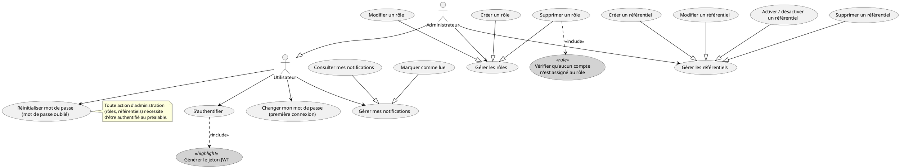
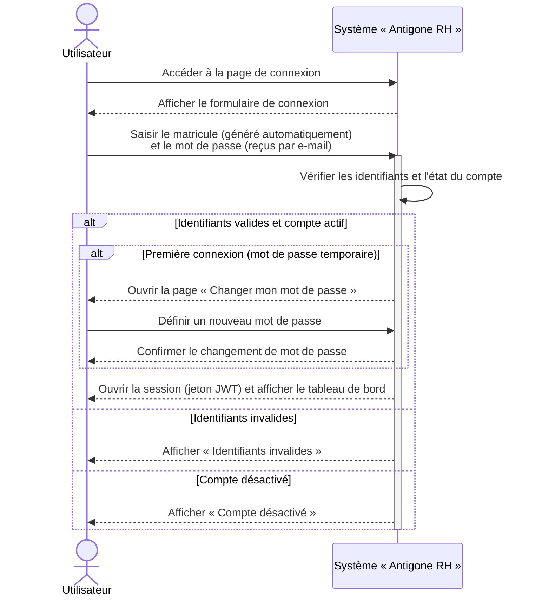
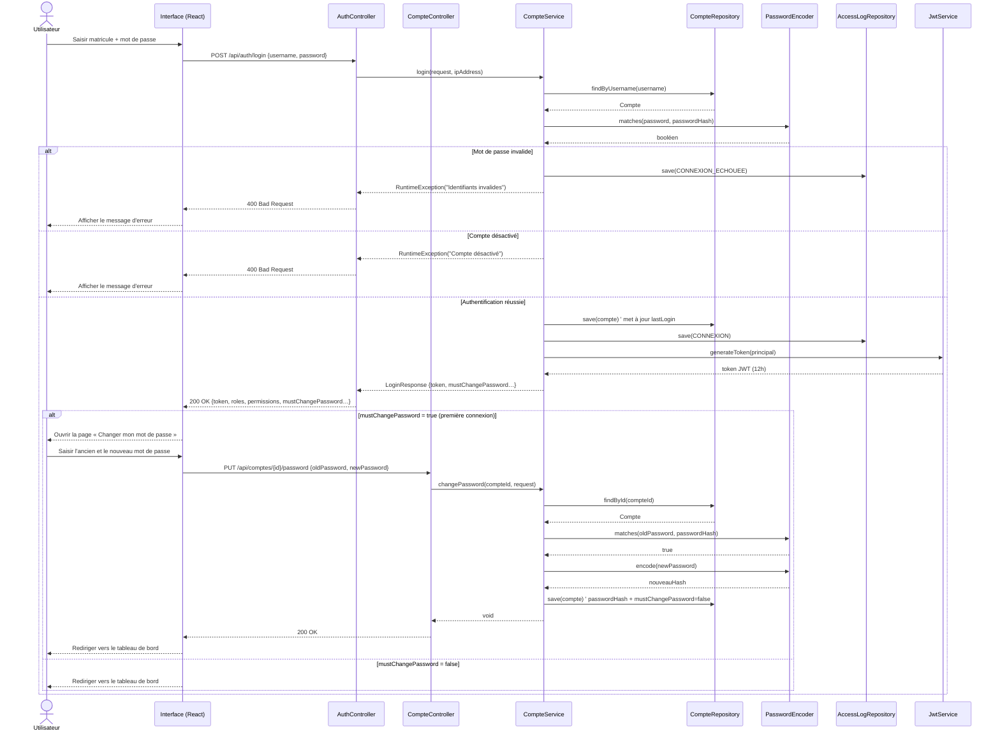
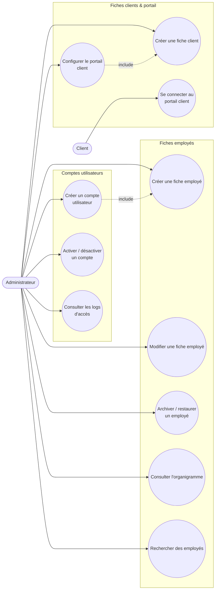
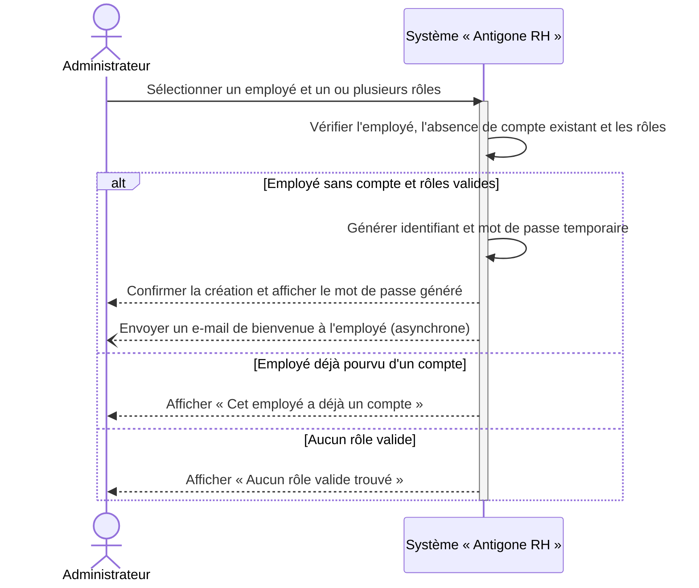
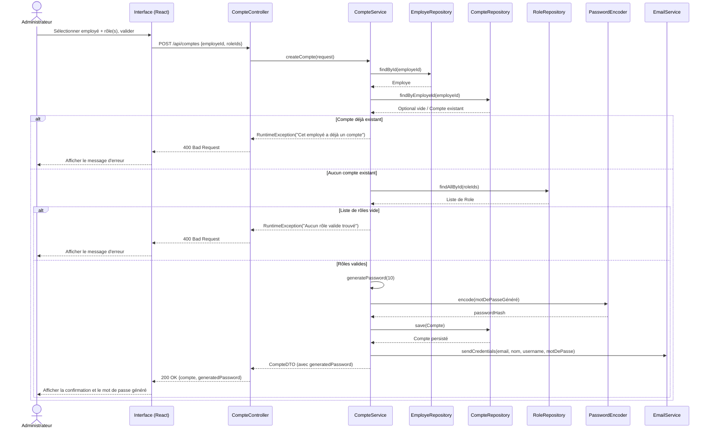

# Chapitre III : Release 1 — Fondations & Identités

## III.1 Introduction

Le chapitre précédent a posé le cadre méthodologique du projet : un backlog produit découpé en dix-sept epics, réparti en neuf sprints de deux semaines, eux-mêmes regroupés en quatre releases livrables. Ce chapitre ouvre la partie « Réalisation » du rapport et s'attache à la première de ces releases.

**Release 1 — Fondations & Identités** rassemble les Sprints 1 et 2. Elle porte un nom volontairement structurant : avant de pouvoir gérer une demande de congé, un projet ou une facture, encore faut-il qu'un utilisateur puisse s'authentifier de façon sécurisée, que ses droits soient définis avec précision, et que les identités qu'il va manipuler — employés, clients — existent dans le système. C'est le socle sur lequel toutes les releases suivantes s'appuient.

Le Sprint 1 met en place les fondations transverses : authentification par jeton JWT (M1), gestion des rôles et des permissions (M3), notifications in-app (M4) et référentiels paramétrables (M6). Le Sprint 2 s'appuie sur ce socle pour administrer l'ensemble des identités de la plateforme (M2) : comptes utilisateurs, fiches employés et fiches clients — ces derniers bénéficiant en plus d'un portail dédié et d'une intégration Google Drive.

Pour chacun des deux sprints, nous suivons la même démarche : présentation du backlog de sprint, diagramme de cas d'utilisation, inventaire des services web exposés, puis description détaillée d'un cas d'utilisation représentatif (description textuelle, diagramme de séquence système et diagramme de séquence objet).

---

## III.2 Backlog du Sprint 1

Le Sprint 1 couvre les modules M1 (Authentification), M3 (Rôles), M4 (Notifications) et M6 (Référentiel), pour une charge totale de 23 points, conformément à la planification établie au chapitre précédent. Chaque user story est décomposée en tâches de développement, estimées individuellement.

<table>
<thead>
<tr><th>User Story</th><th>Tâches</th><th>Estimation</th></tr>
</thead>
<tbody>

<tr><td rowspan="5">En tant qu'utilisateur interne, je veux me connecter avec mon matricule et mon mot de passe afin d'accéder à la plateforme via un jeton sécurisé (JWT).</td><td>Développer l'API d'authentification (contrôleur et service, vérification des identifiants).</td><td>1</td></tr>
<tr><td>Générer et signer le jeton JWT (rôles, permissions, expiration).</td><td>1</td></tr>
<tr><td>Développer l'interface de connexion (formulaire, validation des champs, gestion des erreurs).</td><td>1</td></tr>
<tr><td>Journaliser les tentatives de connexion (accès réussis / échoués).</td><td>1</td></tr>
<tr><td>Tester la fonctionnalité.</td><td>1</td></tr>

<tr><td rowspan="2">En tant qu'utilisateur, je veux être obligé de changer mon mot de passe à ma première connexion afin de ne pas conserver le mot de passe généré automatiquement.</td><td>Développer l'API et l'interface de changement de mot de passe obligatoire (indicateur <code>mustChangePassword</code>).</td><td>1</td></tr>
<tr><td>Tester la fonctionnalité.</td><td>1</td></tr>

<tr><td rowspan="3">En tant qu'utilisateur, je veux pouvoir réinitialiser mon mot de passe oublié via un lien envoyé par e-mail afin de retrouver l'accès à mon compte sans intervention d'un administrateur.</td><td>Développer l'API de demande de réinitialisation (génération du token, envoi de l'e-mail).</td><td>1</td></tr>
<tr><td>Développer l'API de réinitialisation et l'interface « mot de passe oublié » / nouveau mot de passe.</td><td>1</td></tr>
<tr><td>Tester la fonctionnalité.</td><td>1</td></tr>

<tr><td rowspan="5">En tant qu'administrateur, je veux créer des rôles et leur associer un ensemble de permissions afin de définir finement ce que chaque profil peut faire (RBAC).</td><td>Développer l'API de gestion des rôles (CRUD).</td><td>1</td></tr>
<tr><td>Développer l'API de gestion des permissions et de leur association aux rôles.</td><td>1</td></tr>
<tr><td>Développer l'interface de gestion des rôles et permissions.</td><td>1</td></tr>
<tr><td>Sécuriser les endpoints selon les permissions (<code>@PreAuthorize</code>).</td><td>1</td></tr>
<tr><td>Tester la fonctionnalité.</td><td>1</td></tr>

<tr><td rowspan="2">En tant qu'administrateur, je veux modifier ou supprimer un rôle existant afin de faire évoluer les droits d'accès sans devoir recréer les comptes.</td><td>Développer l'API et l'interface de modification/suppression d'un rôle (avec contrôle des comptes assignés).</td><td>1</td></tr>
<tr><td>Tester la fonctionnalité.</td><td>1</td></tr>

<tr><td rowspan="3">En tant qu'utilisateur, je veux recevoir des notifications in-app liées à mes demandes et réunions afin d'être informé sans avoir à vérifier manuellement chaque écran.</td><td>Développer l'API de consultation des notifications (liste, non lues, compteur).</td><td>1</td></tr>
<tr><td>Développer le centre de notifications côté interface (cloche, liste déroulante).</td><td>1</td></tr>
<tr><td>Tester la fonctionnalité.</td><td>1</td></tr>

<tr><td>En tant qu'utilisateur, je veux marquer mes notifications comme lues (individuellement ou toutes à la fois) afin de garder mon centre de notifications à jour.</td><td>Développer et tester le marquage des notifications comme lues (individuellement et en masse).</td><td>1</td></tr>

<tr><td rowspan="2">En tant qu'administrateur, je veux paramétrer les référentiels système (départements, postes, types de congé, types de demande…) afin de faire évoluer les listes de valeurs de l'application sans toucher au code.</td><td>Développer l'API et l'interface CRUD des référentiels (par type, activation/désactivation).</td><td>1</td></tr>
<tr><td>Tester la fonctionnalité.</td><td>1</td></tr>

<tr><td colspan="2" align="right"><strong>Total</strong></td><td><strong>23</strong></td></tr>

</tbody>
</table>

*Table III.1 — Backlog du Sprint 1*

---

## III.3 Diagramme de cas d'utilisation du Sprint 1

*Figure III.1 — Diagramme de cas d'utilisation du Sprint 1*

Trois précisions sur ce diagramme. Comme tout utilisateur interne (Employé, Responsable, Chef de projet, Finance ou Administrateur) hérite du même socle « Utilisateur », l'Administrateur est modélisé comme une spécialisation de cet acteur, à l'image de la relation Coordinatrice/Utilisateur du diagramme de référence — il hérite de tous ses cas d'utilisation et en porte des exclusifs (gestion des rôles, des référentiels). La connexion (UC_Login) *inclut* systématiquement la génération du jeton JWT, puisque `JwtService.generateToken()` est appelé à chaque authentification réussie. Enfin, la suppression d'un rôle *inclut* la vérification qu'aucun compte n'y est encore rattaché — une règle réellement appliquée dans `RoleService.deleteRole()`, qui rejette la suppression tant que des comptes utilisent ce rôle.

---

## III.4 Services Web

Le Sprint 1 expose les points d'entrée REST suivants, répartis en quatre familles.

**Authentification — `/api/auth`**

| Méthode | URL | Description |
|---|---|---|
| POST | `/api/auth/login` | Authentifier un utilisateur interne (matricule + mot de passe) et retourner un jeton JWT avec ses rôles et permissions |
| POST | `/api/auth/client-login` | Authentifier un client sur son portail dédié (identifiants distincts des comptes internes) |
| POST | `/api/auth/forgot-password` | Envoyer un lien de réinitialisation de mot de passe par e-mail |
| POST | `/api/auth/reset-password` | Réinitialiser le mot de passe à partir d'un token temporaire |
| PUT | `/api/comptes/{id}/password` | Changer le mot de passe d'un compte connu (première connexion ou volontaire) |

**Rôles & permissions — `/api/roles`**

| Méthode | URL | Description |
|---|---|---|
| GET | `/api/roles` | Lister tous les rôles |
| GET | `/api/roles/{id}` | Consulter le détail d'un rôle |
| POST | `/api/roles` | Créer un rôle et lui associer des permissions |
| PUT | `/api/roles/{id}` | Modifier le nom ou les permissions d'un rôle |
| DELETE | `/api/roles/{id}` | Supprimer un rôle (refusé s'il est encore assigné à des comptes) |
| GET | `/api/roles/permissions` | Lister l'ensemble des permissions disponibles dans le système |

**Notifications — `/api/notifications`**

| Méthode | URL | Description |
|---|---|---|
| GET | `/api/notifications/employe/{employeId}` | Lister toutes les notifications d'un employé |
| GET | `/api/notifications/employe/{employeId}/unread` | Lister les notifications non lues |
| GET | `/api/notifications/employe/{employeId}/unread-count` | Compter les notifications non lues |
| PATCH | `/api/notifications/{id}/read` | Marquer une notification comme lue |
| PATCH | `/api/notifications/employe/{employeId}/read-all` | Marquer toutes les notifications d'un employé comme lues |

**Référentiels — `/api/referentiels`**

| Méthode | URL | Description |
|---|---|---|
| GET | `/api/referentiels/types` | Lister les types de référentiel disponibles (énumération) |
| GET | `/api/referentiels` | Lister tous les référentiels |
| GET | `/api/referentiels/{id}` | Consulter le détail d'un référentiel |
| GET | `/api/referentiels/type/{type}` | Lister les référentiels d'un type donné |
| GET | `/api/referentiels/type/{type}/actifs` | Lister uniquement les référentiels actifs d'un type donné |
| POST | `/api/referentiels` | Créer un référentiel |
| PUT | `/api/referentiels/{id}` | Modifier un référentiel |
| PATCH | `/api/referentiels/{id}/toggle-actif` | Activer / désactiver un référentiel |
| DELETE | `/api/referentiels/{id}` | Supprimer un référentiel |

---

## III.5 Les cas d'utilisation du Sprint 1

### III.5.1 Cas d'utilisation : « Se connecter »

#### III.5.1.1 Description textuelle

| Élément | Description |
|---|---|
| **Acteurs** | Utilisateur interne : Employé, Responsable hiérarchique / Validateur, Chef de projet, Responsable Finance, Administrateur |
| **Objectif** | Permettre à un utilisateur possédant un compte d'accéder à la plateforme de façon sécurisée et d'obtenir un jeton d'authentification (JWT) reflétant ses rôles et permissions |
| **Pré-condition** | L'utilisateur possède un compte, créé au préalable par un administrateur (cf. cas d'utilisation « Créer un compte utilisateur », III.9.1). Le compte est activé (`enabled = true`) |

**Scénario principal**

1. L'utilisateur accède à la page de connexion et saisit son identifiant (matricule) et son mot de passe.
2. Le système recherche le compte correspondant à l'identifiant saisi.
3. Le système vérifie que le mot de passe saisi correspond au mot de passe haché enregistré (BCrypt).
4. Le système vérifie que le compte est activé.
5. Le système met à jour la date de dernière connexion et journalise l'accès (action `CONNEXION`).
6. Le système construit un jeton JWT signé, valable 12 heures, embarquant l'identité, les rôles et les permissions de l'utilisateur.
7. Le système retourne le jeton ainsi que le profil de l'utilisateur (nom, prénom, e-mail, rôles, permissions, indicateur de changement de mot de passe obligatoire).
8. L'interface stocke le jeton et redirige l'utilisateur vers le tableau de bord correspondant à ses permissions.

**Scénarios alternatifs**

- **A1 — Identifiant inconnu ou mot de passe incorrect** : aux étapes 2 ou 3, le système journalise une tentative échouée (action `CONNEXION_ECHOUEE`) et renvoie le message générique « Identifiants invalides », sans préciser lequel des deux champs est erroné, pour ne pas faciliter une attaque par énumération de comptes.
- **A2 — Compte désactivé** : à l'étape 4, le système renvoie « Compte désactivé » ; l'interface invite l'utilisateur à contacter un administrateur.
- **A3 — Changement de mot de passe obligatoire** : à l'étape 7, si l'indicateur `mustChangePassword` est vrai (première connexion après création du compte, ou après une réinitialisation), l'interface redirige l'utilisateur vers l'écran de changement de mot de passe avant de lui donner accès au reste de l'application.

#### III.5.1.2 Diagramme de séquence système

#### III.5.1.3 Diagramme de séquence objet

---

## III.6 Backlog du Sprint 2

Le Sprint 2 couvre le module M2 (Gestion des utilisateurs) dans son ensemble : comptes, fiches employés et fiches clients, y compris le portail dédié aux clients. Charge totale : 34 points. Chaque user story est décomposée en tâches de développement, estimées individuellement.

<table>
<thead>
<tr><th>User Story</th><th>Tâches</th><th>Estimation</th></tr>
</thead>
<tbody>

<tr><td rowspan="5">En tant qu'administrateur, je veux créer un compte utilisateur pour un employé existant, avec mot de passe généré automatiquement et envoyé par e-mail, afin de lui donner accès à la plateforme sans exposer de mot de passe en clair.</td><td>Développer l'API de création d'un compte (vérification de l'employé, unicité du compte).</td><td>1</td></tr>
<tr><td>Implémenter la génération automatique du mot de passe temporaire.</td><td>1</td></tr>
<tr><td>Implémenter le hachage du mot de passe (BCrypt) et l'indicateur de changement obligatoire.</td><td>1</td></tr>
<tr><td>Développer l'envoi de l'e-mail de bienvenue avec les identifiants.</td><td>1</td></tr>
<tr><td>Tester la fonctionnalité.</td><td>1</td></tr>

<tr><td rowspan="3">En tant qu'administrateur, je veux activer ou désactiver un compte (avec archivage automatique de l'employé associé) afin de couper l'accès d'un utilisateur sans supprimer son historique.</td><td>Développer l'API d'activation/désactivation d'un compte.</td><td>1</td></tr>
<tr><td>Implémenter l'archivage/restauration automatique de l'employé associé.</td><td>1</td></tr>
<tr><td>Tester la fonctionnalité.</td><td>1</td></tr>

<tr><td rowspan="2">En tant qu'administrateur, je veux consulter les logs d'accès d'un compte (connexions réussies et échouées, adresse IP) afin de disposer d'une traçabilité en cas d'incident.</td><td>Développer l'API et l'interface de consultation des logs d'accès (connexions, IP, horodatage).</td><td>1</td></tr>
<tr><td>Tester la fonctionnalité.</td><td>1</td></tr>

<tr><td rowspan="5">En tant qu'administrateur, je veux créer une fiche employé complète (identité, poste, contrat, salaire, hiérarchie) afin d'intégrer un nouveau collaborateur dans le système.</td><td>Développer l'API de création d'une fiche employé (identité, poste, contrat, salaire).</td><td>1</td></tr>
<tr><td>Implémenter la gestion de la hiérarchie (rattachement à un manager).</td><td>1</td></tr>
<tr><td>Réaliser le formulaire de création d'un employé.</td><td>1</td></tr>
<tr><td>Implémenter la validation des champs (CIN, CNSS, RIB, matricule unique).</td><td>1</td></tr>
<tr><td>Tester la fonctionnalité.</td><td>1</td></tr>

<tr><td rowspan="3">En tant qu'administrateur, je veux modifier une fiche employé existante afin de tenir les données RH à jour.</td><td>Développer l'API de modification d'une fiche employé.</td><td>1</td></tr>
<tr><td>Réaliser le formulaire de modification.</td><td>1</td></tr>
<tr><td>Tester la fonctionnalité.</td><td>1</td></tr>

<tr><td rowspan="2">En tant qu'administrateur, je veux archiver ou restaurer un employé afin de gérer les départs sans perdre l'historique de ses demandes et documents.</td><td>Développer l'API et l'interface d'archivage/restauration d'un employé.</td><td>1</td></tr>
<tr><td>Tester la fonctionnalité.</td><td>1</td></tr>

<tr><td rowspan="3">En tant qu'administrateur, je veux consulter l'organigramme de l'entreprise (hiérarchie manager / subordonnés) afin de visualiser la structure organisationnelle.</td><td>Développer l'API de génération de l'organigramme (hiérarchie manager/subordonnés).</td><td>1</td></tr>
<tr><td>Réaliser l'interface de visualisation de l'organigramme.</td><td>1</td></tr>
<tr><td>Tester la fonctionnalité.</td><td>1</td></tr>

<tr><td rowspan="2">En tant qu'administrateur, je veux rechercher des employés selon des critères avancés (département, type de contrat, poste, salaire, manager…) afin de retrouver rapidement une fiche dans une base qui grossit.</td><td>Développer l'API et l'interface de recherche avancée multicritères.</td><td>1</td></tr>
<tr><td>Tester la fonctionnalité.</td><td>1</td></tr>

<tr><td rowspan="5">En tant qu'administrateur, je veux créer une fiche client (coordonnées, contact principal, logo, dossier Google Drive, profil de marque) afin de centraliser les informations nécessaires à la collaboration avec l'agence.</td><td>Développer l'API de création d'une fiche client (coordonnées, contact, profil de marque).</td><td>1</td></tr>
<tr><td>Implémenter l'upload du logo et des fichiers joints.</td><td>1</td></tr>
<tr><td>Intégrer la création automatique du dossier Google Drive du client.</td><td>1</td></tr>
<tr><td>Réaliser le formulaire de création d'un client.</td><td>1</td></tr>
<tr><td>Tester la fonctionnalité.</td><td>1</td></tr>

<tr><td rowspan="3">En tant qu'administrateur, je veux configurer l'accès portail d'un client (identifiants dédiés et pages autorisées) afin de lui ouvrir un espace de suivi sans lui donner accès à l'espace interne.</td><td>Développer l'API de génération des identifiants du portail client (login/mot de passe dédiés).</td><td>1</td></tr>
<tr><td>Implémenter la sélection des pages autorisées du portail.</td><td>1</td></tr>
<tr><td>Tester la fonctionnalité.</td><td>1</td></tr>

<tr><td>En tant que client, je veux me connecter à mon portail dédié afin de suivre mes projets, mes plans médias et récupérer mes fichiers.</td><td>Développer et tester l'API et l'interface de connexion au portail client.</td><td>1</td></tr>

<tr><td colspan="2" align="right"><strong>Total</strong></td><td><strong>34</strong></td></tr>

</tbody>
</table>

*Table III.2 — Backlog du Sprint 2*

---

## III.7 Diagramme de cas d'utilisation du Sprint 2

La création d'un compte (UC1) *inclut* nécessairement l'existence préalable d'une fiche employé (UC4) : un compte n'est jamais créé « à vide », il est toujours rattaché à un employé déjà enregistré. De la même façon, configurer le portail d'un client (UC10) *inclut* la création de sa fiche (UC9), puisque les identifiants du portail sont portés directement par l'entité `Client`.

---

## III.8 Services Web

**Comptes utilisateurs — `/api/comptes`**

| Méthode | URL | Description |
|---|---|---|
| GET | `/api/comptes` | Lister tous les comptes |
| GET | `/api/comptes/{id}` | Consulter le détail d'un compte |
| POST | `/api/comptes` | Créer un compte pour un employé (mot de passe auto-généré, e-mail envoyé) |
| PUT | `/api/comptes/{id}` | Modifier les rôles associés à un compte |
| PATCH | `/api/comptes/{id}/toggle` | Activer / désactiver un compte |
| GET | `/api/comptes/{id}/logs` | Consulter les logs d'accès d'un compte |

**Employés — `/api/employes`**

| Méthode | URL | Description |
|---|---|---|
| GET | `/api/employes` | Lister tous les employés actifs |
| GET | `/api/employes/{id}` | Consulter le détail d'un employé |
| GET | `/api/employes/matricule/{matricule}` | Rechercher un employé par matricule |
| GET | `/api/employes/{id}/subordinates` | Lister les subordonnés directs d'un employé |
| GET | `/api/employes/by-role/{roleName}` | Lister les employés possédant un rôle donné |
| POST | `/api/employes` | Créer une fiche employé |
| PUT | `/api/employes/{id}` | Modifier une fiche employé |
| PUT | `/api/employes/{id}/archive` | Archiver un employé |
| PUT | `/api/employes/{id}/unarchive` | Restaurer un employé archivé |
| GET | `/api/employes/archived` | Lister les employés archivés |
| GET | `/api/employes/organigramme` | Générer l'organigramme hiérarchique |
| GET | `/api/employes/search` | Recherche avancée multicritères |
| GET | `/api/employes/export/csv` | Exporter la liste des employés au format CSV |
| POST | `/api/employes/{id}/image` | Téléverser la photo de profil d'un employé |

**Clients — `/api/clients`**

| Méthode | URL | Description |
|---|---|---|
| GET | `/api/clients` | Lister tous les clients |
| GET | `/api/clients/{id}` | Consulter le détail d'un client |
| POST | `/api/clients` | Créer une fiche client (logo, contact, dossier Drive, profil de marque, accès portail optionnel) |
| PUT | `/api/clients/{id}` | Modifier une fiche client |
| DELETE | `/api/clients/{id}` | Supprimer un client |
| GET | `/api/clients/{id}/drive-link` | Récupérer le lien du dossier Drive (usage interne, accès en écriture) |
| GET | `/api/clients/{id}/client-portal-drive-link` | Récupérer le lien Drive pour le portail client (accès lecture seule) |
| GET | `/api/clients/{id}/drive-files` | Lister les fichiers du dossier Drive du client, groupés par mois |
| POST | `/api/auth/client-login` | Authentifier un client sur son portail dédié |

---

## III.9 Les cas d'utilisation du Sprint 2

### III.9.1 Cas d'utilisation : « Créer un compte utilisateur »

#### III.9.1.1 Description textuelle

| Élément | Description |
|---|---|
| **Acteurs** | Administrateur (acteur principal) ; Employé (bénéficiaire, destinataire de l'e-mail de bienvenue) |
| **Objectif** | Donner à un employé déjà enregistré dans le système un accès sécurisé à la plateforme, avec un ou plusieurs rôles, sans que l'administrateur ait à choisir ou communiquer lui-même un mot de passe |
| **Pré-condition** | L'administrateur est authentifié et dispose des droits de gestion des comptes. La fiche de l'employé concerné existe déjà et n'a pas encore de compte associé. Au moins un rôle valide existe dans le système |

**Scénario principal**

1. L'administrateur accède à l'écran « Comptes utilisateurs » et clique sur « Créer un compte ».
2. Le système affiche un formulaire permettant de sélectionner un employé et un ou plusieurs rôles.
3. L'administrateur sélectionne l'employé concerné et lui attribue un ou plusieurs rôles.
4. L'administrateur valide le formulaire.
5. Le système vérifie que l'employé existe et ne possède pas déjà de compte.
6. Le système vérifie que les rôles sélectionnés existent bien.
7. Le système génère automatiquement l'identifiant de connexion, égal au matricule de l'employé, ainsi qu'un mot de passe temporaire aléatoire de 10 caractères.
8. Le système enregistre le compte : mot de passe haché (BCrypt), compte activé, indicateur « doit changer son mot de passe » activé.
9. Le système envoie un e-mail à l'employé contenant son identifiant et son mot de passe temporaire.
10. Le système affiche une confirmation à l'administrateur, incluant le mot de passe généré (visible une seule fois, à cet instant précis).

**Scénarios alternatifs**

- **A1 — Employé déjà pourvu d'un compte** : à l'étape 5, le système détecte qu'un compte existe déjà pour cet employé, affiche « Cet employé a déjà un compte » et annule la création.
- **A2 — Aucun rôle valide sélectionné** : à l'étape 6, si aucun des rôles transmis n'est trouvé, le système affiche « Aucun rôle valide trouvé » et revient au formulaire.
- **A3 — Employé introuvable** : si l'employé sélectionné n'existe plus au moment de la validation (cas de concurrence, fiche supprimée entre-temps), le système affiche « Employé non trouvé ».

#### III.9.1.2 Diagramme de séquence système

#### III.9.1.3 Diagramme de séquence objet

---

## III.10 Conclusion

Cette première release a mis en place le socle sur lequel repose tout le reste de la plateforme : une authentification sécurisée par jeton JWT, un système de rôles et permissions granulaire (RBAC), des notifications in-app et des référentiels paramétrables côté Sprint 1 ; une administration complète des identités — comptes, employés, clients — côté Sprint 2. Chaque cas d'utilisation détaillé ici, de la simple connexion à la création d'un compte, illustre le même principe directeur : la logique métier sensible (vérification des mots de passe, génération d'identifiants, envoi d'e-mails transactionnels) reste entièrement du côté serveur, le frontend se contentant de collecter la saisie et de restituer le résultat.

La Release 2 — Organisation RH, qui regroupe les Sprints 3 et 4, s'appuiera directement sur ces fondations : le calendrier, les horaires et le tableau de bord de pilotage exploiteront les référentiels et les rôles définis ici, tandis que le circuit de demandes RH utilisera les comptes employés et le système de notifications pour informer les validateurs et les demandeurs à chaque étape.
