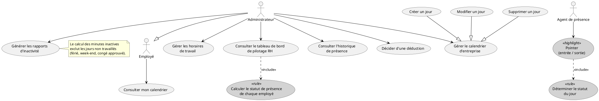
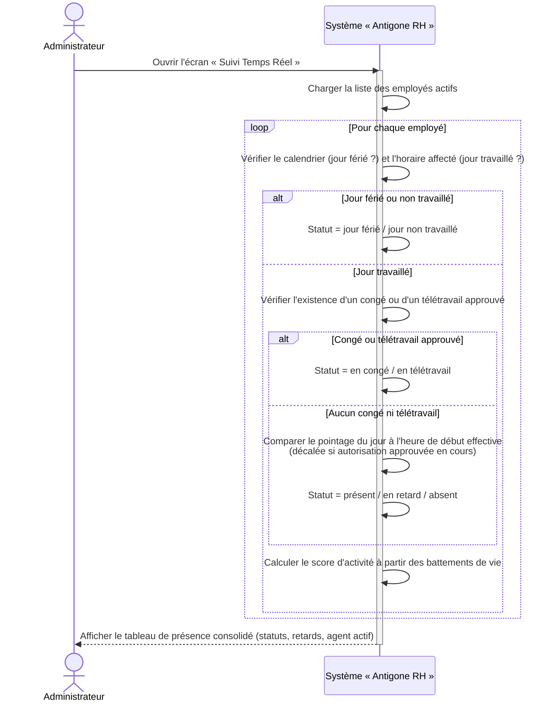
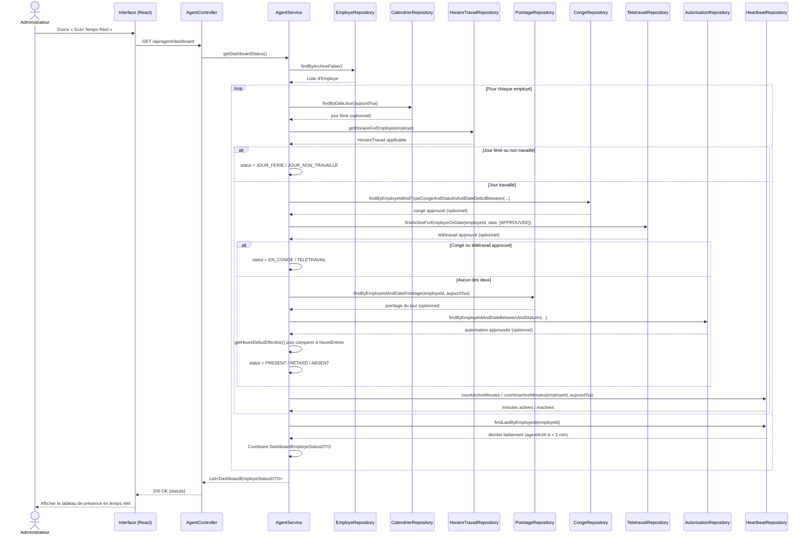
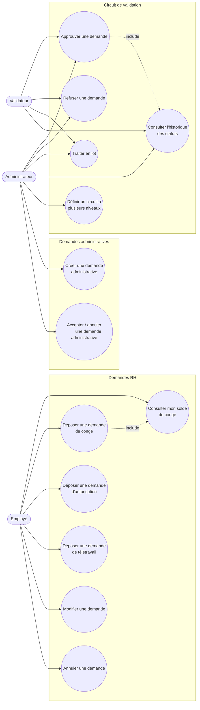
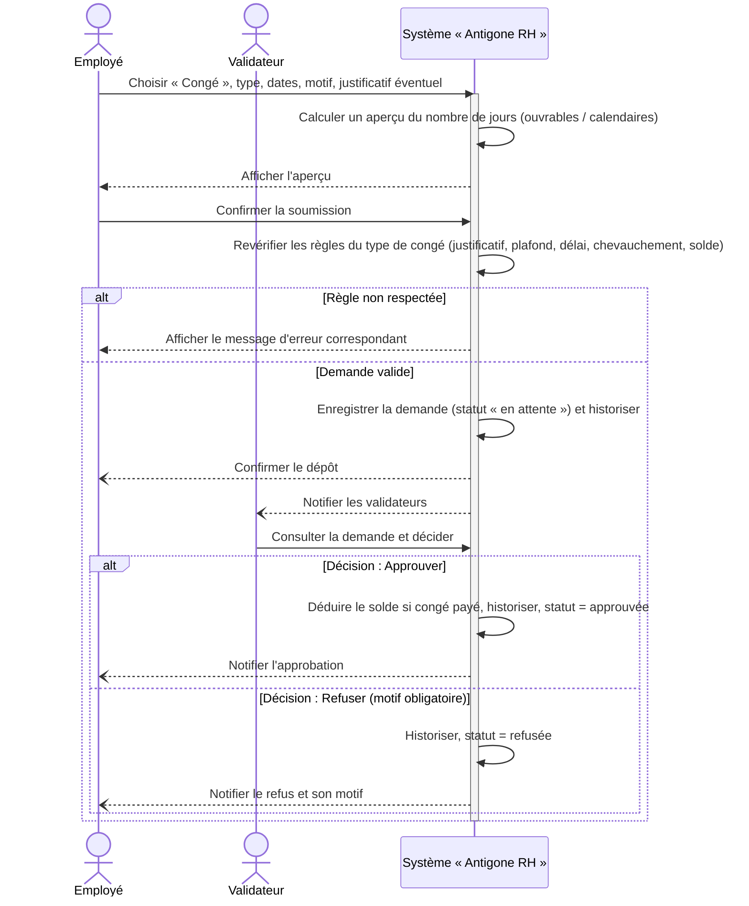
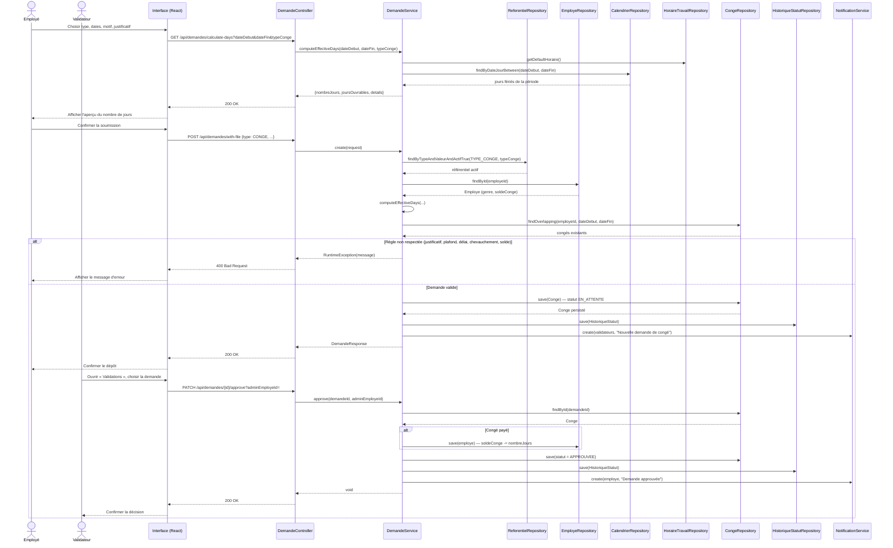

# Chapitre IV : Release 2 — Organisation RH

## IV.1 Introduction

Le chapitre précédent a posé le socle de la plateforme : authentification sécurisée, rôles et permissions, notifications in-app, référentiels paramétrables, puis administration complète des identités — comptes, employés, clients. Ce socle une fois en place, il devient possible de s'attaquer au cœur du métier RH proprement dit : organiser le temps de travail et instruire les demandes des employés.

**Release 2 — Organisation RH** rassemble les Sprints 3 et 4. Elle se découpe en deux moitiés complémentaires. Le Sprint 3 met en place tout ce qui permet de *cadrer* le temps de travail — calendrier d'entreprise, horaires, pointage automatisé par un agent de bureau (module M5 — Calendrier & Horaires) — et de le *superviser* à travers un tableau de bord de pilotage RH en temps réel (module M8 — Tableau de bord de pilotage). Le Sprint 4 s'appuie directement sur ce cadrage pour instruire les demandes RH proprement dites — congés (douze types), autorisations de sortie, télétravail — jusqu'à leur décision par un validateur, avec traçabilité complète de chaque changement de statut (module M7 — Demandes RH).

Cette séparation n'est pas arbitraire : le calcul du nombre de jours décomptés d'une demande de congé (Sprint 4) dépend directement du calendrier et des horaires configurés au Sprint 3 ; de même, le tableau de bord de pilotage RH affiche, pour chaque employé, un statut qui combine à la fois les données de pointage (Sprint 3) et les congés ou télétravails approuvés (Sprint 4). Le Sprint 3 construit donc l'infrastructure d'observation, le Sprint 4 l'exploite pour faire vivre le circuit de décision.

Comme au chapitre précédent, nous suivons pour chacun des deux sprints la même démarche : backlog de sprint, diagramme de cas d'utilisation, inventaire des services web exposés, puis description détaillée d'un cas d'utilisation représentatif (description textuelle, diagramme de séquence système et diagramme de séquence objet).

---

## IV.2 Backlog du Sprint 3

Le Sprint 3 couvre le module M5 (Calendrier & Horaires) et le module M8 (Tableau de bord de pilotage), pour une charge totale de 22 points. Chaque user story est décomposée en tâches de développement, estimées individuellement.

<table>
<thead>
<tr><th>User Story</th><th>Tâches</th><th>Estimation</th></tr>
</thead>
<tbody>

<tr><td rowspan="4">En tant qu'administrateur, je veux paramétrer le calendrier d'entreprise (jours fériés, jours spéciaux, jours de télétravail imposé) afin que les jours non travaillés soient reconnus automatiquement par le système.</td><td>Développer l'API CRUD des jours du calendrier (type de jour, origine, jour payé ou non).</td><td>1</td></tr>
<tr><td>Implémenter la contrainte d'unicité par date et les filtres par type et par période.</td><td>1</td></tr>
<tr><td>Réaliser l'interface d'administration du calendrier (liste, formulaire de création/modification).</td><td>1</td></tr>
<tr><td>Tester la fonctionnalité.</td><td>1</td></tr>

<tr><td rowspan="3">En tant qu'administrateur, je veux définir un ou plusieurs horaires de travail (heures d'entrée/sortie, pause déjeuner, jours travaillés, jours de télétravail) afin d'adapter les horaires selon la saison ou le profil de poste.</td><td>Développer l'API CRUD des horaires de travail.</td><td>1</td></tr>
<tr><td>Réaliser l'interface de gestion des horaires.</td><td>1</td></tr>
<tr><td>Tester la fonctionnalité.</td><td>1</td></tr>

<tr><td rowspan="5">En tant qu'employé, je veux que mon entrée et ma sortie soient enregistrées automatiquement par un agent installé sur mon poste afin de ne pas avoir à pointer manuellement.</td><td>Développer l'API de configuration de l'agent (horaires, jours fériés de l'année, réseau d'entreprise, tolérances).</td><td>1</td></tr>
<tr><td>Développer l'API de réception des battements de vie (heartbeat) avec détection du réseau d'entreprise.</td><td>1</td></tr>
<tr><td>Développer l'API de traitement des événements de pointage (entrée/sortie) avec détermination automatique du statut du jour.</td><td>1</td></tr>
<tr><td>Implémenter le remplissage automatique de l'heure de sortie oubliée (tâche planifiée).</td><td>1</td></tr>
<tr><td>Tester la fonctionnalité.</td><td>1</td></tr>

<tr><td rowspan="4">En tant qu'administrateur, je veux consulter un tableau de bord de suivi de présence en temps réel afin de visualiser en un coup d'œil qui est présent, en retard, absent, en congé ou en télétravail.</td><td>Développer l'API de calcul du statut journalier de chaque employé (cascade jour férié / horaire / congé / télétravail / retard).</td><td>1</td></tr>
<tr><td>Réaliser l'interface de suivi en temps réel (tableau de présence, code couleur par statut).</td><td>1</td></tr>
<tr><td>Développer l'API et l'interface d'historique de présence par employé et par période.</td><td>1</td></tr>
<tr><td>Tester la fonctionnalité.</td><td>1</td></tr>

<tr><td rowspan="3">En tant qu'administrateur, je veux que le système détecte automatiquement les inactivités et les retards excessifs et propose une déduction sur salaire afin de limiter le suivi manuel des temps de travail.</td><td>Développer l'API de génération des rapports d'inactivité (cumul des minutes inactives et des retards sur la période).</td><td>1</td></tr>
<tr><td>Développer l'API et l'interface de décision (déduire / annuler) sur un rapport.</td><td>1</td></tr>
<tr><td>Tester la fonctionnalité.</td><td>1</td></tr>

<tr><td rowspan="3">En tant qu'administrateur, je veux consulter un tableau de bord RH global (effectifs, demandes en cours, présence) afin de piloter l'activité RH depuis un écran unique.</td><td>Développer l'API de statistiques employés (effectifs, masse salariale, répartitions par département / contrat / genre / poste).</td><td>1</td></tr>
<tr><td>Réaliser l'interface du tableau de bord RH agrégeant effectifs, demandes et présence.</td><td>1</td></tr>
<tr><td>Tester la fonctionnalité.</td><td>1</td></tr>

<tr><td colspan="2" align="right"><strong>Total</strong></td><td><strong>22</strong></td></tr>

</tbody>
</table>

*Table IV.1 — Backlog du Sprint 3*

---

## IV.3 Diagramme de cas d'utilisation du Sprint 3

*Figure IV.1 — Diagramme de cas d'utilisation du Sprint 3*

Trois précisions sur ce diagramme. Le pointage (UC_Pointer) n'est jamais déclenché manuellement par l'employé : c'est l'agent de bureau, acteur secondaire, qui envoie l'événement d'entrée/sortie ; ce cas d'utilisation *inclut* systématiquement la détermination du statut du jour, une cascade réellement implémentée dans `AgentService.processEvent()` (jour férié → jour non travaillé selon l'horaire → congé approuvé → télétravail approuvé → retard/présent selon l'heure effective). De la même façon, consulter le tableau de bord de pilotage (UC_Dashboard) *inclut* le calcul du statut de présence de chaque employé, exposé par `AgentService.getDashboardStatus()`. Enfin, la génération des rapports d'inactivité exclut volontairement les jours non travaillés du décompte des minutes inactives, via `AgentService.isJourOuvrePourEmploye()` — une règle qui évite de pénaliser un employé pour son inactivité un jour férié ou en congé.

---

## IV.4 Services Web

Le Sprint 3 expose les points d'entrée REST suivants, répartis en trois familles.

**Calendrier — `/api/calendrier`**

| Méthode | URL | Description |
|---|---|---|
| GET | `/api/calendrier/jours` | Lister tous les jours du calendrier (fériés / spéciaux) |
| GET | `/api/calendrier/jours/{id}` | Consulter le détail d'un jour |
| GET | `/api/calendrier/jours/type/{typeJour}` | Lister les jours d'un type donné |
| GET | `/api/calendrier/jours/periode?debut&fin` | Lister les jours d'une période |
| GET | `/api/calendrier/jours/feries/{annee}` | Lister les jours fériés d'une année |
| POST | `/api/calendrier/jours` | Créer un jour du calendrier |
| PUT | `/api/calendrier/jours/{id}` | Modifier un jour du calendrier |
| DELETE | `/api/calendrier/jours/{id}` | Supprimer un jour du calendrier |
| GET | `/api/calendrier/horaires` | Lister tous les horaires de travail |
| GET | `/api/calendrier/horaires/{id}` | Consulter le détail d'un horaire |
| POST | `/api/calendrier/horaires` | Créer un horaire de travail |
| PUT | `/api/calendrier/horaires/{id}` | Modifier un horaire de travail |
| DELETE | `/api/calendrier/horaires/{id}` | Supprimer un horaire de travail |

**Agent de présence & Pointage — `/api/agent`**

| Méthode | URL | Description |
|---|---|---|
| GET | `/api/agent/config` | Récupérer la configuration de l'agent (horaires, jours fériés, réseau, tolérances) |
| POST | `/api/agent/heartbeat` | Recevoir un battement de vie (actif/inactif, réseau détecté) |
| POST | `/api/agent/event` | Recevoir un événement de pointage (entrée / sortie) |
| POST | `/api/agent/presence-confirm` | Recevoir la confirmation d'une pop-up de présence |
| GET | `/api/agent/dashboard` | Statut de présence en temps réel de tous les employés |
| GET | `/api/agent/historique/{employeId}?debut&fin` | Historique de présence d'un employé sur une période |
| GET | `/api/agent/historique?debut&fin` | Historique de présence de tous les employés sur une période |
| GET | `/api/agent/status/{employeId}` | Vérifier si l'agent de bureau est actif pour un employé |
| GET | `/api/agent/download` | Télécharger l'installeur de l'agent de bureau |
| GET | `/api/agent/rapports` | Lister les rapports d'inactivité |
| POST | `/api/agent/rapports/generer` | Générer les rapports depuis la dernière décision jusqu'à aujourd'hui |
| POST | `/api/agent/rapports/generer-periode?debut&fin` | Générer les rapports sur une période explicite |
| PUT | `/api/agent/rapports/{id}/decision` | Décider (déduire / annuler) sur un rapport d'inactivité |

**Pilotage RH — `/api/employes` (extraits)**

| Méthode | URL | Description |
|---|---|---|
| GET | `/api/employes/stats` | Statistiques employés (effectifs, masse salariale, répartitions) |
| GET | `/api/employes/horaire-entreprise` | Horaire par défaut de l'entreprise et durée maximale d'autorisation |
| GET | `/api/employes/on-leave-today` | Liste des employés en congé approuvé aujourd'hui |

---

## IV.5 Les cas d'utilisation du Sprint 3

### IV.5.1 Cas d'utilisation : « Consulter le tableau de bord de pilotage RH »

#### IV.5.1.1 Description textuelle

| Élément | Description |
|---|---|
| **Acteurs** | Administrateur (ou tout utilisateur interne disposant de la permission `VIEW_MONITORING`) |
| **Objectif** | Visualiser en temps réel le statut de présence de chaque employé (présent, en retard, absent, en congé, en télétravail, jour férié, jour non travaillé) à partir des données de pointage, de calendrier et d'horaires |
| **Pré-condition** | Le calendrier et au moins un horaire de travail sont configurés (cf. IV.9 pour les cas d'utilisation ayant produit ces données). Les employés peuvent disposer, ou non, de l'agent de présence installé sur leur poste |

**Scénario principal**

1. L'administrateur ouvre l'écran « Suivi Temps Réel ».
2. Le système charge la liste des employés actifs (non archivés).
3. Pour chaque employé, le système vérifie si le jour courant est férié (calendrier) ; sinon, il détermine si c'est un jour travaillé selon l'horaire affecté à l'employé (ou l'horaire par défaut de l'entreprise).
4. Si le jour est férié ou non travaillé, le système attribue directement le statut correspondant.
5. Sinon, le système recherche un congé ou un télétravail approuvé couvrant la date du jour.
6. En l'absence de congé ou de télétravail, le système consulte le pointage du jour de l'employé et recherche une éventuelle autorisation approuvée décalant l'heure de début effective.
7. Le système compare l'heure d'entrée pointée à l'heure de début effective pour déterminer le statut « présent » ou « en retard » (avec le nombre de minutes de retard), ou « absent » en l'absence de tout pointage.
8. Pour les employés dont le jour est travaillé, le système calcule, à partir des battements de vie envoyés par l'agent de bureau, le nombre de minutes actives et inactives de la journée, et détermine si l'agent est actuellement actif (dernier battement reçu il y a moins de deux minutes).
9. Le système retourne la liste consolidée à l'interface, qui l'affiche sous forme de tableau avec un code couleur par statut.

**Scénarios alternatifs**

- **A1 — Aucun pointage sur un jour travaillé** : à l'étape 7, le système attribue le statut « absent ».
- **A2 — Autorisation de sortie en cours couvrant le début de journée** : l'heure de début effective est décalée d'autant à l'étape 6, ce qui évite de compter à tort un retard pour l'employé.
- **A3 — Agent de bureau non installé ou injoignable** : l'indicateur « agent actif » reste à faux et le score d'activité n'est pas calculé, mais le statut de pointage déjà connu (s'il existe) continue d'être affiché.

#### IV.5.1.2 Diagramme de séquence système

#### IV.5.1.3 Diagramme de séquence objet

---

## IV.6 Backlog du Sprint 4

Le Sprint 4 couvre le module M7 (Demandes RH), pour une charge totale de 29 points. Chaque user story est décomposée en tâches de développement, estimées individuellement.

<table>
<thead>
<tr><th>User Story</th><th>Tâches</th><th>Estimation</th></tr>
</thead>
<tbody>

<tr><td rowspan="3">En tant qu'employé, je veux consulter mon solde de congé calculé automatiquement selon mon ancienneté afin de savoir combien de jours il me reste avant de déposer une demande.</td><td>Développer l'API de calcul du solde de congé (ancienneté, taux mensuel, report d'une année sur l'autre, jours consommés et en attente).</td><td>1</td></tr>
<tr><td>Réaliser l'affichage du solde sur le tableau de bord de l'employé.</td><td>1</td></tr>
<tr><td>Tester la fonctionnalité.</td><td>1</td></tr>

<tr><td rowspan="6">En tant qu'employé, je veux déposer une demande de congé en choisissant parmi douze types, avec calcul automatique du nombre de jours et upload d'un justificatif si nécessaire, afin de faire valider mon absence sans échange papier.</td><td>Développer l'API de calcul intelligent du nombre de jours (jours ouvrables, jours fériés « sandwichés », règle des 3× pour le congé payé).</td><td>1</td></tr>
<tr><td>Implémenter les règles spécifiques à chaque type de congé (plafonds maladie / maternité / décès, types réservés aux femmes, justificatif obligatoire).</td><td>1</td></tr>
<tr><td>Implémenter le contrôle de chevauchement avec une demande existante et de solde disponible.</td><td>1</td></tr>
<tr><td>Développer l'API de création avec upload de justificatif (multipart).</td><td>1</td></tr>
<tr><td>Réaliser le formulaire de dépôt (aperçu du nombre de jours avant soumission).</td><td>1</td></tr>
<tr><td>Tester la fonctionnalité.</td><td>1</td></tr>

<tr><td rowspan="3">En tant qu'employé, je veux déposer une demande d'autorisation de sortie (date, heure de début, heure de fin) afin de m'absenter ponctuellement sans que cela soit compté comme un jour de congé.</td><td>Développer l'API de création avec contrôle du quota mensuel et des horaires d'entreprise.</td><td>1</td></tr>
<tr><td>Réaliser le formulaire de dépôt.</td><td>1</td></tr>
<tr><td>Tester la fonctionnalité.</td><td>1</td></tr>

<tr><td rowspan="2">En tant qu'employé, je veux déposer une demande de télétravail sur une période donnée afin de faire reconnaître mes jours de travail à distance dans le pointage.</td><td>Développer l'API de création d'une demande de télétravail.</td><td>1</td></tr>
<tr><td>Tester la fonctionnalité.</td><td>1</td></tr>

<tr><td rowspan="3">En tant qu'employé, je veux modifier ou annuler une demande tant qu'elle n'a pas été traitée afin de corriger une erreur de saisie ou revenir sur ma décision.</td><td>Développer l'API de modification (avec re-validation des règles métier du type concerné).</td><td>1</td></tr>
<tr><td>Développer l'API d'annulation.</td><td>1</td></tr>
<tr><td>Tester la fonctionnalité.</td><td>1</td></tr>

<tr><td rowspan="5">En tant que validateur, je veux approuver ou refuser une demande, individuellement ou en lot, afin de traiter rapidement les demandes de mon équipe.</td><td>Développer l'API d'approbation (déduction du solde pour un congé payé, historisation, notification).</td><td>1</td></tr>
<tr><td>Développer l'API de refus (motif obligatoire, historisation, notification).</td><td>1</td></tr>
<tr><td>Développer l'API de traitement par lot (approbation ou refus de plusieurs demandes).</td><td>1</td></tr>
<tr><td>Réaliser l'interface de validation (liste des demandes en attente, actions individuelles et groupées).</td><td>1</td></tr>
<tr><td>Tester la fonctionnalité.</td><td>1</td></tr>

<tr><td rowspan="2">En tant qu'administrateur, je veux consulter l'historique complet des changements de statut d'une demande afin de disposer d'une traçabilité en cas de litige.</td><td>Développer l'API d'historique des statuts d'une demande.</td><td>1</td></tr>
<tr><td>Tester la fonctionnalité.</td><td>1</td></tr>

<tr><td rowspan="3">En tant qu'administrateur, je veux mettre en place un circuit de validation à plusieurs niveaux (plusieurs validateurs successifs) afin de pouvoir faire remonter certaines demandes sensibles à plusieurs responsables.</td><td>Développer l'API de définition des étapes de validation (validateur, ordre).</td><td>1</td></tr>
<tr><td>Développer l'API de décision par étape (la demande n'est approuvée que lorsque toutes les étapes le sont ; un refus à une étape refuse immédiatement la demande).</td><td>1</td></tr>
<tr><td>Tester la fonctionnalité.</td><td>1</td></tr>

<tr><td rowspan="2">En tant qu'administrateur, je veux gérer les demandes administratives « papier » (attestations, ordres de mission…) hors circuit congé/autorisation afin de tracer aussi ces échanges dans le système.</td><td>Développer l'API de création, d'acceptation et d'annulation d'une demande administrative.</td><td>1</td></tr>
<tr><td>Tester la fonctionnalité.</td><td>1</td></tr>

<tr><td colspan="2" align="right"><strong>Total</strong></td><td><strong>29</strong></td></tr>

</tbody>
</table>

*Table IV.2 — Backlog du Sprint 4*

---

## IV.7 Diagramme de cas d'utilisation du Sprint 4

*Figure IV.2 — Diagramme de cas d'utilisation du Sprint 4*

Le « Validateur » n'est pas un rôle figé dans le code : c'est tout employé dont le rôle porte la permission `VIEW_VALIDATIONS`, définie et attribuée comme n'importe quel autre rôle via le module de gestion des rôles du Sprint 1. Déposer une demande de congé (UC2) *inclut* la consultation du solde (UC1), puisque `DemandeService.createConge()` vérifie systématiquement `employe.getSoldeConge()` avant d'accepter un congé payé. Approuver une demande (UC7) *inclut* l'historisation (UC10), chaque décision étant tracée dans `HistoriqueStatut`. Le circuit à plusieurs niveaux (UC11), exposé indépendamment via `/api/validations`, permet d'enchaîner plusieurs validateurs sur une même demande — la demande n'est approuvée que lorsque toutes les étapes le sont, mais un refus à une étape la refuse immédiatement ; en pratique, la majorité des demandes suivent le circuit à un seul niveau porté par `approve`/`refuse` (UC7/UC8), le circuit multi-niveaux restant disponible pour les cas de validation hiérarchique plus poussés.

---

## IV.8 Services Web

**Demandes RH — `/api/demandes`**

| Méthode | URL | Description |
|---|---|---|
| GET | `/api/demandes` | Lister toutes les demandes (congés, autorisations, télétravails) |
| GET | `/api/demandes/{id}` | Consulter le détail d'une demande |
| GET | `/api/demandes/employe/{employeId}` | Lister les demandes d'un employé |
| GET | `/api/demandes/statut/{statut}` | Lister les demandes filtrées par statut |
| POST | `/api/demandes` | Créer une demande (corps JSON) |
| POST | `/api/demandes/with-file` | Créer une demande avec upload d'un justificatif (multipart) |
| PUT | `/api/demandes/{id}` | Modifier une demande (uniquement si en attente) |
| PUT | `/api/demandes/{id}/with-file` | Modifier une demande et remplacer son justificatif |
| GET | `/api/demandes/fichier/{filename}` | Télécharger un justificatif |
| PATCH | `/api/demandes/{id}/approve?adminEmployeId=` | Approuver une demande |
| PATCH | `/api/demandes/{id}/refuse?adminEmployeId&commentaire` | Refuser une demande |
| PATCH | `/api/demandes/{id}/cancel` | Annuler une demande (côté employé) |
| PATCH | `/api/demandes/batch/approve?adminEmployeId=` | Approuver un lot de demandes |
| PATCH | `/api/demandes/batch/refuse?adminEmployeId&commentaire` | Refuser un lot de demandes |
| GET | `/api/demandes/{id}/historique` | Historique des changements de statut d'une demande |
| GET | `/api/demandes/calculate-days?dateDebut&dateFin&typeConge` | Prévisualiser le nombre de jours décomptés avant soumission |

**Circuit de validation — `/api/validations`**

| Méthode | URL | Description |
|---|---|---|
| GET | `/api/validations/demande/{demandeId}` | Lister les étapes de validation d'une demande, dans l'ordre |
| GET | `/api/validations/validateur/{validateurId}` | Lister toutes les étapes assignées à un validateur |
| GET | `/api/validations/validateur/{validateurId}/pending` | Lister les étapes en attente pour un validateur |
| POST | `/api/validations` | Créer une étape de validation (demande, validateur, ordre) |
| PATCH | `/api/validations/{id}/approve?commentaire=` | Approuver une étape (fait avancer la demande si toutes les étapes sont approuvées) |
| PATCH | `/api/validations/{id}/refuse?commentaire=` | Refuser une étape (refuse immédiatement la demande) |

**Demandes administratives — `/api/demandes-papier`**

| Méthode | URL | Description |
|---|---|---|
| GET | `/api/demandes-papier` | Lister toutes les demandes administratives |
| GET | `/api/demandes-papier/{id}` | Consulter le détail d'une demande administrative |
| POST | `/api/demandes-papier` | Créer une demande administrative (statut brouillon) |
| PATCH | `/api/demandes-papier/{id}/accept` | Accepter une demande administrative |
| PATCH | `/api/demandes-papier/{id}/cancel` | Annuler une demande administrative (motif requis) |

**Solde de congé — `/api/employes` (extraits)**

| Méthode | URL | Description |
|---|---|---|
| GET | `/api/employes/{id}/solde-info` | Détail complet du calcul du solde (ancienneté, droits, jours acquis, reportés, consommés, disponible) |
| PATCH | `/api/employes/{id}/solde-conge?solde=` | Forcer manuellement le solde de congé d'un employé |

---

## IV.9 Les cas d'utilisation du Sprint 4

### IV.9.1 Cas d'utilisation : « Déposer une demande de congé »

#### IV.9.1.1 Description textuelle

| Élément | Description |
|---|---|
| **Acteurs** | Employé (acteur principal) ; Validateur — employé dont le rôle porte la permission `VIEW_VALIDATIONS`, ou Administrateur (destinataire de la demande et décideur) |
| **Objectif** | Permettre à un employé de soumettre une demande d'absence, avec calcul automatique du nombre de jours décomptés et vérification des règles propres à chaque type de congé, jusqu'à l'obtention d'une décision tracée du validateur |
| **Pré-condition** | L'employé est authentifié et sa fiche est complète (genre, date d'embauche). Le type de congé demandé est actif dans le référentiel `TYPE_CONGE`. Le calendrier et au moins un horaire de travail sont configurés (cf. IV.5) |

**Scénario principal**

1. L'employé accède à l'écran « Nouvelle demande » et sélectionne le type « Congé ».
2. Le système affiche la liste des types de congé actifs, parmi les douze prévus (payé, maladie, maternité, paternité, sans solde, exceptionnel, formation, récupération, administratif, règles, décès d'un proche, décès en famille), les types réservés aux femmes (maternité, règles) étant filtrés selon le genre de l'employé.
3. L'employé choisit un type, une date de début, une date de fin, saisit un motif et joint un justificatif si le type l'exige.
4. Le système calcule et affiche un aperçu du nombre de jours calendaires et du nombre de jours ouvrables qui seront décomptés du solde, en tenant compte des jours fériés « sandwichés » entre deux jours travaillés du congé.
5. L'employé confirme la soumission.
6. Le système revérifie l'ensemble des règles propres au type sélectionné : présence du justificatif si obligatoire, plafond de jours (2 j. pour un congé maladie, 1 j. pour un congé « règles », 90 j. pour un congé maternité, 5 j. pour un décès d'un proche, 1 j. pour un décès en famille), délai de prévenance d'au moins trois fois le nombre de jours demandés pour un congé payé, interdiction de poser un congé payé isolé un vendredi, absence de chevauchement avec une autre demande de congé, et solde de congé suffisant (congé payé uniquement).
7. Le système enregistre la demande avec le statut « en attente », historise sa création et notifie les validateurs.
8. L'interface confirme le dépôt et affiche la demande dans la liste « Mes demandes ».
9. Le validateur consulte la demande dans l'écran « Validations » et choisit de l'approuver ou de la refuser, individuellement ou en lot avec d'autres demandes.
10. En cas d'approbation d'un congé payé, le système déduit le nombre de jours ouvrables du solde de l'employé, historise le changement de statut et notifie l'employé.
11. En cas de refus, le validateur saisit un motif obligatoire ; le système historise le refus et notifie l'employé avec ce motif.

**Scénarios alternatifs**

- **A1 — Justificatif manquant** : à l'étape 6, pour un type l'exigeant (maladie, décès, maternité), le système refuse la soumission et indique le justificatif attendu.
- **A2 — Plafond dépassé ou règle de genre non respectée** : le système affiche le message correspondant (par exemple « Ce type de congé est réservé aux femmes » ou « Le congé maladie est plafonné à 2 jours »).
- **A3 — Délai de prévenance insuffisant ou congé payé isolé un vendredi** : le système invite l'employé à choisir un congé sans solde ou à avancer sa demande.
- **A4 — Chevauchement avec une demande existante** : le système affiche « Une demande de congé existe déjà sur cette période ».
- **A5 — Solde insuffisant** : le système affiche le solde disponible et refuse la soumission.
- **A6 — Modification ou annulation** : tant que la demande reste « en attente », l'employé peut la modifier (les règles sont réévaluées) ou l'annuler.

#### IV.9.1.2 Diagramme de séquence système

#### IV.9.1.3 Diagramme de séquence objet

---

## IV.10 Conclusion

Cette deuxième release a transformé le socle du chapitre précédent en un véritable outil d'organisation du temps de travail. Le Sprint 3 a doté la plateforme d'un calendrier d'entreprise, d'horaires paramétrables et d'un pointage automatisé par agent de bureau, le tout restitué en temps réel dans un tableau de bord de pilotage RH qui recoupe pointage, calendrier et demandes approuvées pour chaque employé. Le Sprint 4 a exploité cette infrastructure pour instruire les demandes RH elles-mêmes — douze types de congé au calcul de jours entièrement automatisé, autorisations de sortie contingentées, télétravail — jusqu'à leur décision par un validateur, avec une traçabilité complète de chaque changement de statut. Comme au chapitre précédent, la logique sensible (calcul du solde, des jours ouvrables, des plafonds par type de congé, des statuts de présence) reste intégralement portée par les services du backend.

La Release 3 — Projets & Plans médias, qui s'appuiera sur les fondations posées jusqu'ici, réutilisera les comptes employés et le système de notifications pour piloter les équipes de projet et faire circuler les échanges autour des plans médias, tandis que le portail client s'appuiera à son tour sur l'authentification dédiée et l'intégration Google Drive déjà mises en place côté fiche client.
