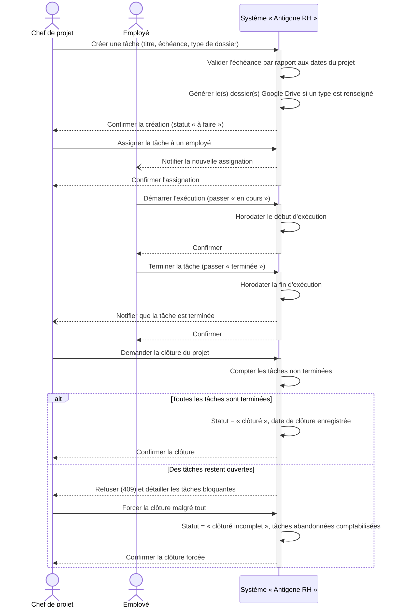
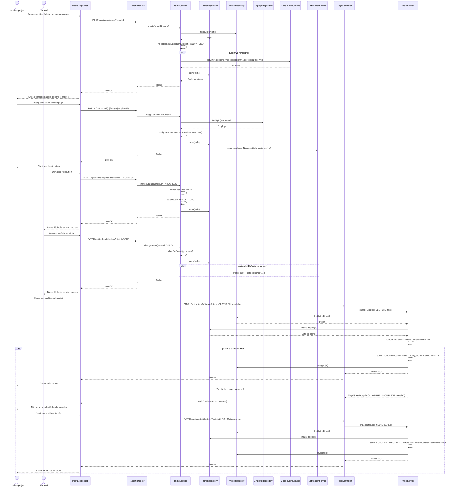
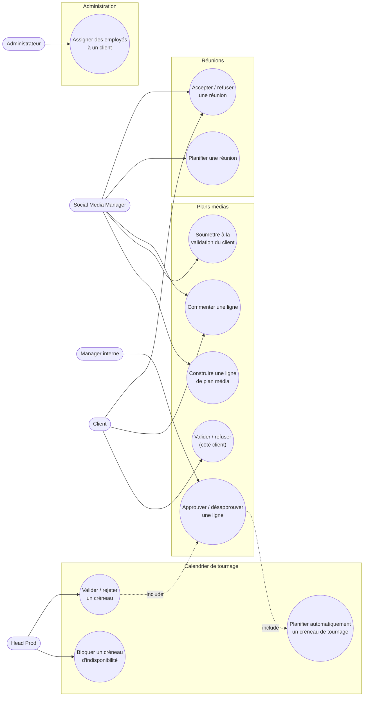
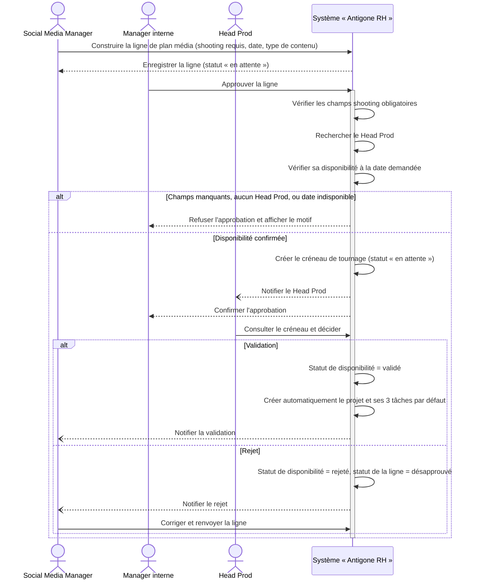
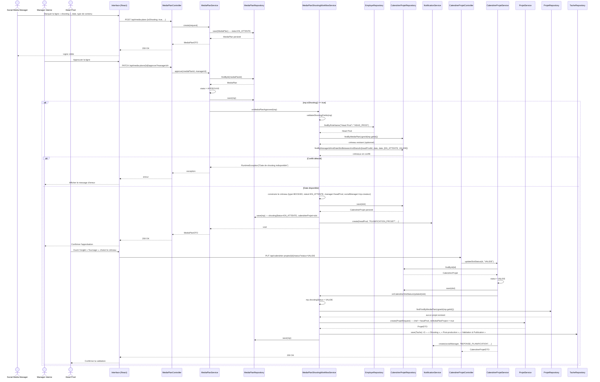

# Chapitre V : Release 3 — Projets & Plans Médias

## V.1 Introduction

Les deux chapitres précédents ont doté la plateforme d'un socle d'identités sécurisé puis d'un système complet d'organisation du temps de travail. Ce chapitre ouvre un troisième volet, de nature différente : il ne s'agit plus d'administrer des personnes ou d'instruire des demandes RH, mais de piloter l'activité opérationnelle de l'agence elle-même — les projets qu'elle mène pour ses clients, et les contenus qu'elle produit pour eux.

**Release 3 — Projets & Plans médias** rassemble les Sprints 5 et 6. Le Sprint 5 met en place le module M9 (Projets, Équipes & Tâches) : créer et suivre un projet, constituer une équipe, répartir le travail sur un tableau Kanban, et clôturer proprement — ou de façon assumée — une fois le périmètre couvert. Le Sprint 6 s'appuie directement sur cette base pour construire le module M10 (Plans médias & Planification) : bâtir le calendrier de publication d'un client (le *plan média*), le faire approuver en interne puis par le client, planifier les tournages qu'il nécessite en réservant un créneau soumis à la validation d'un responsable de production, et organiser les réunions de projet.

Cette release marque une inflexion par rapport aux deux précédentes : pour la première fois, un module construit à un sprint devient lui-même une dépendance technique consommée par le sprint suivant, plutôt qu'un simple socle partagé. Lorsqu'une ligne de plan média « shooting » est validée par le responsable de production (Sprint 6), le système appelle directement `ProjetService.create()` et persiste des `Tache` via `TacheRepository` (Sprint 5) pour matérialiser automatiquement le projet de tournage — sans repasser par l'interface. Les fondations posées en Release 1 restent elles aussi mobilisées : les employés et les clients gérés dans le Sprint 2 sont les chefs de projet, les membres d'équipe et les destinataires des plans médias, et le système de notifications du Sprint 1 relaie chaque décision (assignation, validation, rejet) aux bonnes personnes.

Comme aux chapitres précédents, nous suivons pour chacun des deux sprints la même démarche : backlog de sprint, diagramme de cas d'utilisation, inventaire des services web exposés, puis description détaillée d'un cas d'utilisation représentatif (description textuelle, diagramme de séquence système et diagramme de séquence objet).

---

## V.2 Backlog du Sprint 5

Le Sprint 5 couvre le module M9 (Projets, Équipes & Tâches), pour une charge totale de 33 points. Chaque user story est décomposée en tâches de développement, estimées individuellement.

<table>
<thead>
<tr><th>User Story</th><th>Tâches</th><th>Estimation</th></tr>
</thead>
<tbody>

<tr><td rowspan="4">En tant que chef de projet, je veux créer un projet (nom, dates, type déterminé ou indéterminé, client, chef(s) de projet, équipe(s), membres) afin de cadrer une nouvelle mission avant d'y répartir des tâches.</td><td>Développer l'API de création d'un projet (statut initial forcé à PLANIFIE, validation des dates selon le type déterminé/indéterminé).</td><td>1</td></tr>
<tr><td>Implémenter l'affectation des chefs de projet, des équipes (contrôle qu'une équipe n'est rattachée qu'à un seul projet à la fois) et des membres directs.</td><td>1</td></tr>
<tr><td>Réaliser le formulaire de création d'un projet.</td><td>1</td></tr>
<tr><td>Tester la fonctionnalité.</td><td>1</td></tr>

<tr><td rowspan="4">En tant que chef de projet, je veux modifier un projet et le clôturer une fois les tâches terminées — ou forcer sa clôture si certaines restent ouvertes — afin que son statut reflète fidèlement son avancement réel.</td><td>Développer l'API de modification d'un projet (dates, chefs, équipes, membres, désassociation des équipes retirées).</td><td>1</td></tr>
<tr><td>Développer l'API de changement de statut avec contrôle des tâches non terminées avant clôture, et clôture forcée (statut CLOTURE_INCOMPLET, décompte des tâches abandonnées).</td><td>1</td></tr>
<tr><td>Réaliser l'interface de modification et la modale de confirmation de clôture forcée.</td><td>1</td></tr>
<tr><td>Tester la fonctionnalité.</td><td>1</td></tr>

<tr><td rowspan="2">En tant que chef de projet, je veux supprimer un projet devenu obsolète afin de garder la liste des projets à jour.</td><td>Développer l'API de suppression (détachement des équipes, purge des réactifs internes liés aux tâches, suppression en cascade des tâches).</td><td>1</td></tr>
<tr><td>Tester la fonctionnalité.</td><td>1</td></tr>

<tr><td rowspan="4">En tant que chef de projet, je veux constituer une ou plusieurs équipes et gérer leurs membres afin de répartir les collaborateurs disponibles sur mes projets.</td><td>Développer l'API CRUD d'une équipe (nom, projet optionnel, membres).</td><td>1</td></tr>
<tr><td>Développer l'API d'ajout/retrait d'un membre (notification à l'ajout) et de rattachement d'une équipe à un projet.</td><td>1</td></tr>
<tr><td>Réaliser l'interface de gestion des équipes.</td><td>1</td></tr>
<tr><td>Tester la fonctionnalité.</td><td>1</td></tr>

<tr><td rowspan="4">En tant que chef de projet, je veux répartir les tâches d'un projet sur un tableau Kanban et les assigner à un employé afin de suivre visuellement l'avancement du travail.</td><td>Développer l'API de création d'une tâche (statut TODO forcé, validation de l'échéance par rapport aux dates du projet, génération automatique du/des dossier(s) Google Drive selon le type renseigné).</td><td>1</td></tr>
<tr><td>Développer l'API d'assignation d'une tâche à un employé (notification).</td><td>1</td></tr>
<tr><td>Réaliser le tableau Kanban (colonnes « à faire / en cours / terminée », glisser-déposer).</td><td>1</td></tr>
<tr><td>Tester la fonctionnalité.</td><td>1</td></tr>

<tr><td rowspan="4">En tant qu'employé, je veux faire avancer mes tâches assignées afin de refléter mon avancement réel auprès du chef de projet.</td><td>Développer l'API de changement de statut d'une tâche (blocage du passage à « en cours »/« terminée » sans employé assigné, horodatage automatique du début et de la fin d'exécution).</td><td>1</td></tr>
<tr><td>Développer la notification au chef de projet lorsqu'une tâche est marquée terminée.</td><td>1</td></tr>
<tr><td>Réaliser l'écran « Mes tâches ».</td><td>1</td></tr>
<tr><td>Tester la fonctionnalité.</td><td>1</td></tr>

<tr><td rowspan="3">En tant que chef de projet, je veux relancer un employé en retard ou modifier l'échéance d'une tâche, secondé par un rappel automatique à l'approche des échéances, afin de garder le projet dans les délais.</td><td>Développer l'API de relance manuelle (notification urgente à l'assigné) et de modification de l'échéance d'une tâche (notification de l'ancienne et de la nouvelle date).</td><td>1</td></tr>
<tr><td>Implémenter la tâche planifiée quotidienne de rappel automatique des échéances proches ou dépassées, et l'archivage automatique des tâches terminées depuis plus de 48 heures.</td><td>1</td></tr>
<tr><td>Tester la fonctionnalité.</td><td>1</td></tr>

<tr><td rowspan="3">En tant qu'administrateur, je veux consulter un rapport d'analyse du cycle de vie de chaque projet (délais de mise en place, de distribution, d'exécution et de clôture) afin d'identifier les goulots d'étranglement.</td><td>Développer l'API de calcul des quatre phases du cycle de vie d'un projet, des retards détectés à chaque étape et du temps passé par employé.</td><td>1</td></tr>
<tr><td>Réaliser l'interface du rapport d'analyse.</td><td>1</td></tr>
<tr><td>Tester la fonctionnalité.</td><td>1</td></tr>

<tr><td rowspan="3">En tant qu'administrateur, je veux suivre les compétences de chaque employé (nom, catégorie, niveau) afin de disposer d'une cartographie des savoir-faire disponibles pour constituer les équipes.</td><td>Développer l'API CRUD des compétences (niveau validé entre 1 et 5, notification à l'employé concerné à chaque création, modification ou suppression).</td><td>1</td></tr>
<tr><td>Réaliser l'interface de gestion des compétences.</td><td>1</td></tr>
<tr><td>Tester la fonctionnalité.</td><td>1</td></tr>

<tr><td rowspan="2">En tant qu'administrateur, je veux définir des tâches obligatoires récurrentes pour une équipe ou un employé sur des dates précises afin de les distinguer des tâches ponctuelles d'un projet.</td><td>Développer l'API CRUD des tâches obligatoires et l'interface associée (rattachées à une équipe et/ou un employé, liste de dates).</td><td>1</td></tr>
<tr><td>Tester la fonctionnalité.</td><td>1</td></tr>

<tr><td colspan="2" align="right"><strong>Total</strong></td><td><strong>33</strong></td></tr>

</tbody>
</table>

*Table V.1 — Backlog du Sprint 5*

---

## V.3 Diagramme de cas d'utilisation du Sprint 5

```plantuml
@startuml
skinparam usecase {
  BackgroundColor<<highlight>> LightGray
  BackgroundColor<<rule>> LightGray
}
skinparam ArrowColor Black
skinparam ActorBorderColor Black

actor "Employé" as Emp
actor "Chef de projet" as CP
actor "Administrateur" as Admin
CP --|> Emp
Admin --|> Emp

usecase "Créer un projet" as UC_CreateProj
usecase "Modifier un projet" as UC_UpdateProj
usecase "Clôturer un projet" as UC_CloseProj <<highlight>>
usecase "Vérifier les tâches\nnon terminées" as UC_CheckOpen <<rule>>
UC_CloseProj ..> UC_CheckOpen : <<include>>
usecase "Supprimer un projet" as UC_DeleteProj

usecase "Gérer une équipe" as UC_GererEquipe
usecase "Ajouter / retirer\nun membre" as UC_MembreEquipe
UC_MembreEquipe --|> UC_GererEquipe

usecase "Créer une tâche" as UC_CreateTache
usecase "Générer le(s) dossier(s)\nGoogle Drive" as UC_DriveTache <<rule>>
UC_CreateTache ..> UC_DriveTache : <<include>>
usecase "Assigner une tâche" as UC_AssignTache
usecase "Faire avancer une tâche\n(à faire → en cours → terminée)" as UC_ChangeStatutTache
usecase "Vérifier la présence\nd'un assigné" as UC_CheckAssignee <<rule>>
UC_ChangeStatutTache ..> UC_CheckAssignee : <<include>>
usecase "Relancer un employé /\nmodifier une échéance" as UC_Relance

usecase "Consulter le rapport\nd'analyse d'un projet" as UC_Rapport
usecase "Gérer les compétences" as UC_Competence
usecase "Définir des tâches\nobligatoires" as UC_TacheOblig

note right of UC_CloseProj
  Si des tâches restent ouvertes,
  la clôture est refusée (409) sauf
  si le chef de projet la force
  explicitement (statut CLOTURE_INCOMPLET).
end note

Emp --> UC_ChangeStatutTache

CP --> UC_CreateProj
CP --> UC_UpdateProj
CP --> UC_CloseProj
CP --> UC_DeleteProj
CP --> UC_GererEquipe
CP --> UC_CreateTache
CP --> UC_AssignTache
CP --> UC_Relance

Admin --> UC_Rapport
Admin --> UC_Competence
Admin --> UC_TacheOblig
@enduml
```

*Figure V.1 — Diagramme de cas d'utilisation du Sprint 5*

Quatre précisions sur ce diagramme. Clôturer un projet (UC_CloseProj) *inclut* systématiquement la vérification qu'aucune tâche n'est encore ouverte : `ProjetService.changeStatut(id, statut, force)` compte les tâches dont le statut diffère de `DONE` et, si des tâches restent ouvertes et que `force` vaut `false`, lève une `IllegalStateException("CLOTURE_INCOMPLETE:<n>:<détails>")` que le contrôleur traduit en HTTP 409 — le message structuré est directement consommé par le frontend pour afficher la liste des tâches bloquantes. Créer une tâche (UC_CreateTache) *inclut* la génération du ou des dossiers Google Drive lorsqu'un type est renseigné (`TacheService.create()` appelle `GoogleDriveService.getOrCreateTacheTypeFolder()` pour chaque type séparé par une virgule), mais cette étape échoue silencieusement — l'exception est journalisée sans jamais bloquer la création de la tâche. Faire avancer une tâche (UC_ChangeStatutTache) *inclut* la vérification de la présence d'un assigné : `TacheService.changeStatut()` refuse (409) tout passage à `IN_PROGRESS` ou `DONE` tant qu'aucun employé n'est assigné à la tâche. Enfin, point d'attention à signaler : contrairement aux modules Comptes ou Finance, aucun contrôleur de ce module ne porte d'annotation `@PreAuthorize` — l'accès à `/api/projets/**`, `/api/taches/**` et `/api/equipes/**` repose uniquement sur la règle générique `.anyRequest().authenticated()` de `SecurityConfig` ; la séparation entre ce que fait un Chef de projet et ce que fait un Employé reste, à ce stade, un contrat porté par le frontend plutôt qu'une garantie imposée par le backend.

---

## V.4 Services Web

Le Sprint 5 expose les points d'entrée REST suivants, répartis en six familles.

**Projets — `/api/projets`**

| Méthode | URL | Description |
|---|---|---|
| GET | `/api/projets` | Lister tous les projets |
| GET | `/api/projets/by-employe/{employeId}` | Lister les projets où l'employé est créateur, chef (legacy ou multi) ou membre |
| GET | `/api/projets/by-client/{clientId}` | Lister les projets liés à un client |
| GET | `/api/projets/{id}` | Consulter le détail d'un projet |
| GET | `/api/projets/statut/{statut}` | Lister les projets filtrés par statut |
| GET | `/api/projets/by-departement/{dept}` | Lister les projets où un membre ou un chef appartient au département donné |
| POST | `/api/projets` | Créer un projet (statut initial forcé `PLANIFIE`) |
| PUT | `/api/projets/{id}` | Modifier un projet (dates, chefs, équipes, membres, client) |
| PATCH | `/api/projets/{id}/statut?statut=&force=` | Changer le statut du projet (409 si des tâches restent ouvertes et `force=false`) |
| DELETE | `/api/projets/{id}` | Supprimer un projet (détache les équipes, purge les réactifs liés, cascade sur les tâches) |

**Tâches — `/api/taches`**

| Méthode | URL | Description |
|---|---|---|
| GET | `/api/taches` | Lister toutes les tâches, y compris archivées |
| GET | `/api/taches/{id}` | Consulter le détail d'une tâche |
| GET | `/api/taches/projet/{projetId}` | Tâches actives (non archivées) d'un projet |
| GET | `/api/taches/projet/{projetId}/archived` | Tâches archivées d'un projet |
| GET | `/api/taches/assignee/{employeId}` | Tâches actives assignées à un employé (avec infos projet/chef) |
| POST | `/api/taches/projet/{projetId}` | Créer une tâche dans un projet (statut forcé `TODO`) |
| PUT | `/api/taches/{id}` | Modifier une tâche |
| PUT | `/api/taches/{id}/unarchive` | Désarchiver une tâche |
| PATCH | `/api/taches/{id}/assign/{employeId}` | Assigner la tâche à un employé (notification) |
| PATCH | `/api/taches/{id}/statut?statut=` | Changer le statut (409 si passage `IN_PROGRESS`/`DONE` sans assigné) |
| DELETE | `/api/taches/{id}` | Supprimer une tâche |
| POST | `/api/taches/{id}/relance` | Envoyer une notification urgente de relance à l'assigné |
| PATCH | `/api/taches/{id}/deadline` | Modifier la date d'échéance (notifie l'assigné) |

**Équipes — `/api/equipes`**

| Méthode | URL | Description |
|---|---|---|
| GET | `/api/equipes` | Lister toutes les équipes |
| GET | `/api/equipes/{id}` | Consulter le détail d'une équipe |
| GET | `/api/equipes/projet/{projetId}` | Équipes rattachées à un projet |
| GET | `/api/equipes/projet/{projetId}/membres` | Liste dédupliquée de tous les employés liés au projet (équipes + chef + membres directs) |
| POST | `/api/equipes` | Créer une équipe (notifie les membres) |
| PUT | `/api/equipes/{id}` | Mettre à jour une équipe (notifie les membres de la nouvelle liste) |
| POST | `/api/equipes/{id}/membres/{employeId}` | Ajouter un membre (notification) |
| DELETE | `/api/equipes/{id}/membres/{employeId}` | Retirer un membre |
| PATCH | `/api/equipes/{id}/projet/{projetId}` | Rattacher l'équipe à un projet |
| DELETE | `/api/equipes/{id}` | Supprimer une équipe |

**Tâches obligatoires — `/api/taches-obligatoires`**

| Méthode | URL | Description |
|---|---|---|
| POST | `/api/taches-obligatoires` | Créer une tâche obligatoire (équipe et/ou employé, liste de dates) |
| GET | `/api/taches-obligatoires` | Lister toutes les tâches obligatoires |
| GET | `/api/taches-obligatoires/employe/{employeId}` | Tâches obligatoires applicables à un employé (directes ou via son équipe) |
| DELETE | `/api/taches-obligatoires/{id}` | Supprimer une tâche obligatoire |

**Compétences — `/api/competences`**

| Méthode | URL | Description |
|---|---|---|
| GET | `/api/competences/employe/{employeId}` | Lister les compétences d'un employé |
| POST | `/api/competences` | Ajouter une compétence à un employé (niveau 1 à 5, notification) |
| PUT | `/api/competences/{id}` | Mettre à jour une compétence (notification) |
| DELETE | `/api/competences/{id}` | Supprimer une compétence (notification) |

**Analyse de projet — `/api/projets` (extraits)**

| Méthode | URL | Description |
|---|---|---|
| GET | `/api/projets/{id}/rapport` | Rapport d'analyse du cycle de vie d'un projet (4 phases, retards, temps par employé) |
| GET | `/api/projets/rapports` | Rapport d'analyse pour l'ensemble des projets |

---

## V.5 Les cas d'utilisation du Sprint 5

### V.5.1 Cas d'utilisation : « Faire avancer une tâche jusqu'à la clôture du projet »

#### V.5.1.1 Description textuelle

| Élément | Description |
|---|---|
| **Acteurs** | Chef de projet (acteur principal — crée et assigne les tâches, pilote la clôture) ; Employé (exécute les tâches qui lui sont assignées) |
| **Objectif** | Faire progresser une tâche depuis sa création jusqu'à son exécution complète, puis clôturer le projet une fois son périmètre couvert — proprement si toutes les tâches sont terminées, ou de façon assumée si certaines restent ouvertes |
| **Pré-condition** | Le projet existe et se trouve au statut `PLANIFIE` ou `EN_COURS`. Le chef de projet dispose d'une équipe ou de membres directs parmi lesquels choisir un assigné |

**Scénario principal**

1. Le chef de projet ouvre le tableau Kanban du projet et crée une tâche (titre, date d'échéance, urgence, type de dossier à générer).
2. Le système valide que l'échéance reste comprise entre les dates du projet, génère automatiquement le ou les dossiers Google Drive correspondants si un type a été renseigné, et enregistre la tâche au statut « à faire ».
3. Le chef de projet assigne la tâche à un employé de l'équipe ; le système notifie l'employé.
4. L'employé ouvre l'écran « Mes tâches » et démarre l'exécution ; le système horodate le début d'exécution et déplace la tâche en « en cours ».
5. L'employé termine son travail et marque la tâche comme terminée ; le système horodate la fin d'exécution et notifie le chef de projet.
6. Ce cycle (création, assignation, exécution) se répète pour chacune des tâches du projet.
7. Une fois le périmètre jugé couvert, le chef de projet demande la clôture du projet.
8. Le système recense toutes les tâches du projet et compte celles dont le statut diffère de « terminée ».
9. Si aucune tâche n'est ouverte, le système clôture proprement le projet : statut « clôturé », date de clôture enregistrée.
10. Si des tâches restent ouvertes, le système refuse la clôture et retourne le détail des tâches bloquantes (titre, statut, employé assigné) ; le chef de projet consulte cette liste puis, s'il le souhaite, force explicitement la clôture — le projet passe alors au statut « clôturé incomplet », avec le nombre de tâches abandonnées mémorisé.

**Scénarios alternatifs**

- **A1 — Changement de statut sans assigné** : à l'étape 4 ou 5, si aucun employé n'est assigné à la tâche, le système refuse le passage à « en cours » ou « terminée » (409) et invite à assigner un responsable au préalable.
- **A2 — Retour arrière d'une tâche** : si une tâche « en cours » ou « terminée » est repassée à « à faire », le système réinitialise ses horodatages de début et de fin d'exécution.
- **A3 — Tâche en retard** : le chef de projet peut relancer l'employé assigné (notification urgente) ou repousser l'échéance (notification de l'ancienne et de la nouvelle date à l'assigné) ; indépendamment, une tâche planifiée quotidienne notifie l'employé dès que l'échéance est à deux jours ou déjà dépassée.
- **A4 — Refus de forcer la clôture** : à l'étape 10, le chef de projet peut aussi choisir de ne pas forcer la clôture et d'attendre que les tâches restantes soient terminées.

#### V.5.1.2 Diagramme de séquence système

#### V.5.1.3 Diagramme de séquence objet

---

## V.6 Backlog du Sprint 6

Le Sprint 6 couvre le module M10 (Plans médias & Planification), pour une charge totale de 28 points. Chaque user story est décomposée en tâches de développement, estimées individuellement.

<table>
<thead>
<tr><th>User Story</th><th>Tâches</th><th>Estimation</th></tr>
</thead>
<tbody>

<tr><td rowspan="3">En tant que Head Prod, je veux bloquer manuellement mes créneaux d'indisponibilité sur le calendrier de tournage afin qu'aucun shooting ne me soit proposé sur ces dates.</td><td>Développer l'API de création d'un créneau d'indisponibilité (statut validé directement, sans notification).</td><td>1</td></tr>
<tr><td>Réaliser la vue mensuelle du calendrier de tournage (onglet « Tournage »).</td><td>1</td></tr>
<tr><td>Tester la fonctionnalité.</td><td>1</td></tr>

<tr><td rowspan="4">En tant que social media manager, je veux construire le plan média mensuel d'un client (contenus, formats, plateformes, dates de publication) afin de planifier ses publications.</td><td>Développer l'API de création d'une ligne de plan média (statut EN_ATTENTE forcé).</td><td>1</td></tr>
<tr><td>Développer l'API de création en lot avec génération automatique du dossier Google Drive mensuel du client.</td><td>1</td></tr>
<tr><td>Réaliser le tableau du plan média.</td><td>1</td></tr>
<tr><td>Tester la fonctionnalité.</td><td>1</td></tr>

<tr><td rowspan="4">En tant que manager interne, je veux approuver ou désapprouver une ligne de plan média, avec possibilité de renvoi après désapprobation, afin de valider le contenu avant sa mise en production.</td><td>Développer l'API d'approbation (création automatique d'un projet et de trois tâches par défaut pour les lignes vidéo non-shooting, avec le manager approbateur et un manager du département concerné comme chefs de projet).</td><td>1</td></tr>
<tr><td>Développer l'API de désapprobation et de renvoi d'une ligne (renvoi autorisé uniquement depuis l'état désapprouvé).</td><td>1</td></tr>
<tr><td>Réaliser les actions de validation dans l'interface du plan média.</td><td>1</td></tr>
<tr><td>Tester la fonctionnalité.</td><td>1</td></tr>

<tr><td rowspan="3">En tant que social media manager, je veux soumettre une ligne à la validation du client, individuellement ou en lot, afin d'obtenir son accord avant publication.</td><td>Développer l'API de mise en attente de validation client et de décision côté client (individuelle et en lot), avec création automatique du projet dès que le lot est entièrement décidé.</td><td>1</td></tr>
<tr><td>Réaliser l'écran de validation du portail client.</td><td>1</td></tr>
<tr><td>Tester la fonctionnalité.</td><td>1</td></tr>

<tr><td rowspan="4">En tant que social media manager, je veux qu'une ligne de plan média marquée « shooting » déclenche la réservation d'un créneau de tournage soumis à la validation du Head Prod, afin de sécuriser la disponibilité avant le début de la production.</td><td>Développer la planification automatique du créneau de tournage à l'approbation d'une ligne shooting (contrôle de disponibilité du Head Prod, notification).</td><td>1</td></tr>
<tr><td>Développer la validation/le rejet du créneau par le Head Prod, avec répercussion automatique sur la ligne de plan média (création du projet et des trois tâches par défaut si validé, désapprobation si rejeté).</td><td>1</td></tr>
<tr><td>Réaliser l'affichage des créneaux liés à un shooting dans l'onglet « Tournage ».</td><td>1</td></tr>
<tr><td>Tester la fonctionnalité.</td><td>1</td></tr>

<tr><td rowspan="4">En tant qu'employé, je veux planifier une réunion (présentielle ou en ligne) avec un collègue ou un client, et que celui-ci puisse l'accepter ou la refuser, afin d'organiser les échanges de projet.</td><td>Développer l'API de création d'une réunion (notification au participant interne, auto-acceptation pour un participant client).</td><td>1</td></tr>
<tr><td>Développer l'API de réponse à une réunion (acceptation/refus, notification à l'initiateur).</td><td>1</td></tr>
<tr><td>Réaliser l'agenda des réunions.</td><td>1</td></tr>
<tr><td>Tester la fonctionnalité.</td><td>1</td></tr>

<tr><td rowspan="3">En tant que chef de projet ou client, je veux échanger des commentaires sur chaque cellule d'un plan média afin de centraliser les retours sans sortir du tableau.</td><td>Développer l'API de création et de consultation des commentaires (par ligne, par brouillon, par client et par mois).</td><td>1</td></tr>
<tr><td>Réaliser le fil de commentaires par cellule.</td><td>1</td></tr>
<tr><td>Tester la fonctionnalité.</td><td>1</td></tr>

<tr><td rowspan="3">En tant qu'administrateur, je veux assigner les employés du département social media à un client afin de définir qui peut travailler sur ses plans médias.</td><td>Développer l'API d'assignation en lot (contrainte d'unicité employé/client) et de consultation par client et par employé.</td><td>1</td></tr>
<tr><td>Réaliser l'interface d'assignation.</td><td>1</td></tr>
<tr><td>Tester la fonctionnalité.</td><td>1</td></tr>

<tr><td colspan="2" align="right"><strong>Total</strong></td><td><strong>28</strong></td></tr>

</tbody>
</table>

*Table V.2 — Backlog du Sprint 6*

---

## V.7 Diagramme de cas d'utilisation du Sprint 6

*Figure V.2 — Diagramme de cas d'utilisation du Sprint 6*

Cinq précisions sur ce diagramme. D'abord, une clarification terminologique importante : le calendrier de tournage (`CalendrierProjet`) est une entité totalement distincte du calendrier d'entreprise du Sprint 3 (`Calendrier`, jours fériés) et de l'entité `Reunion` — les trois n'ont ni relation technique ni service commun dans le code ; malgré la proximité de vocabulaire, ce ne sont pas trois facettes d'un même calendrier « projet ». Ensuite, approuver une ligne de plan média (UC5) *inclut* la planification automatique d'un créneau de tournage (UC2), mais uniquement lorsque la ligne porte l'indicateur `isShooting = true` : `MediaPlanService.approve()` délègue alors entièrement à `MediaPlanShootingWorkflowService.onMediaPlanApproved()`, qui recherche l'employé portant le rôle « Head Prod » (ou « HEAD_PROD »), vérifie sa disponibilité à la date demandée, puis crée le créneau — dans le cas contraire (ligne non-shooting au format vidéo), c'est un projet complet qui est créé directement à l'approbation, sans passer par le calendrier. La validation ou le rejet d'un créneau par le Head Prod (UC3) *inclut* symétriquement une répercussion sur la ligne de plan média : une validation déclenche la création automatique d'un `Projet` et de trois `Tache` par défaut (réutilisant `ProjetService` et `TacheRepository` du Sprint 5), tandis qu'un rejet fait redescendre automatiquement le statut global de la ligne à `DESAPPROUVE` — exactement comme un rejet manuel côté manager. Il n'existe, par ailleurs, aucun contrôle de chevauchement de date pour les réunions ni pour les créneaux d'indisponibilité créés manuellement : seule la réservation d'un créneau de tournage (`ensureDateAvailable()`) vérifie la disponibilité du Head Prod. Enfin, `EmailService` est injecté dans `CalendrierProjetService` mais n'y est jamais réellement invoqué (bloc conditionnel vide) : toutes les notifications de ce module transitent par le système de notifications in-app du Sprint 1, jamais par e-mail.

---

## V.8 Services Web

Le Sprint 6 expose les points d'entrée REST suivants, répartis en cinq familles.

**Calendrier de tournage — `/api/calendrier-projets`**

| Méthode | URL | Description |
|---|---|---|
| GET | `/api/calendrier-projets/between?startDate=&endDate=` | Lister les créneaux (en attente / validés) entre deux dates |
| GET | `/api/calendrier-projets/manager/{managerId}?startDate=&endDate=` | Lister les créneaux d'un manager entre deux dates |
| POST | `/api/calendrier-projets/busy` | Créer un créneau d'indisponibilité (statut validé directement) |
| POST | `/api/calendrier-projets/booked` | Réserver un créneau lié à un shooting (statut en attente, notification du manager) |
| PUT | `/api/calendrier-projets/{id}/status?status=` | Changer le statut d'un créneau (déclenche le workflow shooting) |
| DELETE | `/api/calendrier-projets/{id}` | Supprimer le créneau (ou le rejeter, s'il est lié à une ligne de plan média) |

**Plans médias — `/api/media-plans`**

| Méthode | URL | Description |
|---|---|---|
| GET | `/api/media-plans` | Lister toutes les lignes de plan média |
| GET | `/api/media-plans/{id}` | Consulter le détail d'une ligne |
| GET | `/api/media-plans/client/{clientId}` | Lignes d'un client |
| GET | `/api/media-plans/employe/{employeId}` | Lignes des clients assignés à un employé |
| POST | `/api/media-plans` | Créer une ligne (statut `EN_ATTENTE`) |
| POST | `/api/media-plans/bulk` | Créer un lot de lignes (dossier Google Drive mensuel généré automatiquement) |
| PUT | `/api/media-plans/{id}` | Mettre à jour une ligne (partiel) |
| DELETE | `/api/media-plans/{id}` | Supprimer une ligne (cascade projet / créneau / réactifs / commentaires) |
| PATCH | `/api/media-plans/{id}/approve?managerId=` | Approuver une ligne (manager interne) |
| PATCH | `/api/media-plans/{id}/disapprove` | Désapprouver une ligne |
| PATCH | `/api/media-plans/{id}/resubmit` | Renvoyer une ligne désapprouvée |
| PATCH | `/api/media-plans/{id}/request-client-validation` | Passer en attente de validation client |
| PATCH | `/api/media-plans/{id}/client-approve` | Approbation par le client (une ligne) |
| POST | `/api/media-plans/client-approve-all` | Approbation par le client (en lot) |
| PATCH | `/api/media-plans/{id}/client-disapprove` | Refus par le client |
| PATCH | `/api/media-plans/{id}/rectifs` | Mettre à jour le champ des retours client |

**Assignations — `/api/media-plan-assignments`**

| Méthode | URL | Description |
|---|---|---|
| POST | `/api/media-plan-assignments` | Assigner une liste d'employés à un client |
| GET | `/api/media-plan-assignments/client/{clientId}` | Assignations d'un client |
| GET | `/api/media-plan-assignments/employe/{employeId}` | Assignations d'un employé |
| GET | `/api/media-plan-assignments/social-media-employees` | Employés du département social media |
| DELETE | `/api/media-plan-assignments/{id}` | Supprimer une assignation |

**Commentaires — `/api/mediaplan-comments`**

| Méthode | URL | Description |
|---|---|---|
| POST | `/api/mediaplan-comments` | Créer un commentaire |
| GET | `/api/mediaplan-comments/all` | Tous les commentaires (triés par date décroissante) |
| GET | `/api/mediaplan-comments/by-mediaplan/{mediaPlanId}` | Commentaires d'une ligne |
| GET | `/api/mediaplan-comments/by-mediaplan-ids?ids=` | Commentaires de plusieurs lignes |
| GET | `/api/mediaplan-comments/by-draft/{draftKey}` | Commentaires d'un brouillon |
| GET | `/api/mediaplan-comments/by-client-month?clientId=&monthKey=` | Commentaires d'un client pour un mois donné |
| DELETE | `/api/mediaplan-comments/{id}` | Supprimer un commentaire |

**Réunions — `/api/reunions`**

| Méthode | URL | Description |
|---|---|---|
| POST | `/api/reunions?initiateurId=` | Créer une réunion |
| PATCH | `/api/reunions/{id}/respond?accepter=` | Accepter ou refuser une réunion |
| GET | `/api/reunions/employe/{employeId}` | Réunions où l'employé est initiateur ou participant |
| GET | `/api/reunions/employe/{employeId}/between?start=&end=` | Idem, filtré sur une période |
| GET | `/api/reunions/between?start=&end=` | Toutes les réunions sur une période |
| DELETE | `/api/reunions/{id}` | Supprimer une réunion |

---

## V.9 Les cas d'utilisation du Sprint 6

### V.9.1 Cas d'utilisation : « Planifier un tournage à partir d'un plan média »

#### V.9.1.1 Description textuelle

| Élément | Description |
|---|---|
| **Acteurs** | Social Media Manager (initie la demande de tournage) ; Manager interne (approuve la ligne de plan média) ; Head Prod (valide ou rejette la disponibilité) |
| **Objectif** | Sécuriser une date de tournage avant de lancer la production : faire approuver la ligne en interne, réserver automatiquement un créneau soumis au responsable de production, puis matérialiser le projet de tournage dès que la date est confirmée |
| **Pré-condition** | Une ligne de plan média existe pour un client, marquée « shooting requis », avec une date de tournage et un type de contenu renseignés. Un employé porte le rôle « Head Prod » dans le système |

**Scénario principal**

1. Le Social Media Manager construit la ligne de plan média (client, titre, format) et la marque comme nécessitant un tournage, en renseignant la date souhaitée, le lieu et le type de contenu.
2. Le manager interne consulte la ligne en attente et l'approuve.
3. Le système détecte qu'il s'agit d'une ligne « shooting » : plutôt que de créer un projet directement, il délègue au workflow de planification du tournage.
4. Le système vérifie que la date et le type de contenu sont bien renseignés, puis recherche l'employé portant le rôle Head Prod.
5. Le système vérifie la disponibilité du Head Prod à la date demandée — aucun autre créneau en attente ou validé ce jour-là.
6. Le système crée un créneau réservé (statut « en attente ») dans le calendrier de tournage, lié à la ligne de plan média, et notifie le Head Prod.
7. Le Head Prod ouvre l'onglet « Tournage » du calendrier, consulte le créneau et décide de le valider ou de le rejeter.
8. Si le Head Prod valide le créneau : le statut de disponibilité de la ligne passe à « validé », et le système crée automatiquement un projet (chef de projet et créateur : le Head Prod) ainsi que trois tâches par défaut (« Shooting », « Post-production », « Validation & Publication »).
9. Si le Head Prod rejette le créneau : le statut de disponibilité de la ligne passe à « rejeté » avec un motif standard, et le statut global de la ligne redescend automatiquement à « désapprouvé » — exactement comme un rejet manuel classique.
10. Si un Social Media Manager est associé au créneau, il est notifié de la décision prise.

**Scénarios alternatifs**

- **A1 — Champs shooting manquants** : à l'étape 4, si la date ou le type de contenu du tournage n'est pas renseigné, le système refuse l'approbation et affiche le message correspondant (« Date de shooting obligatoire » ou « Type de contenu shooting obligatoire »).
- **A2 — Aucun Head Prod dans le système** : à l'étape 4, si aucun employé ne porte ce rôle, le système refuse l'approbation (« Aucun Head Prod trouvé pour planifier le shooting »).
- **A3 — Date déjà réservée** : à l'étape 5, si le Head Prod a déjà un créneau en attente ou validé à cette date, le système refuse l'approbation (« Date de shooting indisponible ») ; le manager doit choisir une autre date sur la ligne ou attendre la libération du créneau en conflit.
- **A4 — Rejet puis renvoi** : après un rejet (étape 9), le Social Media Manager peut corriger la ligne et la renvoyer ; celle-ci redevient éligible à une nouvelle approbation, qui réutilise le créneau existant plutôt que d'en créer un nouveau — le workflow reste idempotent.

#### V.9.1.2 Diagramme de séquence système

#### V.9.1.3 Diagramme de séquence objet

---

## V.10 Conclusion

Cette troisième release a fait basculer la plateforme du registre RH vers celui de la production. Le Sprint 5 a doté l'agence d'un système complet de gestion de projet — création, constitution d'équipes, répartition des tâches sur un Kanban, clôture propre ou assumée — avec un rapport d'analyse capable de situer précisément où un projet a pris du retard (mise en place, distribution, exécution ou clôture). Le Sprint 6 a construit sur cette base le module le plus élaboré du système : un plan média qui traverse un double circuit de validation (manager interne, puis client), et dont les lignes « shooting » déclenchent une réservation de créneau soumise au Head Prod avant de matérialiser, automatiquement et sans ressaisie, le projet et les tâches correspondants. Comme dans les chapitres précédents, la logique métier sensible — contrôle des tâches ouvertes avant clôture, vérification de disponibilité avant réservation, répercussion en cascade d'un rejet — reste entièrement portée par les services du backend ; nous avons également relevé, pour ce module en particulier, l'absence de restriction par permission au niveau des contrôleurs, un point à corriger avant d'envisager une ouverture plus large des accès.

La Release 4 — Facturation & Paie changera de nouveau de registre : elle dotera l'agence d'un module financier — émission des factures et des devis, suivi des encaissements et des relances, charges et dettes, puis calcul automatisé de la paie tunisienne et des déclarations CNSS et TVA — servi par une application dédiée et cloisonné derrière une permission unique, afin de préserver l'étanchéité des données sensibles vis-à-vis des modules RH et Projets. Elle réutilisera néanmoins les fondations posées jusqu'ici : les fiches clients de la Release 1 comme destinataires des factures, les fiches employés du Sprint 2 comme bénéficiaires des bulletins de paie, et les projets « media plan » de cette release comme rattachement des prestations facturées.
