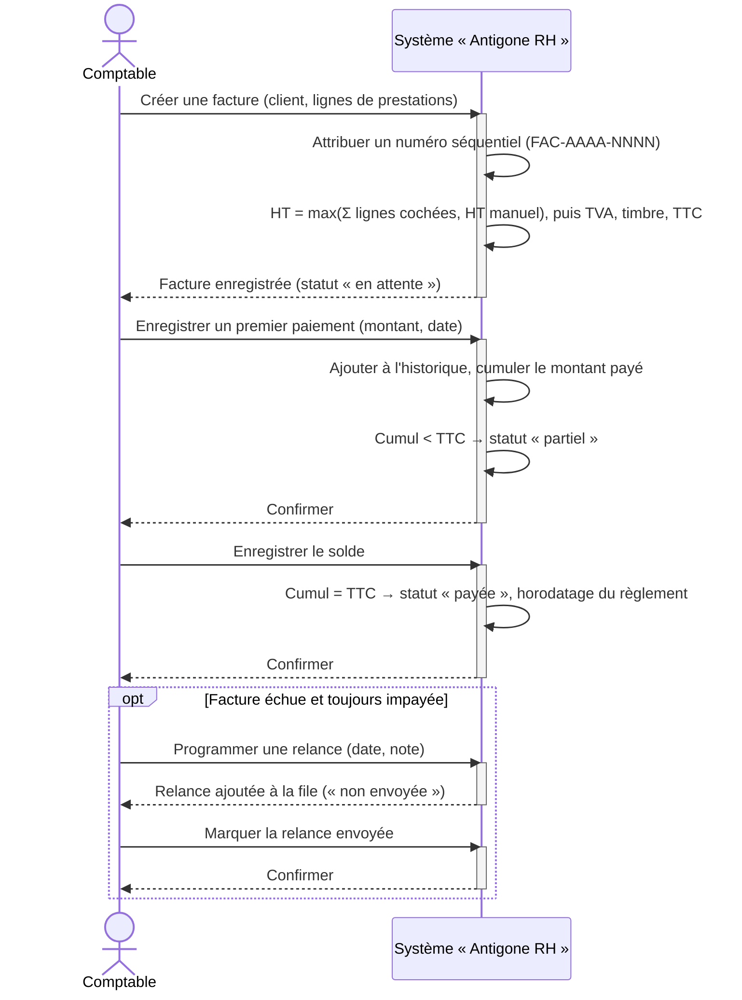
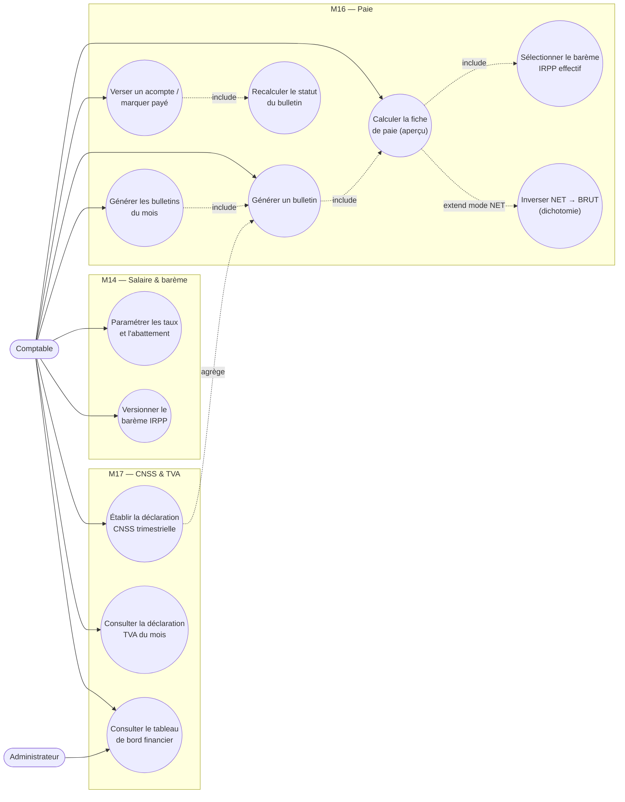
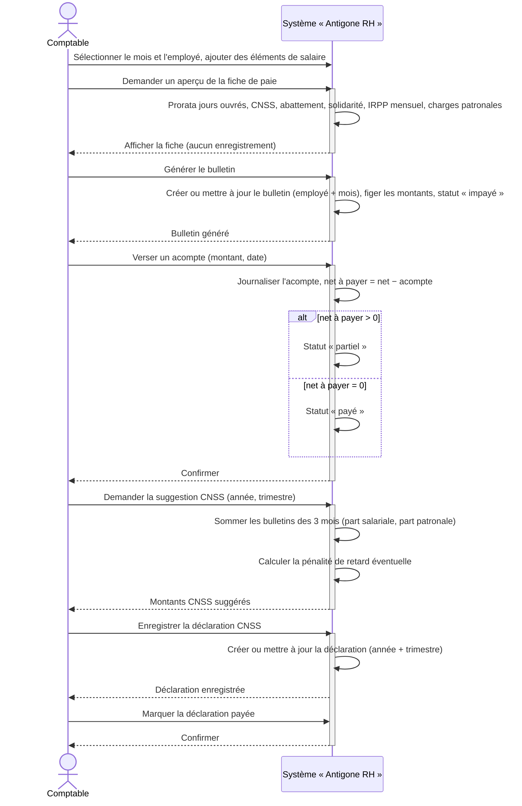

# Chapitre VI : Release 4 — Facturation & Paie

## VI.1 Introduction

Les trois releases précédentes ont doté la plateforme d'un socle d'identités sécurisé, d'un système complet d'organisation du travail RH, puis d'un outillage de pilotage de l'activité opérationnelle de l'agence — projets, tâches et plans médias. Ce chapitre ouvre un quatrième volet, encore d'une autre nature : la gestion financière de l'agence elle-même. Il ne s'agit plus d'administrer des personnes ni de suivre des livrables, mais de facturer les prestations vendues, d'encaisser les règlements, de suivre les charges et les dettes, et — versant le plus technique — d'automatiser le calcul de la paie tunisienne et des déclarations sociales et fiscales.

**Release 4 — Facturation & Paie** rassemble les Sprints 7 et 8. Le Sprint 7 met en place les modules M13 (Facturation) et M15 (Charges & dettes) : émettre des factures et des devis avec une numérotation séquentielle et une tarification (TVA, timbre fiscal), suivre les encaissements partiels jusqu'au solde, programmer des relances sur les impayés, et tenir à jour un échéancier des charges fixes récurrentes ainsi qu'un registre des charges variables et des dettes de l'agence. Le Sprint 8 construit les modules M14 (Salaire), M16 (Paie) et M17 (CNSS & TVA) : paramétrer les taux de cotisation et un barème IRPP versionné, calculer et générer les bulletins de paie mensuels — individuellement ou en lot —, verser des acomptes, puis établir la déclaration CNSS trimestrielle et consulter la déclaration TVA mensuelle ainsi que le résultat net de l'agence.

Cette release conserve la logique d'inflexion des chapitres précédents — un module construit à un sprint devient une dépendance consommée par le suivant. Le tableau de bord financier et la déclaration TVA du Sprint 8 lisent directement les factures et les charges du Sprint 7 pour croiser encaissements et décaissements ; la déclaration CNSS du Sprint 8 agrège les bulletins de paie produits dans le même sprint. Les fondations de la Release 1 restent mobilisées : les clients de la fiche client et les employés gérés au Sprint 2 sont respectivement les destinataires des factures et les bénéficiaires des bulletins de paie. Le moteur de calcul de la paie est, lui, le portage fidèle côté backend d'une logique éprouvée dans un outil autonome antérieur (`Antigone_finance`), désormais unifiée avec le reste du système.

Deux partis pris distinguent nettement ce module des précédents. D'abord, l'étanchéité des données : tout `/api/finance/**` est gardé par une permission dédiée (`VIEW_FINANCE`, ou le rôle `ADMIN`) et servi par une application front distincte (`frontend-finance`), afin qu'un comptable n'accède qu'à la finance et qu'un responsable RH n'y accède pas. Ensuite, l'absence totale de notifications : contrairement aux modules RH, Projets ou Plans médias, aucun service de ce module n'émet de notification in-app ni d'e-mail — toutes ses sorties sont des écrans et des rapports consultés à la demande.

Comme aux chapitres précédents, nous suivons pour chacun des deux sprints la même démarche : backlog de sprint, diagramme de cas d'utilisation, inventaire des services web exposés, puis description détaillée d'un cas d'utilisation représentatif (description textuelle, diagramme de séquence système et diagramme de séquence objet).

---

## VI.2 Backlog du Sprint 7

Le Sprint 7 couvre les modules M13 (Facturation) et M15 (Charges & dettes), pour une charge totale de 18 points. Chaque user story est décomposée en tâches de développement, estimées individuellement.

<table>
<thead>
<tr><th>User Story</th><th>Tâches</th><th>Estimation</th></tr>
</thead>
<tbody>

<tr><td rowspan="4">En tant que comptable, je veux émettre une facture ou un devis pour un client (lignes de prestations, TVA, timbre fiscal) afin de formaliser une prestation vendue.</td><td>Développer l'API de création d'un document : numérotation séquentielle annuelle par type (<code>CompteurDocument</code>), statut <code>EN_ATTENTE</code> forcé, tarification (HT retenu = max(Σ lignes cochées, total HT manuel), TVA et timbre fiscal exclus pour un devis, taux par défaut issus des référentiels).</td><td>1</td></tr>
<tr><td>Développer l'API de modification (numéro et type figés) et de suppression d'un document (cascade sur les paiements et les relances).</td><td>1</td></tr>
<tr><td>Réaliser l'écran Factures / Devis : formulaire de lignes, insertion depuis le catalogue de services, application d'un modèle.</td><td>1</td></tr>
<tr><td>Tester la fonctionnalité.</td><td>1</td></tr>

<tr><td rowspan="4">En tant que comptable, je veux enregistrer les encaissements d'une facture, partiels ou complets, afin que son statut reflète le montant réellement perçu.</td><td>Développer l'API d'enregistrement d'un paiement partiel (<code>PaiementFacture</code>, mise à jour du montant payé dénormalisé, recalcul du statut <code>EN_ATTENTE → PARTIEL → PAYEE</code>).</td><td>1</td></tr>
<tr><td>Développer l'API « marquer payée » (solde forcé aligné sur le total TTC) et d'annulation d'un paiement (jamais de solde négatif).</td><td>1</td></tr>
<tr><td>Réaliser la modale d'historique et de saisie des paiements, ainsi que la liste des factures impayées.</td><td>1</td></tr>
<tr><td>Tester la fonctionnalité.</td><td>1</td></tr>

<tr><td rowspan="4">En tant que comptable, je veux disposer d'un catalogue de services, de modèles de facture et d'un suivi des relances afin d'accélérer la saisie récurrente et de récupérer les créances en retard.</td><td>Développer l'API CRUD du catalogue de services (archivage logique) et des modèles de facture.</td><td>1</td></tr>
<tr><td>Développer l'API de programmation d'une relance sur une facture impayée (<code>RelanceClient</code>) et de passage au statut « envoyée ».</td><td>1</td></tr>
<tr><td>Réaliser les interfaces du catalogue, des modèles et de la file des relances en attente.</td><td>1</td></tr>
<tr><td>Tester la fonctionnalité.</td><td>1</td></tr>

<tr><td rowspan="3">En tant que comptable, je veux suivre les charges fixes récurrentes de l'agence afin de connaître à tout moment ce qui est dû, payé et en retard.</td><td>Développer l'API CRUD d'une charge fixe (montant TTC, taux TVA, jour d'échéance, cycle en mois) et le calcul de l'échéancier mensuel : charge due si le nombre de mois écoulés depuis sa création est un multiple exact du cycle, cumul des impayés antérieurs, extraction HT / TVA depuis le montant TTC.</td><td>1</td></tr>
<tr><td>Développer l'API d'enregistrement d'un paiement mensuel et réaliser l'échéancier ainsi que la synthèse mensuelle des charges (dont TVA déductible).</td><td>1</td></tr>
<tr><td>Tester la fonctionnalité.</td><td>1</td></tr>

<tr><td rowspan="3">En tant que comptable, je veux enregistrer les charges variables, les dettes et les revenus hors facturation du mois afin d'avoir une vue exhaustive des flux de l'agence.</td><td>Développer l'API CRUD des charges variables (rattachées à un mois) et des revenus hors facturation ; API CRUD des dettes avec enregistrement des remboursements (solde restant = max(0, montant total − remboursé)).</td><td>1</td></tr>
<tr><td>Réaliser les interfaces charges variables, dettes et revenus.</td><td>1</td></tr>
<tr><td>Tester la fonctionnalité.</td><td>1</td></tr>

<tr><td colspan="2" align="right"><strong>Total</strong></td><td><strong>18</strong></td></tr>

</tbody>
</table>

*Table VI.1 — Backlog du Sprint 7*

---

## VI.3 Diagramme de cas d'utilisation du Sprint 7

```plantuml
@startuml
skinparam usecase {
  BackgroundColor<<highlight>> LightGray
  BackgroundColor<<rule>> LightGray
}
skinparam ArrowColor Black
skinparam ActorBorderColor Black

actor "Comptable" as Cpt
actor "Administrateur" as Admin
Admin --|> Cpt

usecase "Émettre une facture\nou un devis" as UC_Emettre
usecase "Numéroter\nséquentiellement" as UC_Num <<rule>>
usecase "Appliquer la\ntarification" as UC_Tarif <<rule>>
UC_Emettre ..> UC_Num : <<include>>
UC_Emettre ..> UC_Tarif : <<include>>

usecase "Modifier / supprimer\nun document" as UC_MajDoc
usecase "Enregistrer un\npaiement" as UC_Paiement
usecase "Recalculer le statut\n(en attente / partiel / payée)" as UC_StatutFac <<rule>>
UC_Paiement ..> UC_StatutFac : <<include>>
usecase "Marquer la facture\npayée (solde forcé)" as UC_Solde
usecase "Programmer et suivre\nune relance" as UC_Relance
usecase "Gérer le catalogue\net les modèles" as UC_Catalogue

usecase "Gérer les charges\nfixes récurrentes" as UC_ChargeFixe
usecase "Consulter l'échéancier\net la synthèse du mois" as UC_Echeancier
usecase "Calculer le cumul\nd'impayés antérieurs" as UC_Cumul <<rule>>
UC_Echeancier ..> UC_Cumul : <<include>>
usecase "Enregistrer un paiement\nde charge" as UC_PayCharge
usecase "Gérer les charges\nvariables" as UC_ChargeVar
usecase "Gérer les dettes et\nleurs remboursements" as UC_Dette
usecase "Enregistrer un revenu\nhors facturation" as UC_Revenu

note right of UC_Tarif
  Un devis n'est jamais soumis à
  la TVA ni au timbre fiscal :
  total TTC = total HT. Le total HT
  manuel agit comme un plancher.
end note

Cpt --> UC_Emettre
Cpt --> UC_MajDoc
Cpt --> UC_Paiement
Cpt --> UC_Solde
Cpt --> UC_Relance
Cpt --> UC_Catalogue
Cpt --> UC_ChargeFixe
Cpt --> UC_Echeancier
Cpt --> UC_PayCharge
Cpt --> UC_ChargeVar
Cpt --> UC_Dette
Cpt --> UC_Revenu
@enduml
```



*Figure VI.1 — Diagramme de cas d'utilisation du Sprint 7*

Trois précisions sur ce diagramme. D'abord, la tarification est un point d'inclusion systématique de l'émission d'un document : `FacturationService.appliquerTarification()` retient comme base le plus grand du total des lignes cochées et du total HT saisi manuellement — ce dernier agit donc comme un plancher, jamais comme un remplacement — puis, pour une facture seulement, applique le taux de TVA et le timbre fiscal (à défaut de valeurs explicites, les taux proviennent des référentiels via `FinanceReferentielService`). Un devis (`TypeDocument.DEVIS`) n'est jamais soumis à la TVA ni au timbre : son total TTC égale son total HT. Ensuite, tout mouvement de paiement — enregistrement ou annulation — inclut le recalcul du statut : `recalculerStatut()` fait passer la facture de `EN_ATTENTE` à `PARTIEL` dès qu'un montant est reçu, puis à `PAYEE` lorsque le cumul atteint le total TTC ; l'annulation du dernier paiement la ramène à `EN_ATTENTE`. Enfin, la numérotation est séquentielle et annuelle : un compteur dédié par type de document et par année (`CompteurDocument`) garantit des numéros `FAC-2026-0001`, `DEV-2026-0001`… sans trou ni doublon, et le numéro comme le type restent figés après création. Point d'attention, comme pour le module Projets du chapitre précédent : l'ensemble de `/api/finance/**` est gardé par une permission unique (`VIEW_FINANCE`, ou le rôle `ADMIN`) ; le backend ne distingue pas le Comptable de l'Administrateur, la séparation des responsabilités reste, à ce stade, organisationnelle.

---

## VI.4 Services Web

Le Sprint 7 expose les points d'entrée REST suivants, répartis en cinq familles. Tous sont préfixés par `/api/finance`.

**Facturation & encaissements — `/api/finance/facturation`**

| Méthode | URL | Description |
|---|---|---|
| GET | `/documents?type=` | Lister les factures ou les devis (tri par date d'émission décroissante) |
| GET | `/documents/{id}` | Consulter le détail d'un document |
| GET | `/documents/client/{clientId}` | Documents émis pour un client |
| GET | `/impayees` | Factures émises mais pas encore soldées |
| POST | `/documents` | Créer une facture ou un devis (statut `EN_ATTENTE` forcé, numéro généré) |
| PUT | `/documents/{id}` | Modifier un document (numéro et type figés, statut recalculé) |
| DELETE | `/documents/{id}` | Supprimer (cascade sur les paiements et les relances) |
| POST | `/documents/{id}/payer` | Marquer la facture soldée (paiement de régularisation au TTC) |
| GET | `/documents/{id}/paiements` | Historique des paiements d'un document |
| POST | `/documents/{id}/paiements` | Enregistrer un paiement partiel (montant, date, note) |
| DELETE | `/paiements/{paiementId}` | Annuler un paiement (déduit le montant, jamais de solde négatif) |
| GET | `/services` | Catalogue des services actifs |
| POST · PUT | `/services` · `/services/{id}` | Créer / modifier un service |
| DELETE | `/services/{id}` | Archiver un service (archivage logique) |
| GET · POST | `/templates` · `/templates` | Lister / créer un modèle de facture |
| DELETE | `/templates/{id}` | Supprimer un modèle |
| GET | `/relances` | Relances en attente (non envoyées, tri par date croissante) |
| POST | `/relances` | Programmer une relance sur une facture (`factureId`, `dateRelance`, `note`) |
| POST | `/relances/{id}/envoyee` | Marquer une relance comme envoyée |

**Charges — `/api/finance/charges`**

| Méthode | URL | Description |
|---|---|---|
| GET | `/fixes` | Lister les charges fixes actives (non archivées) |
| POST · PUT | `/fixes` · `/fixes/{id}` | Créer / modifier une charge fixe |
| DELETE | `/fixes/{id}` | Archiver une charge fixe |
| GET | `/fixes/{id}/paiements` | Paiements enregistrés sur une charge fixe |
| POST | `/fixes/{id}/paiements` | Enregistrer un paiement mensuel (`mois`, `montant`, `datePaiement`) |
| GET | `/fixes/etat?mois=` | Échéancier des charges fixes pour un mois (due, payé, reste, cumul impayé, statut) |
| GET | `/variables?mois=` | Charges variables rattachées à un mois |
| POST · PUT | `/variables` · `/variables/{id}` | Créer / modifier une charge variable |
| DELETE | `/variables/{id}` | Supprimer une charge variable |
| GET | `/resume?mois=` | Synthèse mensuelle des charges (fixes dues / payées / restantes, cumul antérieur, variables, TVA déductible) |

**Dettes — `/api/finance/dettes`**

| Méthode | URL | Description |
|---|---|---|
| GET | `/` | Lister les dettes (tri par date d'échéance croissante) |
| POST · PUT | `/` · `/{id}` | Créer / modifier une dette |
| DELETE | `/{id}` | Supprimer une dette (cascade sur les remboursements) |
| GET | `/{id}/paiements` | Remboursements enregistrés sur une dette |
| POST | `/{id}/paiements` | Enregistrer un remboursement (`montant`, `datePaiement`, `note`) |
| DELETE | `/paiements/{paiementId}` | Annuler un remboursement |

**Revenus hors facturation — `/api/finance/revenus`**

| Méthode | URL | Description |
|---|---|---|
| GET | `/?mois=` | Revenus divers d'un mois (montant saisi TTC, HT et TVA extraits) |
| POST · PUT · DELETE | `/` · `/{id}` · `/{id}` | Créer / modifier / supprimer un revenu |

**Référentiel Finance — `/api/finance`**

| Méthode | URL | Description |
|---|---|---|
| GET | `/clients` | Clients, en vue restreinte finance (coordonnées, matricule fiscal, RNE, cycle de facturation) |
| GET | `/parametres-facturation` | Taux de TVA et timbre fiscal par défaut, cycles de charge fixe autorisés, catégories de revenu et de charge |
| GET · POST · PUT · DELETE | `/contacts?clientId=` · `/contacts` · … | Gérer les contacts d'un client (destinataires de facturation) |

---

## VI.5 Les cas d'utilisation du Sprint 7

### VI.5.1 Cas d'utilisation : « Émettre une facture, suivre son encaissement et programmer une relance »

#### VI.5.1.1 Description textuelle

| Élément | Description |
|---|---|
| **Acteurs** | Comptable (acteur principal — émet le document, saisit les encaissements, pilote les relances) |
| **Objectif** | Formaliser une prestation par une facture numérotée, encaisser le règlement du client — en une ou plusieurs fois — jusqu'au solde, puis relancer le client si la facture reste impayée au-delà de son échéance |
| **Pré-condition** | Le client existe dans le référentiel. Les taux de TVA et le timbre fiscal par défaut sont paramétrés dans les référentiels |

**Scénario principal**

1. Le comptable ouvre l'écran Facturation, onglet « Factures », et crée un document : il choisit le client, puis saisit les lignes de prestations (désignation, quantité, prix unitaire), éventuellement en les insérant depuis le catalogue de services ou en appliquant un modèle.
2. Le système attribue un numéro séquentiel (`FAC-2026-0001`), calcule le total HT (le plus grand du total des lignes cochées et du total HT saisi manuellement), applique le taux de TVA et le timbre fiscal, en déduit le total TTC, place la facture au statut « en attente » et l'enregistre.
3. Le comptable transmet la facture au client (hors système).
4. À réception d'un premier règlement, le comptable ouvre la facture et enregistre un paiement (montant, date, note).
5. Le système ajoute le paiement à l'historique, met à jour le montant payé cumulé et recalcule le statut : « partiel » tant que le cumul reste inférieur au total TTC.
6. À réception du solde, le comptable enregistre un second paiement ; le cumul atteint le total TTC, le système passe la facture au statut « payée » et horodate le règlement.
7. Si l'échéance est dépassée et la facture toujours impayée, le comptable la retrouve dans la liste des impayées et programme une relance (date, note).
8. Le système enregistre la relance en file d'attente (« non envoyée »). Après l'avoir adressée au client, le comptable la marque « envoyée ».

**Scénarios alternatifs**

- **A1 — Devis** : à l'étape 1, si le comptable choisit le type « devis », le système génère un numéro `DEV-2026-0001` et n'applique ni TVA ni timbre fiscal — le total TTC égale le total HT.
- **A2 — Solde forcé** : à l'étape 6, le comptable peut utiliser l'action « marquer payée » ; le système enregistre automatiquement un paiement de régularisation égal au reste dû, puis solde la facture.
- **A3 — Annulation d'un paiement** : si un paiement a été saisi par erreur, le comptable le supprime ; le système déduit le montant (sans jamais descendre sous zéro) et réévalue le statut — retour à « en attente » si le cumul retombe à zéro.
- **A4 — Suppression du document** : la suppression d'une facture purge en cascade ses paiements et ses relances.
- **A5 — Total HT manuel** : si le comptable saisit un total HT supérieur à la somme des lignes, c'est ce montant qui est retenu comme base de calcul (plancher).

#### VI.5.1.2 Diagramme de séquence système



#### VI.5.1.3 Diagramme de séquence objet

```mermaid
sequenceDiagram
    actor Cpt as Comptable
    participant IHM as Interface (React)
    participant FCtrl as FacturationController
    participant FSvc as FacturationService
    participant CptRepo as CompteurDocumentRepository
    participant CliRepo as ClientRepository
    participant RefSvc as FinanceReferentielService
    participant FacRepo as FactureRepository
    participant PayRepo as PaiementFactureRepository
    participant RelRepo as RelanceClientRepository

    Cpt->>IHM: Saisir le client et les lignes de prestations
    IHM->>FCtrl: POST /api/finance/facturation/documents
    FCtrl->>FSvc: create(request)
    FSvc->>CptRepo: findByTypeAndAnnee(FACTURE, année)
    CptRepo-->>FSvc: CompteurDocument
    FSvc->>CptRepo: save(compteur) — dernierNumero + 1
    FSvc->>CliRepo: findById(clientId)
    CliRepo-->>FSvc: Client
    alt taux non fournis dans la requête
        FSvc->>RefSvc: getTvaDefaut() / getTimbreFiscalDefaut()
        RefSvc-->>FSvc: taux TVA, timbre fiscal
    end
    FSvc->>FSvc: appliquerTarification() — HT, TVA, timbre, TTC ; statut = EN_ATTENTE
    FSvc->>FacRepo: save(facture)
    FacRepo-->>FSvc: Facture persistée
    FSvc-->>FCtrl: FactureDTO
    FCtrl-->>IHM: 200 OK
    IHM-->>Cpt: Afficher la facture « en attente »

    Cpt->>IHM: Enregistrer un paiement (montant)
    IHM->>FCtrl: POST /documents/{id}/paiements
    FCtrl->>FSvc: enregistrerPaiement(id, montant, date, note)
    FSvc->>FacRepo: findById(id)
    FacRepo-->>FSvc: Facture
    FSvc->>PayRepo: save(PaiementFacture)
    FSvc->>FSvc: montantPaye += montant ; recalculerStatut()
    FSvc->>FacRepo: save(facture)
    FSvc-->>FCtrl: FactureDTO (statut PARTIEL, puis PAYEE au solde)
    FCtrl-->>IHM: 200 OK

    Cpt->>IHM: Programmer une relance
    IHM->>FCtrl: POST /relances {factureId, dateRelance, note}
    FCtrl->>FSvc: createRelance(factureId, date, note)
    FSvc->>FacRepo: findById(factureId)
    FacRepo-->>FSvc: Facture
    FSvc->>RelRepo: save(RelanceClient — envoyee = false)
    FSvc-->>FCtrl: RelanceClientDTO
    FCtrl-->>IHM: 200 OK
    IHM-->>Cpt: Relance ajoutée à la file d'attente
```

---

## VI.6 Backlog du Sprint 8

Le Sprint 8 couvre les modules M14 (Salaire), M16 (Paie) et M17 (CNSS & TVA), pour une charge totale de 24 points. Chaque user story est décomposée en tâches de développement, estimées individuellement.

<table>
<thead>
<tr><th>User Story</th><th>Tâches</th><th>Estimation</th></tr>
</thead>
<tbody>

<tr><td rowspan="3">En tant que comptable, je veux paramétrer les taux de cotisation et l'abattement forfaitaire afin que tous les bulletins soient calculés sur une base commune et maîtrisée.</td><td>Développer l'API de lecture / mise à jour des paramètres de paie (part salariale CNSS, contribution de solidarité, part patronale CNSS, TFP, FOPROLOS, accident du travail, abattement) — table à ligne unique, valeurs par défaut Tunisie.</td><td>1</td></tr>
<tr><td>Réaliser l'écran des paramètres de paie.</td><td>1</td></tr>
<tr><td>Tester la fonctionnalité.</td><td>1</td></tr>

<tr><td rowspan="2">En tant que comptable, je veux versionner le barème IRPP progressif afin de pouvoir recalculer un mois ancien avec les taux en vigueur à l'époque.</td><td>Développer l'API de création et de liste des barèmes IRPP (tranches plafond / taux, date d'entrée en vigueur ; barème effectif = le dernier dont la date ≤ premier jour du mois).</td><td>1</td></tr>
<tr><td>Tester la fonctionnalité.</td><td>1</td></tr>

<tr><td rowspan="2">En tant que comptable, je veux disposer des employés et des clients dans le module Finance sans passer par les permissions RH afin de travailler de façon cloisonnée.</td><td>Développer l'API de vue restreinte des employés (contrat couvrant le mois, prorata embauche / départ, exonération des contrats CIVP / Freelance / Stage) et des clients.</td><td>1</td></tr>
<tr><td>Tester la fonctionnalité.</td><td>1</td></tr>

<tr><td rowspan="4">En tant que comptable, je veux calculer la fiche de paie d'un employé pour un mois donné afin d'anticiper le net et le coût employeur avant de figer le bulletin.</td><td>Développer le moteur de calcul : jours ouvrés, prorata, éléments dynamiques (gain / retenue / net_only, unité montant ou jours, drapeaux affectsBrut / affectsCnss / affectsIrpp), CNSS salarié, salaire imposable, abattement, contribution de solidarité, IRPP mensuel (barème annualisé ÷ 12), net, charges patronales, coût total.</td><td>1</td></tr>
<tr><td>Développer la conversion NET → BRUT par recherche dichotomique (l'IRPP progressif interdit l'inversion analytique) et l'exonération totale des contrats CIVP / Freelance / Stage.</td><td>1</td></tr>
<tr><td>Développer l'API d'aperçu (calcul sans persistance).</td><td>1</td></tr>
<tr><td>Tester le moteur de calcul.</td><td>1</td></tr>

<tr><td rowspan="4">En tant que comptable, je veux générer et archiver les bulletins de paie, individuellement ou pour tout le mois, afin de disposer d'un document figé par employé.</td><td>Développer l'API de génération d'un bulletin (upsert par employé + mois, instantané figé des montants, statut <code>IMPAYE</code>) et de génération en lot de tous les employés actifs d'un mois.</td><td>1</td></tr>
<tr><td>Développer l'API de consultation (par mois, par employé, impayés antérieurs à un mois, report du net des mois non soldés).</td><td>1</td></tr>
<tr><td>Réaliser l'écran Salaires : sélection du mois, liste des bulletins, panneau de détail, ajout d'éléments de salaire.</td><td>1</td></tr>
<tr><td>Tester la fonctionnalité.</td><td>1</td></tr>

<tr><td rowspan="3">En tant que comptable, je veux verser des acomptes sur salaire et solder les bulletins afin de suivre ce qui reste à payer à chaque employé.</td><td>Développer l'API d'enregistrement d'un acompte (journal d'audit <code>AcompteSalaire</code>, mise à jour du net à payer, recalcul du statut <code>IMPAYE → PARTIEL → PAYE</code>) et de solde total d'un bulletin.</td><td>1</td></tr>
<tr><td>Réaliser la modale de versement d'acompte et l'historique.</td><td>1</td></tr>
<tr><td>Tester la fonctionnalité.</td><td>1</td></tr>

<tr><td rowspan="3">En tant que comptable, je veux établir la déclaration CNSS trimestrielle afin de reverser à l'organisme social les cotisations dues.</td><td>Développer l'API de suggestion des montants d'un trimestre (somme des bulletins des 3 mois : part salariale + solidarité, part patronale ; pénalité de retard = montant brut × mois de retard × 1 %, échéance au 15 du mois suivant la fin du trimestre).</td><td>1</td></tr>
<tr><td>Développer l'API d'enregistrement (upsert année + trimestre) et de passage à « payée » ; réaliser l'écran CNSS.</td><td>1</td></tr>
<tr><td>Tester la fonctionnalité.</td><td>1</td></tr>

<tr><td rowspan="3">En tant que comptable, je veux consulter la déclaration TVA du mois et le résultat net de l'agence afin de piloter la trésorerie.</td><td>Développer l'API de déclaration TVA mensuelle calculée à la volée (TVA collectée sur factures au prorata de l'encaissement + sur autres revenus ; TVA déductible sur charges ; TVA nette et sens du solde).</td><td>1</td></tr>
<tr><td>Développer l'API des tableaux de bord (vue des encaissements, vue des décaissements, résultat net et marge) et réaliser le tableau de bord financier.</td><td>1</td></tr>
<tr><td>Tester la fonctionnalité.</td><td>1</td></tr>

<tr><td colspan="2" align="right"><strong>Total</strong></td><td><strong>24</strong></td></tr>

</tbody>
</table>

*Table VI.2 — Backlog du Sprint 8*

---

## VI.7 Diagramme de cas d'utilisation du Sprint 8



*Figure VI.2 — Diagramme de cas d'utilisation du Sprint 8*

Quatre précisions sur ce diagramme. D'abord, la génération d'un bulletin (UC4) *inclut* toujours le calcul de la fiche de paie (UC3) : `PayrollService` délègue l'intégralité de l'arithmétique à `PayrollCalculator`, qui n'écrit rien — seule la génération persiste le résultat, sous la forme d'un instantané figé (`BulletinPaie`) unique par couple employé + mois. Le calcul s'appuie sur le barème IRPP effectif pour le mois (UC3b) : `BaremeIrppRepository` retourne le dernier barème dont la date d'entrée en vigueur précède le premier jour du mois demandé, ce qui permet de recalculer un mois ancien avec les taux de l'époque. Ensuite, la génération en lot (UC5) applique UC4 à chaque employé dont le contrat couvre au moins une partie du mois — une embauche ou un départ en cours de mois donne un salaire au prorata des jours ouvrés. Le versement d'un acompte (UC6) *inclut* le recalcul du statut : `recalculerStatut()` fait passer le bulletin de `IMPAYE` à `PARTIEL` dès qu'un acompte est versé, puis à `PAYE` lorsque le net à payer atteint zéro. Enfin, la déclaration CNSS trimestrielle (UC7) *agrège* les trois bulletins mensuels du trimestre : elle somme d'un côté la part salariale (CNSS + contribution de solidarité), de l'autre la part patronale, et y ajoute une pénalité de retard forfaitaire (montant brut × mois de retard × 1 %) si l'échéance légale — le 15 du mois suivant la fin du trimestre — est dépassée. Deux mécanismes restent volontairement simples : la conversion NET → BRUT (UC3c), que l'IRPP progressif interdit d'inverser analytiquement, est résolue par une recherche dichotomique à 64 itérations ; et la déclaration TVA (UC8) n'est jamais persistée — elle est recalculée à chaque consultation, en croisant la TVA collectée sur les factures (au prorata du montant réellement encaissé) et sur les autres revenus avec la TVA déductible sur les charges du mois.

---

## VI.8 Services Web

Le Sprint 8 expose les points d'entrée REST suivants, répartis en quatre familles.

**Paie — `/api/finance/paie`**

| Méthode | URL | Description |
|---|---|---|
| GET | `/parametres` | Taux de cotisation et abattement en vigueur |
| PUT | `/parametres` | Mettre à jour les taux (table à ligne unique) |
| GET | `/baremes-irpp` | Historique des barèmes IRPP (tri par date d'effet décroissante) |
| POST | `/baremes-irpp` | Créer un barème IRPP (tranches, date d'entrée en vigueur) |
| POST | `/calcul` | Aperçu de la fiche de paie d'un employé pour un mois (sans persistance) |
| POST | `/generer` | Générer ou mettre à jour le bulletin d'un employé pour un mois |
| POST | `/generer-tout/{mois}` | Générer les bulletins de tous les employés actifs du mois |
| GET | `/bulletins?mois=` | Bulletins d'un mois |
| GET | `/bulletins/employe/{employeId}` | Bulletins d'un employé (tri par mois décroissant) |
| GET | `/impayes?avant=` | Bulletins non soldés antérieurs à un mois donné |
| GET | `/totaux?mois=` | Totaux du mois (masse brute / nette, CNSS salariale / patronale, IRPP, TFP, FOPROLOS, coût total, net payé / restant) |
| GET | `/acomptes?employeId=&mois=` | Acomptes versés à un employé pour un mois |
| POST | `/bulletins/{id}/payer` | Marquer un bulletin payé (acompte aligné sur le net, net à payer = 0) |
| POST | `/acompte` | Enregistrer un acompte sur salaire (`employeId`, `mois`, `montant`, `date`, `note`) |

**CNSS — `/api/finance/cnss`**

| Méthode | URL | Description |
|---|---|---|
| GET | `/?annee=` | Déclarations CNSS d'une année (tri par trimestre) |
| GET | `/suggestion?annee=&trimestre=` | Montants suggérés à partir des bulletins des 3 mois du trimestre, pénalité de retard incluse |
| POST | `/` | Enregistrer une déclaration (upsert sur année + trimestre) |
| POST | `/{id}/payer` | Marquer une déclaration comme payée |

**Tableau de bord & TVA — `/api/finance/dashboard`**

| Méthode | URL | Description |
|---|---|---|
| GET | `/encaissements?mois=` | Vue des encaissements du mois (facturé, encaissé, en attente, autres revenus, répartition) |
| GET | `/decaissements?mois=` | Vue des décaissements du mois (masse salariale, charges patronales, taxes dues, charges fixes / variables, dettes) |
| GET | `/resultat?mois=` | Résultat net et marge du mois (revenus − dépenses) |
| GET | `/tva?mois=` | Déclaration TVA du mois (collectée factures / autres revenus, déductible, nette, sens du solde) |

**Référentiel Finance — `/api/finance`**

| Méthode | URL | Description |
|---|---|---|
| GET | `/employes?mois=` | Employés dont le contrat couvre le mois (embauche / départ au prorata) ; sans `mois`, tous les employés |

---

## VI.9 Les cas d'utilisation du Sprint 8

### VI.9.1 Cas d'utilisation : « Calculer et générer un bulletin de paie, verser un acompte, puis établir la déclaration CNSS du trimestre »

#### VI.9.1.1 Description textuelle

| Élément | Description |
|---|---|
| **Acteurs** | Comptable (acteur principal — calcule et génère les bulletins, verse les acomptes, établit les déclarations) |
| **Objectif** | Produire le bulletin de paie mensuel d'un employé à partir de son salaire contractuel et d'éléments variables, régler tout ou partie du net, puis, en fin de trimestre, agréger les bulletins dans la déclaration CNSS |
| **Pré-condition** | Les paramètres de paie (taux CNSS, solidarité, charges patronales, abattement) et un barème IRPP effectif pour le mois sont enregistrés. L'employé a un salaire de base et un type de contrat |

**Scénario principal**

1. Le comptable ouvre l'écran Salaires, sélectionne le mois et l'employé, et ajoute éventuellement des éléments de salaire (prime, bonus, absence en jours, acompte).
2. Il demande un aperçu ; le système calcule la fiche sans la persister : prorata sur les jours ouvrés si l'embauche ou le départ tombe en cours de mois, brut effectif, CNSS salarié, salaire imposable, abattement forfaitaire, revenu net imposable, contribution de solidarité, IRPP mensuel (barème annualisé puis divisé par douze), net, charges patronales et coût total employeur.
3. Le comptable valide et demande la génération du bulletin.
4. Le système crée le bulletin (ou met à jour celui qui existe déjà pour cet employé et ce mois), y fige tous les montants calculés, le place au statut « impayé » et l'horodate.
5. Le comptable verse un acompte à l'employé (montant, date).
6. Le système journalise l'acompte, diminue le net à payer et recalcule le statut : « partiel » si le net à payer reste positif, « payé » s'il atteint zéro.
7. Le solde est versé plus tard, soit par un second acompte, soit par l'action « marquer payé » qui aligne l'acompte sur le net et met le net à payer à zéro.
8. En fin de trimestre, le comptable ouvre l'écran CNSS et demande la suggestion pour l'année et le trimestre.
9. Le système parcourt les bulletins des trois mois du trimestre, somme d'un côté la part salariale (CNSS salarié + contribution de solidarité), de l'autre la part patronale (CNSS employeur), calcule la pénalité de retard éventuelle (montant brut × mois de retard × 1 %, échéance au 15 du mois suivant la fin du trimestre) et propose le montant total.
10. Le comptable enregistre la déclaration (création ou mise à jour pour ce couple année / trimestre), puis, après règlement à la CNSS, la marque « payée ».

**Scénarios alternatifs**

- **A1 — Génération en lot** : à l'étape 3, le comptable peut lancer « générer tout le mois » ; le système produit un bulletin pour chaque employé dont le contrat couvre au moins une partie du mois.
- **A2 — Salaire en net** : si l'employé est payé « en net », le système détermine d'abord le brut correspondant par recherche dichotomique — l'IRPP progressif interdisant l'inversion analytique — avant d'appliquer le calcul normal.
- **A3 — Contrat exonéré** : pour un contrat CIVP, Freelance ou Stage, le système n'applique aucune retenue sociale ni fiscale — le net égale le brut effectif.
- **A4 — Report des impayés** : les bulletins des mois antérieurs non soldés sont reportés dans la vue des décaissements et dans l'écran des bulletins impayés, avec leurs montants figés au moment du calcul.
- **A5 — Recalcul** : régénérer un bulletin déjà marqué payé ne change pas son statut ; sinon, tout changement de paramètres ou d'éléments recalcule les montants et réévalue le statut.

#### VI.9.1.2 Diagramme de séquence système



#### VI.9.1.3 Diagramme de séquence objet

```mermaid
sequenceDiagram
    actor Cpt as Comptable
    participant IHM as Interface (React)
    participant PCtrl as PayrollController
    participant PSvc as PayrollService
    participant Calc as PayrollCalculator
    participant ERepo as EmployeRepository
    participant ParRepo as ParametresPaieRepository
    participant BarRepo as BaremeIrppRepository
    participant BulRepo as BulletinPaieRepository
    participant AcoRepo as AcompteSalaireRepository
    participant CCtrl as CnssController
    participant CSvc as CnssService
    participant DecRepo as DeclarationCnssRepository

    Cpt->>IHM: Demander un aperçu (employé, mois, éléments)
    IHM->>PCtrl: POST /api/finance/paie/calcul
    PCtrl->>PSvc: calculerApercu(employeId, mois, elements)
    PSvc->>ERepo: findById(employeId)
    ERepo-->>PSvc: Employe
    PSvc->>ParRepo: findById(1)
    ParRepo-->>PSvc: ParametresPaie
    PSvc->>BarRepo: findFirstByEffectiveFromLessThanEqual(1er du mois)
    BarRepo-->>PSvc: tranches IRPP effectives
    PSvc->>Calc: calculerFichePaie(employe, mois, taux, tranches, elements)
    Calc-->>PSvc: FichePaieDTO
    PSvc-->>PCtrl: FichePaieDTO
    PCtrl-->>IHM: 200 OK (aucune persistance)

    Cpt->>IHM: Générer le bulletin
    IHM->>PCtrl: POST /api/finance/paie/generer
    PCtrl->>PSvc: genererBulletin(employeId, mois, elements)
    PSvc->>BulRepo: findByEmployeIdAndMois(employeId, mois)
    BulRepo-->>PSvc: bulletin existant ou nouveau (statut IMPAYE)
    PSvc->>Calc: calculerFichePaie(...)
    Calc-->>PSvc: FichePaieDTO
    PSvc->>PSvc: figer les montants, netAPayer = net − acompte, recalculerStatut()
    PSvc->>BulRepo: save(bulletin)
    PSvc-->>PCtrl: BulletinPaieDTO
    PCtrl-->>IHM: 200 OK

    Cpt->>IHM: Verser un acompte
    IHM->>PCtrl: POST /api/finance/paie/acompte
    PCtrl->>PSvc: enregistrerAcompte(employeId, mois, montant, date, note)
    PSvc->>PSvc: genererOuMettreAJourBulletin(employe, mois)
    PSvc->>PSvc: acompte += montant ; netAPayer = net − acompte ; recalculerStatut()
    PSvc->>BulRepo: save(bulletin)
    PSvc->>AcoRepo: save(AcompteSalaire) — journal d'audit
    PSvc-->>PCtrl: BulletinPaieDTO
    PCtrl-->>IHM: 200 OK

    Cpt->>IHM: Demander la suggestion CNSS du trimestre
    IHM->>CCtrl: GET /api/finance/cnss/suggestion?annee=&trimestre=
    CCtrl->>CSvc: calculerSuggestionDepuisBulletins(annee, trimestre)
    loop pour chacun des 3 mois du trimestre
        CSvc->>BulRepo: findByMois(mois)
        BulRepo-->>CSvc: bulletins du mois
        CSvc->>CSvc: cumuler part salariale (CNSS + solidarité) et part patronale
    end
    CSvc->>CSvc: calculerPenalite() — échéance = 15 du mois suivant la fin du trimestre
    CSvc-->>CCtrl: DeclarationCnssDTO (statut IMPAYE, non persistée)
    CCtrl-->>IHM: 200 OK

    Cpt->>IHM: Enregistrer puis payer la déclaration
    IHM->>CCtrl: POST /api/finance/cnss
    CCtrl->>CSvc: saveDeclaration(dto)
    CSvc->>DecRepo: findByAnneeAndTrimestre(annee, trimestre)
    DecRepo-->>CSvc: déclaration existante ou nouvelle
    CSvc->>DecRepo: save(declaration)
    CSvc-->>CCtrl: DeclarationCnssDTO
    IHM->>CCtrl: POST /api/finance/cnss/{id}/payer
    CCtrl->>CSvc: marquerPayee(id, date)
    CSvc->>DecRepo: save(statut = PAYE, datePaiement)
    CSvc-->>CCtrl: DeclarationCnssDTO
    CCtrl-->>IHM: 200 OK
```

---

## VI.10 Conclusion

Cette quatrième release a fait entrer la plateforme dans le domaine financier et comptable. Le Sprint 7 a doté l'agence d'une chaîne de facturation complète — émission de factures et de devis à numérotation séquentielle, tarification paramétrable, suivi des encaissements partiels jusqu'au solde, relances sur impayés — et d'un suivi des charges (échéancier des charges fixes récurrentes tenant compte du cycle et du cumul des impayés, charges variables) et des dettes de l'agence. Le Sprint 8 a construit la brique la plus calculatoire du système : un moteur de paie tunisien reproduisant fidèlement la mécanique CNSS, contribution de solidarité, abattement forfaitaire et IRPP progressif, capable de générer les bulletins d'un mois en lot, de gérer les acomptes et le report des mois non soldés, puis d'alimenter la déclaration CNSS trimestrielle et la déclaration TVA mensuelle, et enfin un tableau de bord croisant encaissements, décaissements et résultat net.

Plusieurs choix de conception structurent ce module : les montants d'une facture comme d'un bulletin sont figés à l'enregistrement (instantané historisé), le montant payé est dénormalisé et recalculé à chaque mouvement, la déclaration TVA n'est jamais persistée mais recalculée à la volée, et l'ensemble reste cloisonné derrière une permission unique et une application dédiée. Nous relevons pour ce module les limites suivantes, à traiter avant une mise en production : la permission `VIEW_FINANCE` est monolithique — aucune distinction n'est faite entre consultation et écriture, ni entre facturation et paie ; la pénalité de retard CNSS est approchée (mois de retard = jours ÷ 30, arrondi, avec un minimum de 1) ; et la conversion NET → BRUT repose sur une dichotomie dont la précision, bien que suffisante en pratique, n'est pas garantie analytiquement.

La dernière release — Assistant conversationnel & Tableaux de bord consolidés — s'appuiera sur l'ensemble des données accumulées au fil des quatre releases : le chatbot pourra interroger en langage naturel les projets, les demandes RH et les indicateurs financiers, tandis que les tableaux de bord transverses réuniront en une vue unique les signaux des modules RH, Projets et Finance.
