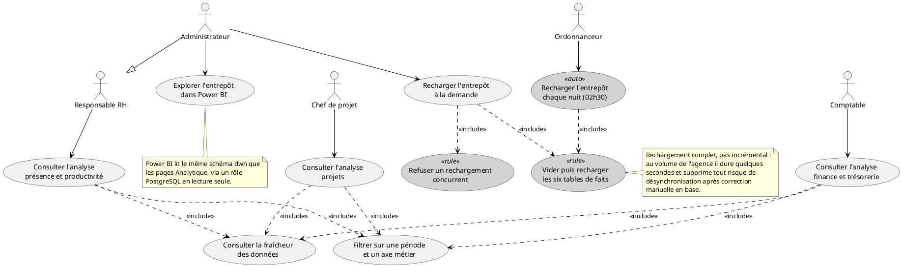
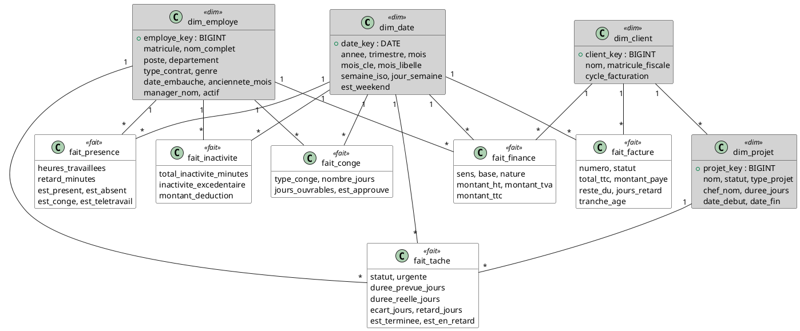
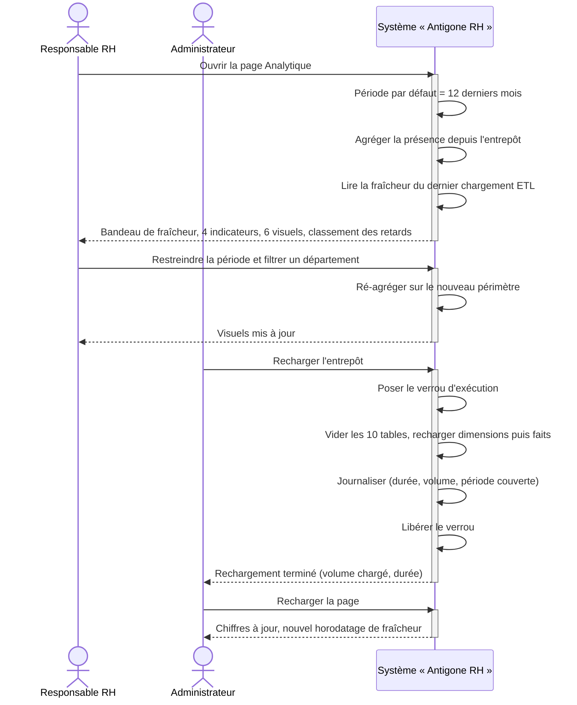
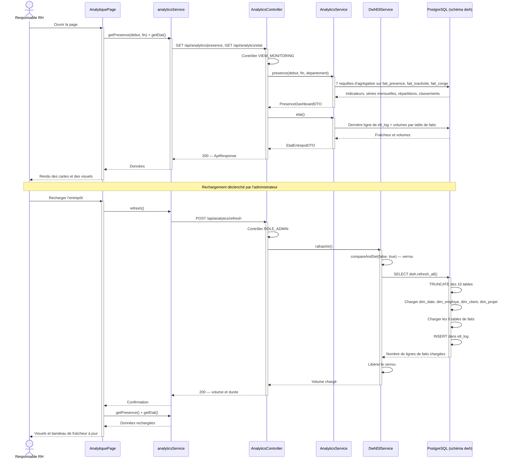

# Chapitre VII : Release 5 — Informatique décisionnelle

## VII.1 Introduction

Les quatre releases précédentes ont doté Antigone 360° d'un socle d'identités, d'un système d'organisation du temps de travail, d'un outillage de pilotage des projets et des plans médias, puis d'une chaîne financière complète. Chacune a produit ses propres écrans de consultation — un tableau de bord RH, un tableau de bord projets, un tableau de bord financier — mais tous partagent la même limite : ils lisent directement les tables de saisie, et ne répondent qu'à des questions portant sur l'instant présent ou sur un mois isolé. *Combien de projets sont en cours ce mois-ci ?* est une question à laquelle l'application sait répondre. *L'absentéisme du département création a-t-il augmenté depuis deux ans, et cette hausse coïncide-t-elle avec les périodes de forte charge projet ?* est une question qu'elle ne sait pas poser.

Cet écart n'est pas un défaut de conception : il tient à la nature même du modèle de données. Un schéma transactionnel est normalisé pour écrire vite, sans doublon ni incohérence ; il est structuré autour de l'entité (l'employé, la facture, la tâche), pas autour de l'analyse. Interroger l'historique complet d'une agence sur un tel schéma impose des jointures profondes et des agrégations répétées, dont le coût retombe sur la base de production — donc sur les écrans de saisie des utilisateurs. C'est précisément le problème que l'informatique décisionnelle résout depuis trente ans par une séparation nette : d'un côté le système opérationnel (OLTP), optimisé pour la transaction ; de l'autre un entrepôt de données (OLAP), optimisé pour l'analyse, alimenté périodiquement depuis le premier.

**Release 5 — Informatique décisionnelle** ajoute cette seconde moitié à la plateforme. Elle construit un entrepôt de données dédié, modélisé **en étoile** selon l'approche de Kimball, alimenté chaque nuit par une procédure ETL, et restitué de deux façons complémentaires : par trois pages « Analytique » intégrées aux applications existantes, et par un rapport **Power BI** branché sur le même entrepôt. Le périmètre couvre trois domaines d'analyse retenus pour leur valeur de pilotage : **présence et productivité**, **finance et trésorerie**, **projets**.

Deux partis pris structurent tout le chapitre. D'abord, **une source unique de vérité analytique** : les pages web et Power BI ne calculent rien indépendamment l'un de l'autre, ils lisent les mêmes tables de faits et appliquent les mêmes règles d'agrégation. Deux restitutions du même entrepôt ne peuvent pas se contredire — argument décisif quand un dirigeant compare un chiffre affiché à l'écran avec un chiffre exporté. Ensuite, **la réutilisation du cloisonnement existant** : la release n'invente aucun modèle de sécurité propre, elle réemploie les permissions déjà définies (`VIEW_MONITORING`, `VIEW_FINANCE`, `VIEW_PROJETS`), de sorte qu'un comptable accède à l'analyse financière et un responsable RH à l'analyse de présence, exactement comme pour les modules opérationnels correspondants.

Comme aux chapitres précédents, nous suivons la démarche habituelle : backlog de sprint, diagramme de cas d'utilisation, description de l'architecture décisionnelle, inventaire des services web exposés, puis description détaillée d'un cas d'utilisation représentatif.

---

## VII.2 Backlog du Sprint 9

Le Sprint 9 couvre le module M18 (Décisionnel), pour une charge totale de 16 points.

<table>
<thead>
<tr><th>User Story</th><th>Tâches</th><th>Estimation</th></tr>
</thead>
<tbody>

<tr><td rowspan="4">En tant qu'architecte de la solution, je veux un entrepôt de données séparé du schéma transactionnel afin que les analyses historiques ne pèsent pas sur les écrans de saisie.</td><td>Concevoir le modèle en étoile : quatre dimensions conformes (<code>dim_date</code>, <code>dim_employe</code>, <code>dim_client</code>, <code>dim_projet</code>) et six tables de faits, avec définition explicite du grain de chacune.</td><td>1</td></tr>
<tr><td>Écrire le script DDL du schéma <code>dwh</code> : tables, clés étrangères, index, table de version du modèle et journal d'exécution ETL.</td><td>1</td></tr>
<tr><td>Développer l'initialiseur de schéma côté backend : construction au démarrage, reconstruction automatique lorsque la version du modèle change.</td><td>1</td></tr>
<tr><td>Tester la fonctionnalité.</td><td>1</td></tr>

<tr><td rowspan="4">En tant qu'administrateur, je veux que l'entrepôt soit rechargé automatiquement chaque nuit afin que les tableaux de bord reflètent les données de la veille sans intervention.</td><td>Développer la procédure stockée <code>dwh.refresh_all()</code> : génération de la dimension temps sur les bornes réelles des données, alimentation des dimensions avec membre « inconnu », puis des six tables de faits.</td><td>1</td></tr>
<tr><td>Développer le service d'ordonnancement (tâche planifiée à 02h30, verrou d'exécution concurrente) et le déclenchement manuel réservé à l'administrateur.</td><td>1</td></tr>
<tr><td>Développer la journalisation des exécutions (durée, volume chargé, période couverte) et l'API d'état de fraîcheur.</td><td>1</td></tr>
<tr><td>Tester la fonctionnalité.</td><td>1</td></tr>

<tr><td rowspan="4">En tant que responsable RH, je veux un tableau de bord de présence et de productivité afin de suivre l'absentéisme, les retards et la charge horaire par département.</td><td>Développer l'API d'agrégation de la présence (taux de présence, d'absentéisme, de télétravail, heures, retards, inactivité hebdomadaire, congés par type).</td><td>1</td></tr>
<tr><td>Réaliser la page Analytique RH : cartes d'indicateurs, courbes d'évolution mensuelle, répartition par statut et par département, classement des retards.</td><td>1</td></tr>
<tr><td>Appliquer les règles de lisibilité graphique (palette validée pour les déficiences de vision des couleurs, axe unique, légende systématique, tableau de valeurs de secours).</td><td>1</td></tr>
<tr><td>Tester la fonctionnalité.</td><td>1</td></tr>

<tr><td rowspan="2">En tant que comptable, je veux un tableau de bord financier distinguant l'engagement comptable de la trésorerie réellement encaissée afin de piloter à la fois le résultat et le cash.</td><td>Développer l'API d'agrégation financière (produits, charges par nature, masse salariale, résultat, marge, encaissements, décaissements, balance âgée des créances).</td><td>1</td></tr>
<tr><td>Réaliser la page Analytique Finance et tester la fonctionnalité.</td><td>1</td></tr>

<tr><td rowspan="2">En tant que chef de projet, je veux un tableau de bord projets afin d'identifier les projets à risque et de mesurer les délais réels de réalisation.</td><td>Développer l'API d'agrégation projets (taux de complétion, tâches en retard, délai moyen et écart au prévu, charge par collaborateur, projets à risque).</td><td>1</td></tr>
<tr><td>Réaliser la page Analytique Projets et tester la fonctionnalité.</td><td>1</td></tr>

<tr><td rowspan="2">En tant que dirigeant, je veux explorer librement les mêmes données dans Power BI afin de construire mes propres analyses sans solliciter le développement.</td><td>Créer un rôle PostgreSQL en lecture seule sur le schéma <code>dwh</code>, établir la connexion Power BI, déclarer les relations du modèle en étoile et marquer la table de dates.</td><td>1</td></tr>
<tr><td>Écrire le jeu de mesures DAX des trois domaines et construire les trois pages du rapport.</td><td>1</td></tr>

<tr><td colspan="2" align="right"><strong>Total</strong></td><td><strong>16</strong></td></tr>

</tbody>
</table>

*Table VII.1 — Backlog du Sprint 9*

---

## VII.3 Diagramme de cas d'utilisation du Sprint 9

*Figure VII.1 — Diagramme de cas d'utilisation du Sprint 9*

Trois précisions sur ce diagramme. D'abord, le rechargement de l'entrepôt est le seul cas d'utilisation à double déclencheur : il est joué automatiquement par l'ordonnanceur à 02h30, et manuellement par l'administrateur depuis n'importe laquelle des trois pages Analytique. Ce second chemin existe pour la démonstration et pour les corrections urgentes — après une saisie rétroactive, attendre la nuit n'est pas acceptable. Ensuite, l'inclusion du verrou d'exécution n'est pas un détail d'implémentation : la procédure ETL commence par un `TRUNCATE`, deux exécutions simultanées se videraient donc mutuellement leurs tables en cours de chargement ; le second appel est refusé (HTTP 409) plutôt que mis en file d'attente. Enfin, la consultation de la fraîcheur des données est incluse dans les trois cas de consultation : chaque page affiche en bandeau la date du dernier chargement, car un tableau de bord décisionnel qui ne dit pas de quand datent ses chiffres invite à la méprise — l'utilisateur d'une application transactionnelle est habitué à des données instantanées.

Point d'attention : le backend ne distingue pas le Responsable RH du Chef de projet ou du Comptable par des rôles nominatifs, mais par les permissions déjà en place (`VIEW_MONITORING`, `VIEW_PROJETS`, `VIEW_FINANCE`). La release n'introduit donc aucune nouvelle permission — choix délibéré : un utilisateur autorisé à consulter un module opérationnel l'est aussi à en consulter l'analyse, et l'inverse serait difficile à justifier.

---

## VII.4 Architecture décisionnelle

### VII.4.1 Le modèle en étoile

Le schéma `dwh`, créé dans la même instance PostgreSQL que le schéma transactionnel, suit une modélisation dimensionnelle. Il oppose deux familles de tables : les **dimensions**, qui portent les axes d'analyse (qui, quoi, quand), et les **faits**, qui portent les mesures numériques et référencent les dimensions. Cette forme donne son nom à l'étoile : une table de faits au centre, ses dimensions en rayons.

*Figure VII.2 — Modèle en étoile de l'entrepôt `dwh`*

Le **grain** — ce que représente une ligne — est défini explicitement pour chaque table de faits, car c'est la décision de conception dont dépendent toutes les autres.

| Table de faits | Grain : une ligne = … | Source transactionnelle |
|---|---|---|
| `fait_presence` | un employé, un jour | `pointages` |
| `fait_inactivite` | un employé, une semaine | `rapports_inactivite` |
| `fait_conge` | une demande de congé | `conges` ⋈ `demandes` |
| `fait_finance` | un flux financier élémentaire | `factures`, `paiements_factures`, `autres_revenus`, `bulletins_paie`, `charges_fixes`, `charges_variables` |
| `fait_facture` | une facture (photographie de son état) | `factures` |
| `fait_tache` | une tâche de projet | `taches` |

*Table VII.2 — Grain des tables de faits*

Trois choix de modélisation méritent d'être justifiés.

**Les indicateurs binaires.** `fait_presence` porte des colonnes `est_present`, `est_absent`, `est_conge`, `est_teletravail`, `est_retard`, valant 0 ou 1. Ce n'est pas une redondance du champ `statut` : une moyenne sur une colonne 0/1 donne directement un taux. Le taux de présence s'écrit alors `AVG(est_present) * 100` en SQL et `DIVIDE(SUM(est_present), COUNTROWS(...)) * 100` en DAX — deux expressions triviales, impossibles à écrire différemment d'un outil à l'autre. Sans ces colonnes, chaque restitution devrait réimplémenter la liste des statuts considérés comme « présent », et les deux implémentations finiraient par diverger.

**La double base du fait financier.** `fait_finance` distingue par une colonne `base` deux lectures du même flux : `ENGAGEMENT` (comptable, à la date d'émission de la facture ou du mois de paie) et `TRESORERIE` (à la date d'encaissement ou de décaissement réel). Cette distinction est la traduction, dans le modèle, d'une réalité de gestion : une facture émise en janvier et réglée en mars appartient au résultat de janvier mais à la trésorerie de mars. La contrepartie est un risque de double comptage, assumé et documenté : toute mesure doit filtrer `base`, faute de quoi elle additionne deux fois le même dinar. Le principe est rappelé dans un commentaire de la table, dans le code de l'API et dans le guide Power BI.

**Le membre « inconnu ».** Chaque dimension contient une ligne de clé `-1` (« Non affecté », « Client non renseigné »). Les faits dont la clé étrangère source est nulle — une tâche sans assigné, une facture sans client — y sont rattachés par `COALESCE(..., -1)`. Sans ce membre, la jointure interne entre le fait et sa dimension les écarterait silencieusement, et les totaux de l'entrepôt seraient inférieurs à ceux de l'application sans qu'aucune erreur ne soit signalée. C'est une pratique standard de l'entreposage, et le type d'écart qu'un jury attend de voir traité.

### VII.4.2 La chaîne ETL

L'alimentation est assurée par la procédure stockée `dwh.refresh_all()`, écrite en PL/pgSQL. Le choix de placer la transformation dans la base plutôt que dans la JVM répond à deux préoccupations : les volumes ne transitent jamais par le réseau ni par la mémoire du serveur d'application, et le traitement reste rejouable à la main depuis n'importe quel client SQL — argument de maintenabilité pour une équipe réduite.

La procédure applique une stratégie de **rechargement complet** : vidage des dix tables par un `TRUNCATE` unique, puis reconstruction dans l'ordre dimensions → faits. Le rechargement incrémental, qui ne traiterait que les lignes modifiées depuis la dernière exécution, serait plus économe mais exigerait de tracer les suppressions et les mises à jour rétroactives dans le schéma transactionnel. Au volume d'une agence de communication — quelques dizaines de milliers de lignes de faits — le rechargement complet s'exécute en quelques secondes ; l'optimiser serait prématuré, et la simplicité obtenue supprime toute classe de bug de désynchronisation.

Deux détails de robustesse méritent mention. La dimension temps n'est pas générée sur une plage figée mais sur les **bornes réelles des données** : la procédure calcule la date minimale et maximale rencontrées dans l'ensemble des sources, puis étend la dimension d'une année au-delà. Une donnée antérieure à la plage prévue étendrait la dimension au lieu d'être écartée par la jointure. Par ailleurs, l'initialiseur de schéma compare au démarrage une **version du modèle** stockée dans `dwh.meta` : lorsqu'elle change, le schéma est supprimé et reconstruit de zéro. Cette liberté n'est possible que parce que l'entrepôt ne contient aucune donnée propre — tout y est dérivé, donc reconstructible sans perte. Elle évite d'écrire une migration de schéma à chaque évolution du modèle d'analyse.

| Élément | Choix retenu |
|---|---|
| Stratégie de chargement | Rechargement complet (`TRUNCATE` + `INSERT … SELECT`) |
| Emplacement de la transformation | Procédure stockée PL/pgSQL, dans la base |
| Périodicité | Quotidienne, 02h30 (paramétrable par `BI_ETL_CRON`) |
| Déclenchement manuel | `POST /api/analytics/refresh`, réservé à l'administrateur |
| Concurrence | Verrou applicatif — un second appel simultané est refusé |
| Traçabilité | Table `dwh.etl_log` : horodatage, durée, volume, période couverte |
| Évolution du schéma | Reconstruction complète pilotée par une version dans `dwh.meta` |

*Table VII.3 — Choix d'architecture de la chaîne ETL*

### VII.4.3 La double restitution

L'entrepôt est exposé de deux manières, qui ne se concurrencent pas mais répondent à des usages distincts.

Les **pages Analytique** — une par application front — servent le suivi quotidien dans l'outil de travail. Elles sont alimentées par `/api/analytics/**`, héritent du cloisonnement par permission et de l'identité visuelle de l'application, et n'exigent aucune compétence particulière. Elles sont volontairement fermées : périodes, filtres et visuels sont ceux que le développement a jugés pertinents.

Le rapport **Power BI**, branché sur le schéma `dwh` par un rôle PostgreSQL en lecture seule, sert l'exploration libre et l'export. Il permet à un dirigeant de croiser des axes que l'application n'a pas prévus, de construire ses propres mesures et d'extraire les données vers un tableur. Le mode d'importation est préféré au DirectQuery : le rapport devient autonome et n'interroge plus la base de production à chaque interaction.

Ces deux restitutions lisent les mêmes tables et appliquent les mêmes définitions d'indicateurs — c'est la conséquence directe des colonnes d'indicateurs binaires évoquées plus haut. À période égale, elles affichent donc nécessairement les mêmes chiffres, ce qui est la condition pour que l'un puisse servir à vérifier l'autre.

---

## VII.5 Services Web

Le Sprint 9 expose une famille unique de points d'entrée REST, préfixés par `/api/analytics`.

| Méthode | URL | Permission requise | Description |
|---|---|---|---|
| GET | `/presence?debut=&fin=&departement=` | `VIEW_MONITORING`, `VIEW_DASHBOARD_RH` ou `ADMIN` | Indicateurs de présence et de productivité : taux de présence, d'absentéisme et de télétravail, heures travaillées, retards, évolution mensuelle, répartition par statut et par département, classement des retards, inactivité hebdomadaire, congés approuvés par type |
| GET | `/departements` | idem | Liste des départements présents dans l'entrepôt (alimente le filtre) |
| GET | `/finance?debut=&fin=` | `VIEW_FINANCE` ou `ADMIN` | Indicateurs financiers : produits HT, charges par nature, masse salariale, résultat et marge (base engagement), encaissements et décaissements (base trésorerie), balance âgée des créances, chiffre d'affaires par client, factures en retard |
| GET | `/projets?debut=&fin=` | `VIEW_PROJETS` ou `ADMIN` | Indicateurs projets : taux de complétion, tâches en retard, délai moyen de réalisation et écart au prévu, répartition des projets par statut, charge par collaborateur, projets à risque |
| GET | `/etat` | Authentifié | Fraîcheur de l'entrepôt : date et durée du dernier chargement, volume chargé, nombre de lignes par table de faits |
| POST | `/refresh` | `ADMIN` | Rechargement complet de l'entrepôt (409 si un rechargement est déjà en cours) |

*Table VII.4 — Services web du Sprint 9*

Deux conventions s'appliquent à l'ensemble de ces points d'entrée. En l'absence de paramètres `debut` et `fin`, la période par défaut est celle des **douze derniers mois**, du premier jour du mois d'il y a un an à aujourd'hui. Et lorsque l'entrepôt est indisponible — schéma jamais construit, base inaccessible —, le contrôleur renvoie un **503** accompagné de la marche à suivre, plutôt qu'une trace SQL : l'indisponibilité du décisionnel ne doit ni ressembler à une absence de données, ni exposer la structure interne de la base.

---

## VII.6 Cas d'utilisation : « Consulter l'analyse de présence et recharger l'entrepôt »

### VII.6.1 Description textuelle

| Élément | Description |
|---|---|
| **Acteurs** | Responsable RH (acteur principal — consulte et filtre) ; Administrateur (acteur secondaire — déclenche un rechargement) |
| **Objectif** | Mesurer l'évolution de la présence, de l'absentéisme et de la charge horaire sur une période choisie, identifier les départements et les collaborateurs les plus exposés, et s'assurer que les chiffres consultés sont à jour |
| **Pré-condition** | L'utilisateur dispose de la permission `VIEW_MONITORING`. L'entrepôt a été construit au démarrage du backend et contient au moins une exécution ETL |

**Scénario principal**

1. Le responsable RH ouvre la page « Analytique (BI) » depuis le panneau Monitoring de l'application RH.
2. Le système interroge en parallèle l'agrégat de présence sur la période par défaut — les douze derniers mois — et l'état de fraîcheur de l'entrepôt.
3. Le système affiche en bandeau la date du dernier chargement, puis quatre cartes d'indicateurs (taux de présence, taux d'absentéisme, heures travaillées, part de télétravail) et une ligne de contexte (journées suivies, effectif, jours de retard, retard moyen).
4. Le système restitue six visuels : évolution mensuelle des taux de présence et d'absentéisme, heures travaillées par mois, répartition des journées par statut, taux de présence par département, inactivité excédentaire hebdomadaire, jours de congé par type ; puis le classement des dix collaborateurs au retard cumulé le plus élevé.
5. Le responsable RH restreint la période à l'année en cours et sélectionne un département dans le filtre.
6. Le système recharge l'ensemble des agrégats sur le nouveau périmètre et met à jour tous les visuels.
7. Constatant que les données datent de la veille alors qu'une régularisation de pointages vient d'être saisie, le responsable RH sollicite l'administrateur.
8. L'administrateur, depuis la même page, déclenche le rechargement de l'entrepôt.
9. Le système vide puis reconstruit les dix tables de l'entrepôt, journalise l'exécution, puis relance le chargement de la page ; le bandeau de fraîcheur affiche l'horodatage du nouveau chargement.

**Scénarios alternatifs**

- **A1 — Entrepôt jamais chargé** : à l'étape 3, si aucune exécution ETL n'a été journalisée, le bandeau indique « L'entrepôt n'a jamais été chargé » et les visuels restent vides. L'administrateur applique l'étape 8.
- **A2 — Entrepôt indisponible** : si le schéma `dwh` est absent ou la base inaccessible, le système renvoie un 503 ; la page affiche un bandeau d'erreur explicite assorti d'un bouton « Réessayer », et non une page vide qui laisserait croire à une absence d'activité.
- **A3 — Rechargement concurrent** : à l'étape 8, si le rechargement nocturne est en cours, le système refuse la demande (409) et en informe l'administrateur, plutôt que de lancer une seconde exécution qui corromprait la première.
- **A4 — Filtre sans résultat** : si la période et le département sélectionnés ne couvrent aucun pointage, les cartes affichent zéro et chaque visuel porte un message explicite (« Aucun rapport d'inactivité sur la période »), afin de distinguer l'absence de données d'un échec de chargement.
- **A5 — Utilisateur non autorisé** : un utilisateur dépourvu de `VIEW_MONITORING` ne voit pas l'entrée de menu et, s'il accède à l'URL directement, est redirigé vers son tableau de bord ; l'appel API correspondant est rejeté avec un 403.
- **A6 — Analyse par département** : le visuel « Taux de présence par département » ignore délibérément le filtre de département — il perdrait sinon sa fonction comparative. Cette exception est signalée dans le sous-titre du visuel.

### VII.6.2 Diagramme de séquence système

### VII.6.3 Diagramme de séquence objet

---

## VII.7 Conclusion

Cette cinquième release ajoute à Antigone 360° la dimension qui lui manquait : la capacité d'interroger son propre historique. L'apport n'est pas un écran de plus — les quatre releases précédentes en comptaient déjà — mais une **couche d'architecture distincte**, dont la séparation d'avec le transactionnel est le principe fondateur. Un schéma dénormalisé une fois par nuit remplace des jointures rejouées à chaque consultation ; la base de production cesse de porter le coût de l'analyse.

Trois acquis méritent d'être retenus. Le premier est méthodologique : la modélisation en étoile, avec définition explicite du grain de chaque table de faits et traitement du membre inconnu, applique à ce projet une démarche éprouvée plutôt qu'une agrégation improvisée. Le deuxième est la **non-duplication des définitions d'indicateurs** : en portant les taux sous forme de colonnes binaires dans le fait, l'entrepôt rend la formule de calcul triviale et identique en SQL comme en DAX — les pages web et Power BI ne peuvent pas diverger. Le troisième prolonge le principe directeur de tout le projet, énoncé dès la Release 1 : la logique reste dans la couche qui en est responsable. De même que la logique métier sensible n'a jamais été déléguée au frontend ni au modèle de langage, la logique de transformation analytique n'est déléguée ni à Power BI, ni au code applicatif — elle est dans la procédure ETL, en un seul endroit, versionnée avec le reste du schéma.

Deux limites sont assumées. Le rechargement complet ne passerait pas à l'échelle d'un volume de données supérieur de plusieurs ordres de grandeur ; il faudrait alors passer à un chargement incrémental, ce qui suppose de tracer les suppressions dans le schéma transactionnel. Et le rapport Power BI, faute de licence Pro, reste un livrable de poste de travail : il n'est ni publié dans un espace partagé ni intégré aux applications web. C'est précisément ce qui justifie l'existence des pages Analytique, qui apportent au quotidien l'essentiel de la valeur du décisionnel à l'intérieur de l'outil de travail.
